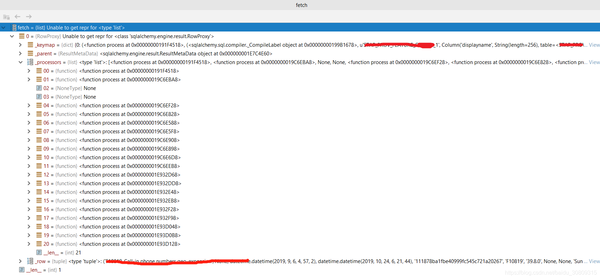
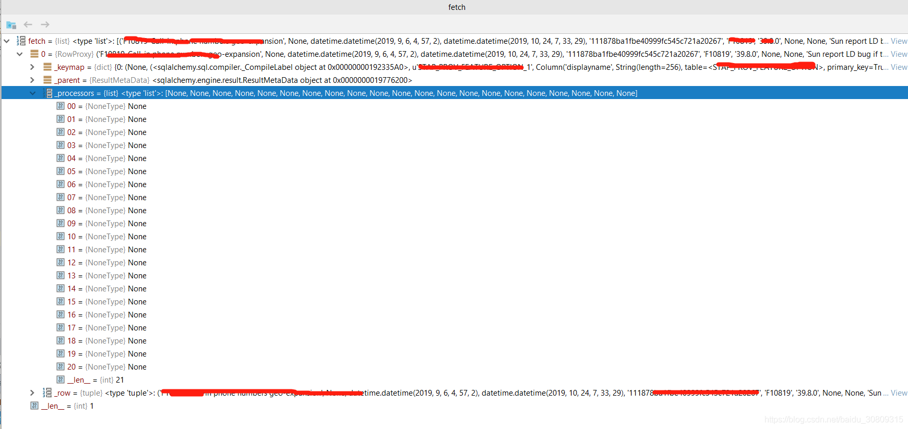

第一种情况参考：https://blog.csdn.net/baidu_30809315/article/details/102677574

1.报错代码

```python
opt = FeatureOption.query.get(display_name)
 
# 此时sqlalchemy版本是1.2.6， flask_sqlalchemy版本是2.3.2
```

2.异常信息

```python
  File "path\xxx\xxx\views.py", line 64, in feature_config
    opt = FeatureOption.query.get(display_name)
  File "path\venv\lib\site-packages\sqlalchemy\orm\query.py", line 882, in get
    ident, loading.load_on_ident)
  File "path\venv\lib\site-packages\sqlalchemy\orm\query.py", line 916, in _get_impl
    return fallback_fn(self, key)
  File "path\venv\lib\site-packages\sqlalchemy\orm\loading.py", line 232, in load_on_ident
    return q.one()
  File "path\venv\lib\site-packages\sqlalchemy\orm\query.py", line 2848, in one
    ret = self.one_or_none()
  File "path\venv\lib\site-packages\sqlalchemy\orm\query.py", line 2818, in one_or_none
    ret = list(self)
  File "path\venv\lib\site-packages\sqlalchemy\orm\loading.py", line 98, in instances
    util.raise_from_cause(err)
  File "path\venv\lib\site-packages\sqlalchemy\util\compat.py", line 203, in raise_from_cause
    reraise(type(exception), exception, tb=exc_tb, cause=cause)
  File "path\venv\lib\site-packages\sqlalchemy\orm\loading.py", line 79, in instances
    rows = [proc(row) for row in fetch]
  File "path\venv\lib\site-packages\sqlalchemy\orm\loading.py", line 493, in _instance
    loaded_instance, populate_existing, populators)
  File "path\venv\lib\site-packages\sqlalchemy\orm\loading.py", line 593, in _populate_full
    dict_[key] = getter(row)
  File "path\venv\lib\site-packages\sqlalchemy\engine\result.py", line 93, in __getitem__
    return processor(self._row[index])
  File "path\venv\lib\site-packages\sqlalchemy\processors.py", line 78, in process
    return decoder(value, errors)[0]
  File "path\venv\lib\encodings\utf_8.py", line 16, in decode
    return codecs.utf_8_decode(input, errors, True)
UnicodeDecodeError: 'utf8' codec can't decode byte 0xa0 in position 41: invalid start byte
```

3.解决办法（升级flask_sqlalchemy版本）

```python
pip install Flask-SQLAlchemy==2.4.1
 
# sqlalchemy版本不用升级
```

4.报错原因

（1）表面原因：0xa0是不间断空白符，为iso-8859-1特有编码，故utf-8无法解析；（可以查看两种编码的范围）

（2）内在原因：Debug sqlalchemy源码，主要看loading.py和result.py执行的步骤；

```python
def instances(query, cursor, context):
	... ...
    try:
		... ...
        while True:
            context.partials = {}
 
            if query._yield_per:
                fetch = cursor.fetchmany(query._yield_per)
                if not fetch:
                    break
            else:
                fetch = cursor.fetchall()   # 第一步：这里查到的fetch对象在2.3.2版本中fetch[0]['_processors']不是None，但是在2.4.1版本中查出来全部是None，主要原因
 
            if single_entity:
                proc = process[0]
                rows = [proc(row) for row in fetch]  # 第二部：由此进入_instance_processor方法中的_instance方法
            else:
                rows = [keyed_tuple([proc(row) for proc in process])
                        for row in fetch]
            ... ...
    except Exception as err:
        cursor.close()
        util.raise_from_cause(err)  # 此处抛出异常信息
```

```python
def _instance_processor(
        mapper, context, result, path, adapter,
        only_load_props=None, refresh_state=None,
        polymorphic_discriminator=None,
        _polymorphic_from=None):
	... ...
    def _instance(row):
        ... ...
        if currentload or populate_existing:
			... ...
            _populate_full(
                context, row, state, dict_, isnew, load_path,
                loaded_instance, populate_existing, populators)     # 第三步：由此进入_populate_full方法
            ... ...
    return _instance
```

```python
def _populate_full(
        context, row, state, dict_, isnew, load_path,
        loaded_instance, populate_existing, populators):
    if isnew:
        # first time we are seeing a row with this identity.
        state.runid = context.runid
 
        for key, getter in populators["quick"]:
            dict_[key] = getter(row)     # 第四步：由此进入BaseRowProxy类的__getitem__方法，此处的getter是itemgetter()类型，通过这个返回的函数作用到对象上才能取得其值
        ... ...
    elif load_path != state.load_path:
        ... ...
    else:
        ...
 
    class BaseRowProxy(object):
        __slots__ = ('_parent', '_row', '_processors', '_keymap')
 
        def __init__(self, parent, row, processors, keymap):
            """RowProxy objects are constructed by ResultProxy objects."""
 
            self._parent = parent
            self._row = row
            self._processors = processors
            self._keymap = keymap
 
        ... ...
        def __getitem__(self, key):
            try:
                processor, obj, index = self._keymap[key]
            except KeyError:
                processor, obj, index = self._parent._key_fallback(key)
            except TypeError:
                if isinstance(key, slice):
                    l = []
                    for processor, value in zip(self._processors[key],
                                                self._row[key]):
                        if processor is None:
                            l.append(value)
                        else:
                            l.append(processor(value))
                    return tuple(l)
                else:
                    raise
            if index is None:
                raise exc.InvalidRequestError(
                    "Ambiguous column name '%s' in "
                    "result set column descriptions" % obj)
            if processor is not None:
                return processor(self._row[index])    #  第五步：版本2.3.1进入此分支，然后进入到py_fallback方法的to_conditional_unicode_processor_factory方法
            else:
                return self._row[index]    # 第五步：2.4.1因为processors都是None，故进入此分支，直接返回
		
		... ...
```

```python
def py_fallback():
	... ...
    def to_conditional_unicode_processor_factory(encoding, errors=None):
        decoder = codecs.getdecoder(encoding)
 
        def process(value):
            if value is None:
                return None
            elif isinstance(value, util.text_type):
                return value
            else:
                # decoder returns a tuple: (value, len). Simply dropping the
                # len part is safe: it is done that way in the normal
                # 'xx'.decode(encoding) code path.
                return decoder(value, errors)[0]    # 第六步：版本2.3.2进入此方法，触发decode，故2.3.2会抛出异常
        return process
    ... ...
```

（3）由上可知版本2.3.2走了6步，而版本2.4.1只走了5步，第六步是出错步骤；

5.具体原因要查两个版本cursor.fetchall()得到的processors为何不同（下面是两个fetch对象的截图）

flask_sqlalchemy==2.3.2 (问题版本 below picture) 



flask_sqlalchemy==2.4.1(正常版本 below picture)


