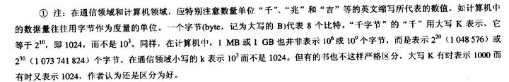
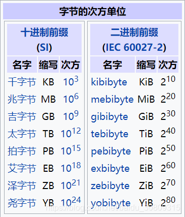
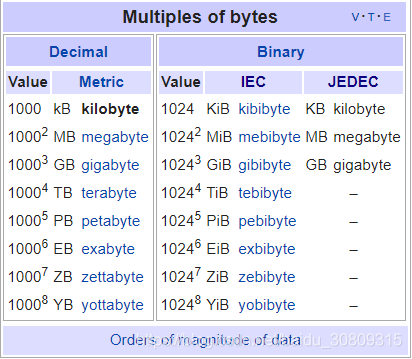
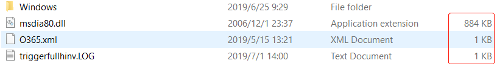

1. 谢希仁《计算机网络》注释



2. 国际标准（SI/IEC/JEDEC）

```
KiB(IEC)  -->  1KiB = 1,024 Byte
KB(SI)    -->  1KB  = 1,000 Byte
KB(JEDEC) -->  1KB  = 1,024 Byte
```

SI国际单位制，国际单位制以七个基本单位为基础，包括长度-米m，质量-千克kg，时间-秒s，电流-安培A，热力学温度-开尔文K，物质的量-摩尔mol，发光强度-坎德拉cd;

IEC国际电工委员会是世界上最早的国际标准化组织，于1906年成立，主要是负责有关电气工程和电子工程领域中的国际标准化工作。

JEDEC固态技术协会是固态及半导体工业界的一个标准化组织，制定固态电子方面的工业标准。

 


3. Windows里的KB是JEDEC的标准



4. 为什么会有1KB=1000B？

（1）二进制算术不如十进制算术方便（喜欢10的幂，而不是2的幂，内存越大，误差越大，逐渐不适用）

（2）制造商通常使用该术语（反正都是kb，哪个看上去更好看？你的磁盘是否缩水了？）

（3）标准和实施系统中不兼容（设计人员和实际操作人员，比如网络带宽方面，100Mb是真的吗）

（4）1kg=1000g, 1km=1000m, 所以1kb=1000b（思维定势）

（5）行业差异
