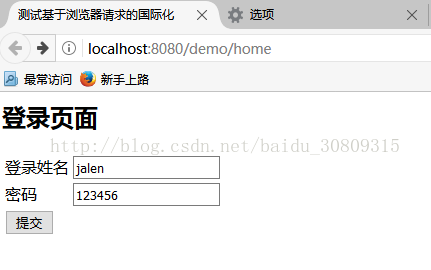
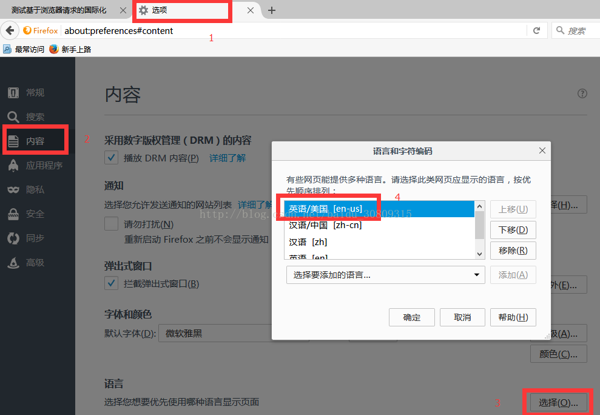
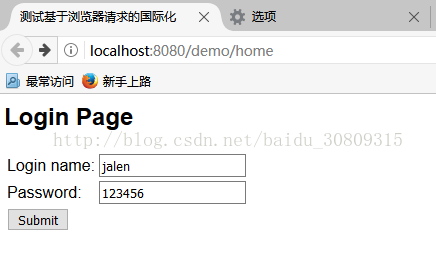

说明：这个示例来自肖文吉老师写的《Spring+Mybatis企业应用实战》第五章第一节

场景：对外访问支持

步骤：1.加载资源文件；2.输出国际化

代码：git@github.com:SincerelyUnique/spring-mvc-Internationalization-default.git

# 创建资源文件：
在resources目录下创建bundle文件夹，文件夹里包含三个属性文件，message.properties，message_en_US.properties和message_zh_CN.properties，如下

① message_en_US.properties
```
loginname = Login name:
password = Password:
submit = Submit
welcome = Welcome {0} access demo
title = Login Page
username = administrator
```
② message_zh_CN.properties（注意这里是将中文转Unicode编码，可以借助在线工具： http://tool.chinaz.com/tools/unicode.aspx）
```
loginname=\u767b\u5f55\u59d3\u540d
password=\u5bc6\u7801
submit=\u63d0\u4ea4
welcome=\u6b22\u8fce{0}\u8bbf\u95eeDemo
title=\u767b\u5f55\u9875\u9762
username=\u7528\u6237\u540d 
```
③ message.properties (这个是备用文件，当上面两个文件缺少某个属性时，可以去下面这个文件中找，即默认属性值)
```
loginname = Login name:
password = Password:
submit = Submit
welcome = Welcome {0} access demo
title = Login Page
username = administrator
```

# 加载属性资源文件

（在spring-mvc.xml中添加如下配置）

```xml
    <!--加载国际化配置-->
    <bean id="messageSource" class="org.springframework.context.support.ResourceBundleMessageSource">
        <!-- 国际化信息所在的文件路径和文件名（我的在resources下的bundle文件夹中，所以是bundle.message） -->
        <property name="basename" value="bundle.message"/>
 
        <!-- 如果在国际化资源文件中找不到对应代码的信息，就用这个代码作为名称  -->
        <property name="useCodeAsDefaultMessage" value="true" />
    </bean>
    <mvc:interceptors>
        <!--国际化拦截器如果采用基于（session/cookie）则必须配置-->
        <bean class="org.springframework.web.servlet.i18n.LocaleChangeInterceptor"/>
    </mvc:interceptors>
    <!--AcceptHeaderLocaleResolver配置，因为AcceptHeaderLocaleResolver是默认语言区域，不配置也可以-->
    <bean id="localeResolver" class="org.springframework.web.servlet.i18n.AcceptHeaderLocaleResolver"/>
```

# 输出国际化之jsp页面

① 登录页面

```jsp
<%@page language="java" contentType="text/html; charset=UTF-8" pageEncoding="UTF-8" %>
<%@taglib prefix="form" uri="http://www.springframework.org/tags/form" %>
<%@taglib prefix="spring" uri="http://www.springframework.org/tags" %>
<jsp:useBean id="user" class="com.demo.domain.User" scope="request"/>
<html>
<head>
    <meta http-equiv="content-type" content="text/html;charset=UTF-8">
    <title>测试基于浏览器请求的国际化</title>
</head>
<body>
 
<h2><spring:message code="title"/></h2>
<form:form modelAttribute="user" method="post" action="login">
    <table>
        <tr>
            <td><spring:message code="loginname"/></td>
            <td><form:input path="loginname"/></td>
        </tr>
        <tr>
            <td><spring:message code="password"/></td>
            <td><form:input path="password"/></td>
        </tr>
        <tr>
            <td><input type="submit" value="<spring:message code="submit"/>"></td>
        </tr>
    </table>
</form:form>
 
</body>
</html>
```

② 登录成功页面

```jsp
<%@ taglib prefix="spring" uri="http://www.springframework.org/tags" %>
<%@ page contentType="text/html; charset=UTF-8" pageEncoding="UTF-8" %>
<!doctype html>
<html>
<body>
<spring:message code="welcome" arguments="${requestScope.user.username}"/>
</body>
</html>
```

# 输出国际化之控制器

```java
import com.demo.domain.User;
import org.springframework.stereotype.Controller;
import org.springframework.ui.Model;
import org.springframework.validation.annotation.Validated;
import org.springframework.web.bind.annotation.ModelAttribute;
import org.springframework.web.bind.annotation.PathVariable;
import org.springframework.web.bind.annotation.RequestMapping;
import org.springframework.web.bind.annotation.RequestMethod;
import org.springframework.web.servlet.support.RequestContext;
 
import javax.servlet.http.HttpServletRequest;
 
@Controller
public class TestController {
 
    @RequestMapping("/home")
    public String home(){
        return "home";
    }
 
    @RequestMapping("/{formName}")
    public String loginForm(@PathVariable String formName, Model model){
        User user = new User();
        model.addAttribute("user",user);
        return formName;
    }
 
    @RequestMapping(value = "/login",method = RequestMethod.POST)
    public String login(@ModelAttribute @Validated User user,Model model,HttpServletRequest request){
        if (user.getLoginname()!=null && user.getLoginname().equals("jalen")
                && user.getPassword()!=null && user.getPassword().equals("123456")){
            //从后台代码获取国际化信息username
            RequestContext requestContext = new RequestContext(request);
            String username = requestContext.getMessage("username");
 
            //将获取的username信息设置到User对象，并设置到Model中
            user.setUsername(username);
            model.addAttribute("user",user);
            return "success";
        }
        return "error";
    }
}
```

# 输出国际化之实体类

```java
import lombok.AllArgsConstructor;
import lombok.Data;
import lombok.NoArgsConstructor;
 
@Data
@AllArgsConstructor
@NoArgsConstructor
public class User {
 
    private String loginname;
 
    private String password;
 
    private String username;
 
}
```

# 结果演示



调整火狐浏览器语言



查看表单语言变化



