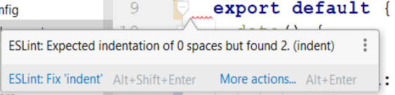
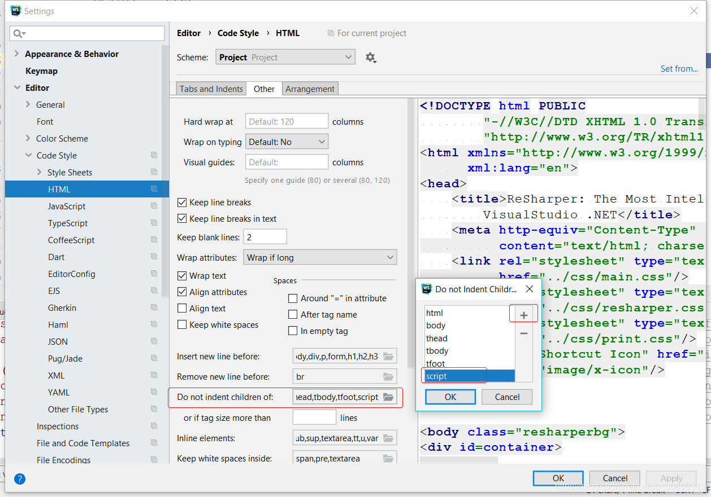

1.原因

2.参考

https://github.com/vuejs/eslint-plugin-vue/issues/352

3.解决

（1） 编辑Eslint配置，忽略缩进：'indent': 'off'

（2） 编辑webstorm规则，忽略script子标签缩进，File => Setting => Editor => Code Style => HTML 找到 add Do not indent children of 的选项，添加 script 标签。然后code=>Reformat Code即可

