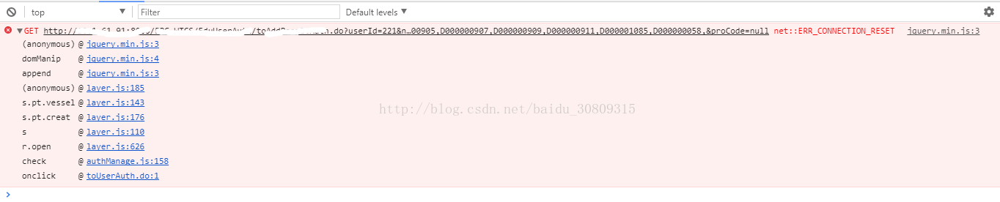

# 错误信息

# 原因
请求参数较长，修改后正常了，可能是被浏览器或服务器限制了

# 参考
https://www.ionos.com/digitalguide/hosting/technical-matters/err-connection-reset/  （问题描述）

https://www.w3.org/Protocols/rfc2616/rfc2616-sec3.html#sec3.2.1  (http1.1协议对URI请求没有设置任何长度限制)

https://stackoverflow.com/Questions/2659952/maximum-length-of-http-get-request  （限制来源可能是client端或server端）

# 备注
这个博客是17年的了，当时这个问题应该是在修改过参数长度后正常了，但是现在看好像这个解决方式并不符合这个问题的造成原因，感觉应该是网络原因造成的TCP连接断开，或者说network不可达，不过没有办法重现了
