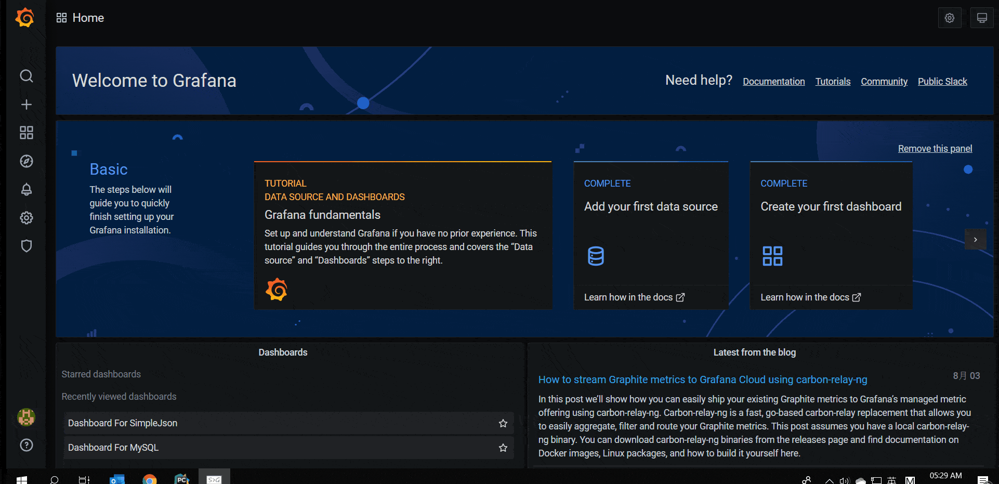

这里主要使用‘/’， ‘/query’， ‘/annotations’ 三个API，api使用python flask实现。

‘/query’， ‘/annotations’提供的是模拟数据。

Grafana版本为v7.1.1

```python
from flask import Flask, request, jsonify, json
from flask_cors import CORS, cross_origin
 
import pandas as pd
 
app = Flask(__name__)
 
cors = CORS(app)
app.config['CORS_HEADERS'] = 'Content-Type'
 
 
@app.route('/', methods=['GET', 'POST'])
@cross_origin()
def index():
    """Add to Data Source for save&test"""
    print request.headers, request.get_json()
    return 'Python Grafana data source, used for rendering HTML panels and timeseries data.'
 
 
@app.route('/query', methods=['GET', 'POST'])
@cross_origin(max_age=600)
def query_metrics():
    """
    Add 2 series by type 'timeserie', one line contains two points.
    Add 1 series by type 'table', one line contains three points.
    """
    req = request.get_json()
    query_from = pd.Timestamp(req['range']['from']).to_pydatetime()
    query_to = pd.Timestamp(req['range']['to']).to_pydatetime()
    freq = str(req.get('intervalMs')) + 'ms' if 'intervalMs' in req else None
    print('query from %s to %s.' % (query_from, query_to))
    print('query frequency interval is %s.' % freq)
 
    results = []
    for targets in req['targets']:
        ref_id, req_type = targets.get('refId'), targets.get('type')
        print('ref id is %s. req type is %s.' % (ref_id, req_type))
        target_str = targets.get('target')
        if target_str:
            target_info = json.loads(target_str)
            panel_id, panel_name = target_info['panelId'], target_info['panelName']
            print('panel id is %s. panel name is %s.' % (panel_id, panel_name))
            result = []
            if req_type == 'timeserie':
                result = [
                    {
                        "target": "upper_75",
                        "datapoints": [
                            [622, 1450754160000],  # 2015-12-22 03:16:00
                            [365, 1450754220000]  # 2015-12-22 03:17:00
                        ]},
                    {
                        "target": "upper_90",
                        "datapoints": [
                            [861, 1450754160000],  # 2015-12-22 03:16:00
                            [767, 1450754220000]  # 2015-12-22 03:17:00
                        ]
                    }
                ]
            if req_type == 'table':
                result = [
                    {
                        "columns": [
                            {"text": "Time", "type": "time"},
                            {"text": "Country", "type": "string"},
                            {"text": "Number", "type": "number"}
                        ],
                        "rows": [
                            [1450754160000, "SE", 123],  # 2015-12-22 03:16:00
                            [1450754200000, "DE", 331],  # 2015-12-22 03:16:40
                            [1450754220000, "US", 221]   # 2015-12-22 03:17:00
                        ],
                        "type": "table"
                    }
                ]
            results.extend(result)
    return jsonify(results)
 
 
@app.route('/annotations', methods=['GET', 'POST'])
@cross_origin(max_age=600)
def query_annotations():
    """Add annotation at 2015-12-22 03:17:00"""
    req = request.get_json()
    query_from = pd.Timestamp(req['range']['from']).to_pydatetime()
    query_to = pd.Timestamp(req['range']['to']).to_pydatetime()
    print('query from %s to %s.' % (query_from, query_to))
    annotation = req['annotation']
    query = annotation.get('query')
    results = [{
        "annotation": query,  # The original annotation sent from Grafana.
        "time": 1450754200000,  # Time since UNIX Epoch in milliseconds. (required), 2015-12-22 03:17:00
        "title": 'Title for annotation',  # The title for the annotation tooltip. (required)
        "tags": 'Tags for annotation',  # Tags for the annotation. (optional)
        "text": 'Text for annotation'  # Text for the annotation. (optional)
    }]
    return jsonify(results)
 
 
@app.route('/search', methods=['GET', 'POST'])
@cross_origin()
def find_metrics():
    req = request.get_json()
    query_from = pd.Timestamp(req['range']['from']).to_pydatetime()
    query_to = pd.Timestamp(req['range']['to']).to_pydatetime()
    print('query from %s to %s.' % (query_from, query_to))
    return jsonify([])
 
 
@app.route('/panels', methods=['GET', 'POST'])
@cross_origin()
def get_panel():
    req = request.args
    query_from = pd.Timestamp(req['range']['from']).to_pydatetime()
    query_to = pd.Timestamp(req['range']['to']).to_pydatetime()
    print('query from %s to %s.' % (query_from, query_to))
    query = req['query']
    print(query)
    return jsonify([])
 
 
if __name__ == '__main__':
    app.run(host='0.0.0.0', port=5000, debug=True)
```

效果演示：



参考：

```
   https://www.jianshu.com/p/bbd507a68bb9
   https://gist.github.com/linar-jether/95ff412f9d19fdf5e51293eb0c09b850
   https://github.com/grafana/simple-json-datasource
   https://grafana.com/grafana/plugins/grafana-simple-json-datasource
```
