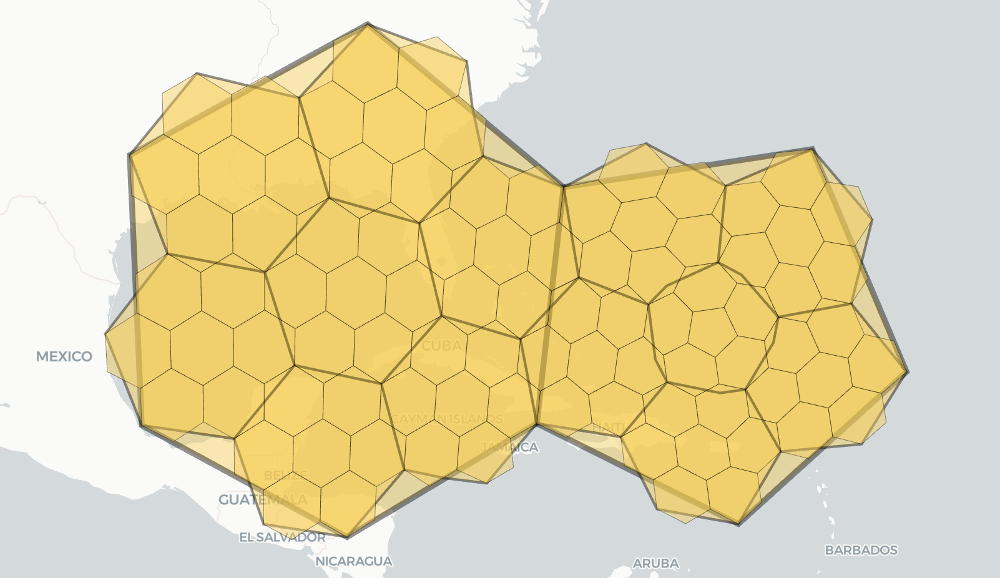

# 什么是geocoding？

Geocoding 是将地址描述（例如街道地址、城市名称、邮政编码等）转换为地理坐标（即纬度和经度）的过程。
这个过程使得基于地址的地理数据能够在地图上显示和使用。
例如，将地址 "1600 Amphitheatre Parkway, Mountain View, CA" 转换为地理坐标 (37.423021, -122.083739)。

## Geocoding 通常用于以下应用场景：

- 地图显示：将地址信息转换为坐标后，可以在地图上显示具体位置。
- 位置搜索：允许用户输入地址来查找特定位置。
- 路线规划：基于起点和终点的地址进行导航和路线规划。
- 位置分析：在地理信息系统（GIS）中进行空间分析和数据可视化。

## 逆向地理编码 (Reverse Geocoding)

逆向地理编码是将地理坐标转换为地址描述的过程。例如，将坐标 (37.423021, -122.083739) 转换为 "1600 Amphitheatre Parkway, Mountain View, CA"。

## Geocoding 服务

有许多在线服务和 API 可以执行 geocoding 和逆向地理编码，例如：

- Google Maps Geocoding API：提供全球范围的 geocoding 和逆向地理编码服务。
- OpenStreetMap (Nominatim)：一个开源的地理编码服务，基于 OpenStreetMap 数据。
- Bing Maps API：微软提供的地理编码和逆向地理编码服务。
- Mapbox Geocoding API：提供高性能的地理编码和逆向地理编码服务。

# uber h3 是什么？

1. Uber H3 是一个用于地理空间数据处理的开源库，旨在对地球表面进行空间划分和索引，形成一个离散的全球网格系统，用于将地理位置索引到六边形网格中。。
2. H3 是一个由 Uber 开发的六边形网格系统，其设计用于高效的地理位置编码和区域分析，每个坐标可以索引到单元格 ID，每个单元格 ID 代表一个唯一的单元格。
3. 索引数据可以跨不同的数据集快速连接，并以不同的精度级别进行聚合。
4. H3 支持一系列基于网格的算法和优化，包括最近邻、最短路径、梯度平滑等。
5. 通过使用 H3，开发人员可以在地理空间应用程序中实现高效的数据处理和分析。

uber研发初衷：用于有效优化乘车定价和调度，以及可视化和探索空间数据，H3能够分析地理信息，以设定动态价格并在全市范围内做出其他决策，来分析和优化整个市场。

为什么不对最细粒度进行分析呢？ 因为对最细粒度（即事件发生的确切位置）进行分析非常困难且昂贵。对区域（例如城市内的社区）的分析更为实用。主要体现以下几方面：

- 数据量庞大：高密度数据，例如，在一个繁忙的城市中，每分钟可能有成千上万的事件发生。
- 存储需求：存储和管理这些数据的成本也会显著增加。
- 高计算需求：例如，计算每个位置的交通模式、事件频率或热点分布等，都需要复杂的算法和处理能力。
- 性能问题：处理和分析大规模的细粒度数据可能会导致性能瓶颈，尤其是在实时数据流和大数据环境中。
- 个人隐私：细粒度位置数据可能涉及到用户的私人信息，如他们的具体行踪。
- 数据保护：保护用户隐私和数据安全增加了额外的复杂性和成本。需要采取加密、数据去标识化等措施来确保数据安全。
- 数据清洗：处理原始位置数据通常需要进行数据清洗和预处理，包括去除噪声、纠正错误和填补缺失值等。
- 高级分析：进行空间分析、模式识别和预测分析需要先进的分析工具和技术，这些通常需要高水平的专业知识和资源。
- 复杂的可视化：展示每个具体位置的数据可能需要复杂的可视化技术，以便于理解和决策。这些可视化工具的开发和维护也会增加成本。
- 模式识别：从细粒度数据中识别出有意义的模式和趋势可能非常困难，需要高级的分析方法和机器学习技术。

反观h3有以下几点好处：

- 数据简化：将数据按区域聚合，减少数据量，降低存储和计算需求。
- 易于处理：区域级分析更易于处理和分析，因为数据被分成了更管理和分析友好的块。
- 隐私保护：聚合数据可以减少对个人隐私的影响，更易于遵守隐私保护法规。

> H3开源时间：2018年, 实现语言：C语言

主要特点和功能：

- 六边形网格：H3 将地球表面划分为六边形网格，这种划分方式可以提供均匀的空间分布，使得地理区域的分析和处理更加简便。
- 空间索引：H3 提供了一个空间索引系统，可以用于高效地存储和查询地理空间数据。
- 分辨率：H3 网格系统支持不同的分辨率，从较大的区域到较小的区域都可以通过调整分辨率来表示。分辨率越高，网格的细节越精细。
- 空间分析：H3 允许进行各种空间分析任务，例如区域查询、邻域分析和聚合计算。它支持多种几何操作，如计算距离、查找相邻单元等。
- 开源：H3 是一个开源项目，用户可以根据自己的需要进行修改和扩展。它支持多种编程语言，包括 C、Python、JavaScript 和 Go。

典型应用：

- 地理数据可视化：使用 H3 的六边形网格，可以将地理数据以可视化方式呈现，帮助理解地理分布和模式。
- 位置服务：在位置服务应用中，可以使用 H3 进行高效的区域查询和分析。
- 城市规划和分析：H3 可以用于城市规划和区域分析，帮助优化资源分配和管理。
- 大数据处理：对于大规模的地理数据集，H3 提供了一种高效的处理和分析方法。

# 了解H3 

首先看下效果图

现实中点和区域效果

|                                      |  |  |
|--------------------------------------|--|--|
|  |  ||

为什么选择六边形，uber给的理由是：因为城市中的人们经常在运动，而六边形可以最大限度地减少用户在城市中移动时引入的量化误差。六边形还允许轻松地近似半径，因为目前能够做网格空间索引的形状只有三角形、矩形和六边形，而六边形因为边数最多，最接近圆，所以理论上来说在某些场景下是最优的选择。详细体现在以下几点

- 均匀性：六边形能够在平面上均匀地覆盖区域，没有明显的重叠或缝隙。与正方形网格相比，六边形的边界与邻接网格的边界之间的对接更加自然。
- 空间紧凑性：六边形的每个角都与其他六边形的角对接，这样可以更紧凑地填充空间，从而减少空白区域或重叠区域。
- 边界效应最小化：在六边形网格中，每个单元的边界长度是固定的，且与邻接单元的边界接触平滑，这样可以最小化在计算过程中由于边界分割引起的误差。
- 一致的距离：六边形的每个边长都相同，使得从一个六边形到其邻近六边形的距离保持一致。这种一致性有助于减少因距离不均匀引起的计算误差。
- 稳定的邻接关系：六边形网格的每个单元有六个邻接单元，这种稳定的邻接关系简化了空间计算，如距离计算和邻接查询。与其他形状相比，六边形的邻接关系更加均匀和一致。
- 减少“边界效应”：由于六边形的形状，网格之间的边界效应减少了。这使得在进行区域分析时，边界上的数据不会因为与邻接单元的不规则接触而产生误差。
- 多分辨率支持：六边形网格可以支持多种分辨率，通过改变六边形的大小来适应不同的分析需求。例如，可以使用较大的六边形进行宏观分析，使用较小的六边形进行微观分析。
- 比例一致性：由于六边形的对称性，其空间覆盖的比例在各个方向上是一致的，这有助于在进行比例分析时减少偏差。
- 与自然特征对接：在复杂的城市环境中，六边形网格比其他形状更能适应自然地理特征和城市道路布局，减少了人工创建网格时对自然地形的不适配。

在GIS领域中，对空间填充曲线熟悉的同学应该知道，不论是GeoHash, Z2或者Hilbert，虽然看起来都是将空间按照经纬度分割成了一个个大小相等的网格，但实际上这些网格的实际面积并不相等。对于靠近极地的网格，虽然经纬度的间隔没变，但由于地球的曲率，这些网格的实际面积远小于靠近赤道的网格。这种实际面积不相等的网格索引可能会造成一个问题，那就是由于网格大小不一致导致网格内数据量不一致，造成热网格和冷网格，Uber认为这会大大降低空间查询效率。

## 投影 + 网格

投影和网格是地理空间分析中的两个重要概念。投影是将地球表面的三维曲面转换为二维平面的过程。

投影类型：

- 等距投影：保持距离不变，但可能扭曲面积和角度。例如，墨卡托投影。
- 等角投影：保持角度不变，但可能扭曲距离和面积。例如，兰伯特正形投影。
- 等面积投影：保持面积不变，但可能扭曲距离和角度。例如，阿尔贝斯等面积投影。

投影的影响：

- 变形：不同的投影方式会对地图的面积、距离、角度和形状产生不同程度的变形。
- 应用选择：根据应用需求选择合适的投影方式，例如，导航应用通常使用墨卡托投影，而统计地图可能使用等面积投影。

网格是将地理区域划分为规则的单元格，用于数据存储、分析和可视化。网格可以有不同的形状，如正方形、矩形或六边形等。
选择合适的投影和网格系统可以减少数据处理中的变形和误差，确保地理数据的准确性和实用性。

## H3 投影

- H3以二十面体面（左）为中心的心轴投影进行 H3 的地图投影，将地球投影为球形二十面体（右）。
- 这将地球从一个球体投射到一个二十面体，即二十面的柏拉图立体，基于二十面体的地图投影会产生二十个独立的二维平面，而不是单个平面。
- 将地球当作一个二十面体，这个二十面体的每一个面都是球面三角形，有12个顶点，称为球形二十面体，在这个球形十二面体的每个面上都有相同排列方式的六边形。由于这个球形二十面体的12个顶点每一个都在地球上的水里，可以保证对于每个面做处理时不会遇到边界
- 二十面体可以通过多种方式展开，每次都会生成一个二维地图。
- H3并没有展开二十面体来构建其网格系统，而是将其网格放置在二十面体本身的表面上，形成测地离散全局网格系统。

|                                     |                                     |                                     |
|-------------------------------------|-------------------------------------|-------------------------------------|
|  |  |  |

uber自身认为使用六边形作为单元形状对于 H3 至关重要。因为从一个六边形中点到其邻域距离相等，只有一个距离(注：正方形有两个距离，三角形有三个距离)，如下：

|                                     |                                     |                                     |
|-------------------------------------|-------------------------------------|-------------------------------------|
|  |  |  |

H3 网格是通过在地球上布置 122 个基本单元而构建的，每个面有 10 个单元。有些单元被多个面所包含。
由于不可能仅用六边形来平铺二十面体，因此我们选择引入十二个五边形，每个二十面体顶点都有一个五边形。
这些顶点由 R. Buckminster Fuller 使用球面二十面体方向定位，将所有顶点放置在水中。这有助于避免我们的工作中出现五边形。

在二十面体的顶点处，有五个面交于这个顶点，每个面在这个顶点处都有一个小三角形，所以这些小三角形会形成一个五边形。也就是说，H3并不能保证每个空间单元都是六边形，在一些地方还是会存在五边形，但是这样做也不会造成很大影响，因为根据球形二十面体每个顶点都在水里的特性，这种五边形只会出现在水域周围，不会对Uber的打车和外卖业务造成很大的影响。

每个面上有5.5个六边形和3/5个五边形，即第0层一共有110个六边形和12个五边形。H3将这110个六边形称为基网格（base cells）。H3最高可以到15层，也就是说H3有16个层级的空间索引粒度，在粒度最细的第15层中，平均每个网格的大小为0.9平方米，平均边长为0.509713米。在往下一层划分时，每个父网格对应7个子网格

H3支持十六种分辨率。每个较精细分辨率的单元的面积是较粗分辨率的七分之一。六边形不能完美地细分为七个六边形，因此更精细的单元仅大致包含在母单元内。
这些子单元的标识符可以很容易地被截断，以更粗的分辨率找到它们的祖先单元，从而实现高效的索引。由于子单元仅被近似包含，因此截断过程会产生固定量的形状扭曲。这种失真仅在执行小区标识符截断时出现；当以特定分辨率索引位置时，单元边界是精确的。

|                                     |                                     |                                     |
|-------------------------------------|-------------------------------------|-------------------------------------|
|  |  |  |

## 坐标索引

对六边形索引，H3使用了一种IJK坐标系来确定六边形的位置。IJK坐标系长这样：

当然，H3不会简单地使用这种坐标系来对所有六边形进行编码，因为在每一个层级六边形的排列方式都不太一样。总的来说，在所有层级中，六边形的排列方式只有两种类型，称为Class II和Class III。在这两种类型的排列方式中，IJK坐标系的三个轴的方向不太一样。对于这种在一个二十面体的面上，根据不同的六边形排列方式使用不同方向坐标轴的坐标系，H3称之为FaceIJK坐标系：

那么对于一个面上所有层级的所有六边形，都使用FaceIJK坐标系编码，再加上面的唯一标识符可不可以？答案是可以，但没必要，因为如果这样做，H3编码会更加表示不了层级之间的关系。H3为了突出层级之间的关联性，使用了一种方法：每个六边形都包含其父六边形的坐标。这样只需要规定好每个网格的子网格坐标的计算方法，对于子网格，只需在父网格的坐标后面追加子网格的坐标即可。这样一来，只需关注一个网格的7个子网格如何计算坐标，所有层级的每个网格的坐标都可以递归得到，这7个网格坐标的计算方法见图7，为了表述方便，我称之为IJK七网格坐标系。那么还有12个五边形咋办？不好意思，那12个五边形随着层级划分仍然是12个，层级越高这些五边形越小，并且都在海里，影响不大，直接不管了！

# 使用

H3库的基本功能是索引位置，它将纬度和经度对转换为64位H3索引，识别网格单元。
函数 geoToH3 接受纬度、经度和分辨率（0 到 15 之间，0 表示最粗略，15 表示最精细），并返回一个索引。 h3ToGeo 和 h3ToGeoBoundary 是该函数的反函数，分别提供由 H3 索引指定的网格单元的中心坐标和轮廓。

相邻的六边形具有使用网格系统近似圆形的有用属性。 kRing 函数提供原点索引的网格距离 k 内的网格单元。

H3 的分层性质允许有效地截断索引的精度（或分辨率）并恢复原始索引。上面显示了一组六边形的非紧凑和紧凑表示。
非紧凑表示在分辨率为 6 时具有 10,633 个六边形，但紧凑表示在分辨率高达 6 时具有 901 个六边形。在这两种情况下，六边形索引都是 64 位整数。

|                                     |                                     | 
|-------------------------------------|-------------------------------------|
|  |  |

# 参考

[H3 官网](https://h3geo.org/)
[H3: Uber’s Hexagonal Hierarchical Spatial Index](https://www.uber.com/en-JP/blog/h3/)
[H3 Index Bit Layout](https://observablehq.com/@nrabinowitz/h3-index-bit-layout)
[H3 Index Structure](https://h3geo.org/docs/core-library/h3indexing)
[Tables of Cell Statistics Across Resolutions](https://h3geo.org/docs/core-library/restable)
[Coordinate systems](https://h3geo.org/docs/core-library/coordsystems)
