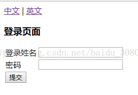
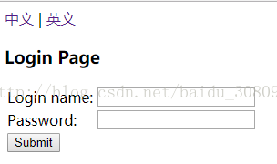

# 定义properties文件

① message.properties

```
loginname = Login name:
password = Password:
submit = Submit
welcome = Welcome {0} access demo
title = Login Page
username = administrator
```

② message_en_US.properties

```
loginname = Login name:
password = Password:
submit = Submit
welcome = Welcome {0} access demo
title = Login Page
#username = administrator
```

③  message_zh_CN.properties

```
loginname=\u767b\u5f55\u59d3\u540d
password=\u5bc6\u7801
submit=\u63d0\u4ea4
welcome=\u6b22\u8fce{0}\u8bbf\u95eeDemo
title=\u767b\u5f55\u9875\u9762
#username=\u7528\u6237\u540d
```

# 定义spring mvc配置文件

```xml
<?xml version="1.0" encoding="UTF-8"?>
<beans xmlns="http://www.springframework.org/schema/beans"
       xmlns:mvc="http://www.springframework.org/schema/mvc" xmlns:context="http://www.springframework.org/schema/context"
       xmlns:tx="http://www.springframework.org/schema/tx" xmlns:aop="http://www.springframework.org/schema/aop"
       xmlns:p="http://www.springframework.org/schema/p" xmlns:xsi="http://www.w3.org/2001/XMLSchema-instance"
       xmlns:cache="http://www.springframework.org/schema/cache"
       xsi:schemaLocation="
        http://www.springframework.org/schema/beans
        http://www.springframework.org/schema/beans/spring-beans.xsd
        http://www.springframework.org/schema/mvc
        http://www.springframework.org/schema/mvc/spring-mvc.xsd
        http://www.springframework.org/schema/context
        http://www.springframework.org/schema/context/spring-context.xsd
        http://www.springframework.org/schema/tx
		http://www.springframework.org/schema/tx/spring-tx.xsd
		http://www.springframework.org/schema/aop
		http://www.springframework.org/schema/aop/spring-aop.xsd
		http://www.springframework.org/schema/cache http://www.springframework.org/schema/cache/spring-cache.xsd">
 
    <!-- 自动扫描controller包下的所有类，使其认为spring mvc的控制器 -->
    <context:component-scan base-package="com.demo">
        <context:include-filter type="annotation"
                                expression="org.springframework.stereotype.Controller" />
    </context:component-scan>
 
    <!-- 相当于注册了DefaultAnnotationHandlerMapping和AnnotationMethodHandlerAdapter两个bean，配置一些messageconverter。即解决了@Controller注解的使用前提配置。 -->
    <mvc:annotation-driven />
 
    <!--加载国际化配置-->
    <bean id="messageSource" class="org.springframework.context.support.ResourceBundleMessageSource">
        <!-- 国际化信息所在的文件名 -->
        <property name="basename" value="bundle.message"/>
 
        <!-- 如果在国际化资源文件中找不到对应代码的信息，就用这个代码作为名称  -->
        <property name="useCodeAsDefaultMessage" value="true" />
    </bean>
 
    <mvc:interceptors>
        <!--国际化拦截器如果采用基于（session/cookie）则必须配置-->
        <bean class="org.springframework.web.servlet.i18n.LocaleChangeInterceptor"/>
    </mvc:interceptors>
 
    <!--AcceptHeaderLocaleResolver配置，因为AcceptHeaderLocaleResolver是默认语言区域，不配置也可以-->
    <!--<bean id="localeResolver" class="org.springframework.web.servlet.i18n.AcceptHeaderLocaleResolver"/>-->
    <!--SessionLocaleResolver-->
    <bean id="localeResolver" class="org.springframework.web.servlet.i18n.SessionLocaleResolver"/>
 
    <!-- 对模型视图名称的解析，即在模型视图名称添加前后缀 -->
    <bean class="org.springframework.web.servlet.view.InternalResourceViewResolver" p:prefix="/WEB-INF/views/" p:suffix=".jsp" />
 
</beans>
```

# 定义jsp

```jsp
<%@page language="java" contentType="text/html; charset=UTF-8" pageEncoding="UTF-8" %>
<%@taglib prefix="form" uri="http://www.springframework.org/tags/form" %>
<%@taglib prefix="spring" uri="http://www.springframework.org/tags" %>
<jsp:useBean id="user" class="com.demo.domain.User" scope="request"/>
<html>
<head>
    <meta http-equiv="content-type" content="text/html;charset=UTF-8">
    <title>测试基于HttpSession的国际化</title>
</head>
<body>
 
<!--用户可以选择切换语言环境-->
<a href="home?request_locale=zh_CN">中文</a> | <a href="home?request_locale=en_US">英文</a>
 
<br/>
 
<h3><spring:message code="title"/></h3>
<form:form modelAttribute="user" method="post" action="login">
    <table>
        <tr>
            <td><spring:message code="loginname"/></td>
            <td><form:input path="loginname"/></td>
        </tr>
        <tr>
            <td><spring:message code="password"/></td>
            <td><form:input path="password"/></td>
        </tr>
        <tr>
            <td><input type="submit" value="<spring:message code="submit"/>"></td>
        </tr>
    </table>
</form:form>
 
</body>
</html>
```

# 添加controller

git@github.com:SincerelyUnique/spring-mvc-Internationalization-httpsession.git

# 结果




