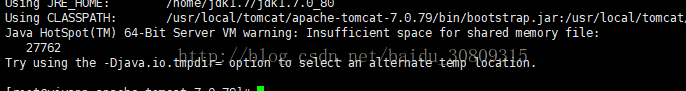
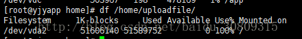

线上服务器运行时突然停止了，而且访问这台服务器的界面很卡，而且停止服务器时遇到如下问题：



> Insufficient space for shared memory file

首先咨询百度翻译，意思是：共享内存文件空间不足。

提示文件空间不足，而恰巧我们的程序涉及到文件的上传。

那么肯定是文件存储的磁盘空间不足。

使用df查看一下文件存储的磁盘的利用率，已然达到了100%。如下：



好吧，咨询了一下专业的人士，他将不要将tomcat放在 /usr/local下面，因为 /usr/目录与/home目录共用一个磁盘分区，而且分区比较小。

建议将服务器放到/app目录下。/app是专门存放应用的路径。

附录：

下面是一些linux查看磁盘的命令演示：

```bash
[root@yjyapp ~]# df -m
Filesystem     1M-blocks  Used Available Use% Mounted on
/dev/vda2          50397 25763     22075  54% /
tmpfs               7976     1      7976   1% /dev/shm
/dev/vda1            194    34       151  19% /boot
/dev/vdb          201587   188    191160   1% /file
/dev/vdc          503967   944    477423   1% /app
```

```bash
[root@yjyapp ~]# fdisk -l
 
Disk /dev/vda: 64.4 GB, 64424509440 bytes
16 heads, 63 sectors/track, 124830 cylinders
Units = cylinders of 1008 * 512 = 516096 bytes
Sector size (logical/physical): 512 bytes / 512 bytes
I/O size (minimum/optimal): 512 bytes / 512 bytes
Disk identifier: 0x000edfae
   Device Boot      Start         End      Blocks   Id  System
/dev/vda1   *           3         409      204800   83  Linux
Partition 1 does not end on cylinder boundary.
/dev/vda2             409      104434    52428800   83  Linux
Partition 2 does not end on cylinder boundary.
/dev/vda3          104434      121078     8388608   82  Linux swap / Solaris
Partition 3 does not end on cylinder boundary.
Disk /dev/vdb: 214.7 GB, 214748364800 bytes
16 heads, 63 sectors/track, 416101 cylinders
Units = cylinders of 1008 * 512 = 516096 bytes
Sector size (logical/physical): 512 bytes / 512 bytes
I/O size (minimum/optimal): 512 bytes / 512 bytes
Disk identifier: 0x00000000
Disk /dev/vdc: 536.9 GB, 536870912000 bytes
16 heads, 63 sectors/track, 1040253 cylinders
Units = cylinders of 1008 * 512 = 516096 bytes
Sector size (logical/physical): 512 bytes / 512 bytes
I/O size (minimum/optimal): 512 bytes / 512 bytes
Disk identifier: 0x00000000
```

```bash
[root@yjyapp ~]# df -lh
Filesystem      Size  Used Avail Use% Mounted on
/dev/vda2        50G   26G   22G  54% /
tmpfs           7.8G  264K  7.8G   1% /dev/shm
/dev/vda1       194M   34M  151M  19% /boot
/dev/vdb        197G  188M  187G   1% /file
/dev/vdc        493G  944M  467G   1% /app
```

```bash
[root@yjyapp ~]# df -lh /home/uploadfile/
Filesystem      Size  Used Avail Use% Mounted on
/dev/vda2        50G   26G   22G  54% /
```

查看当前目录下各文件夹所占内存及总内存

```bash
[root@oadev weaver]# du -ah --max-depth=1
1.1G	./workspace
47M	./e-message客户端
299M	./jdk1.7.0_79
1.4G	./EMobile_bak
234M	./jdk1.6.0_27
4.0K	./lost+found
808M	./Resin
27M	./e-message
86M	./EMobile
1.3G	./ESearch
1.8G	./ESearch_bak
92G	./ecology
264K	./diffver
98G	.
```
