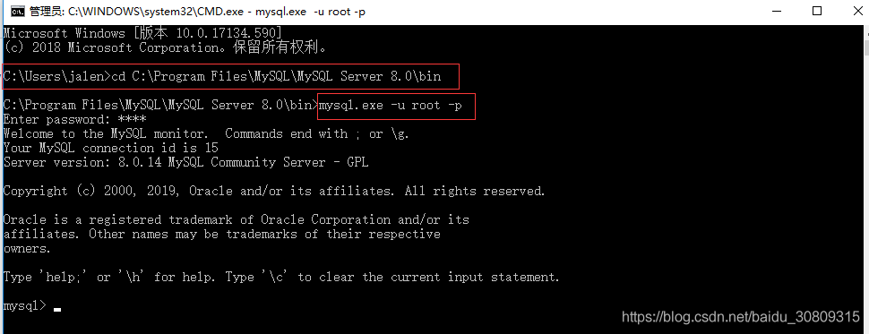
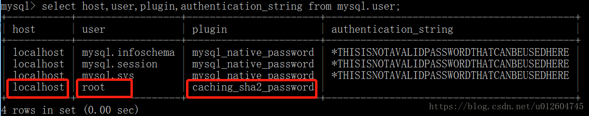
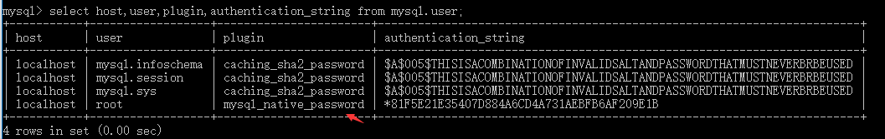
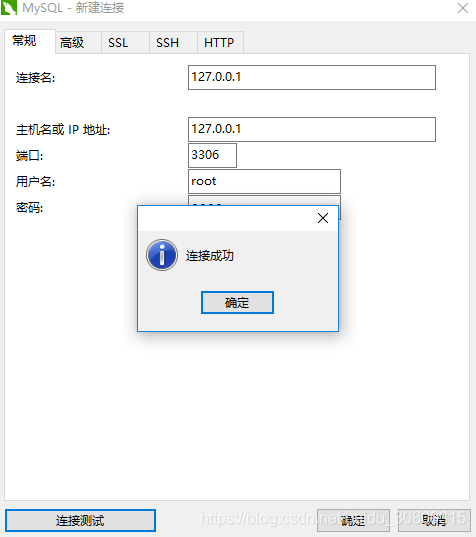

1. 以windows为例，cmd进入命令行，cd进入mysql安装后的bin目录，登陆mysql



2. 查看用户信息

```sql
select host,user,plugin,authentication_string from mysql.user;
```



3. 更新密码

```sql
ALTER USER 'root'@'localhost' IDENTIFIED WITH mysql_native_password BY 'root';
```

4. 再次查看用户信息，并核对



5. 登陆navicat for mysql



参考：https://blog.csdn.net/u012604745/article/details/80632860 
