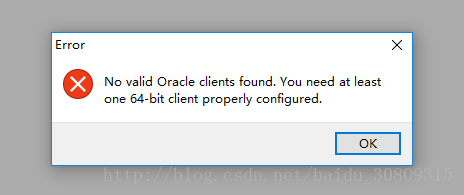

1. 问题：安装了toad for oracle12.12后，当打开软件时显示该错误。

2. 原因：没有安装64位oracle客户端。

3. 解决办法：

（1）下载安装toad for oracle 12.12 （其他版本也可以）

（2）打开后，你会看到上面的错误提示。

（3）下载 instant client 12.2

（4）解压到任意位置，如C:\app\instantclient_12_2

（5）设置环境变量，“TNS_ADMIN”，

（6）同理，设置系统Path变量

（7）然后把你之前配置好的 tnsnames.ora 文件移动到 C:\app\instantclient_12_2 中，这样就做好了。

附录：

本文参考自[stackexchange](https://dba.stackexchange.com/questions/175333/db-client-tool-to-get-the-error-message-when-open-toad-oracle-client)。
