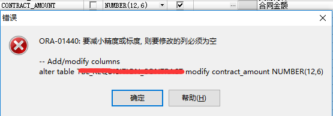

这是一个oracle改字段精度时遇到的问题，原本字段的类型为`number(12,2)`

想要精确到小数点后6位

当修改为`number(12,6)`时，遇到

应该改为`number(16,6)`,两边各加4位,此时正确

附录：

参考：[官网](https://docs.oracle.com/cd/B19306_01/server.102/b14200/sql_elements001.htm)
参考：[MSDN](https://www.microsoft.com/en-us/download/details.aspx?id=56495)

