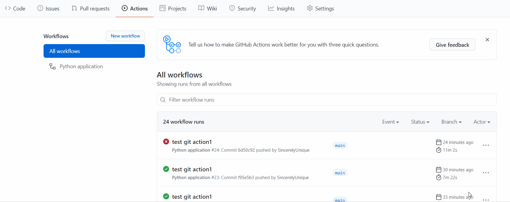

```bash
使用git自带的action脚本实现CI/CD
 
先理解下CI/CD概念（CD有两种意思）
CI：continuous integration，持续集成，属于开发人员的自动化流程，是一种软件工程流程，
    是将所有软件工程师对于软件的工作副本持续集成到共享主线（mainline）的一种举措。
CD：continuous delivery，持续交付，是一种软件工程手法，让软件产品的产出过程在一个短
    周期内完成，以保证软件可以稳定、持续的保持在随时可以释出的状况。
CD：continuous deployment，持续部署，是一种软件工程方法，意指在软件开发流程中，以自
    动化方式，频繁而且持续性的，将软件部署到生产环境（production environment）中，
    使软件产品能够快速的发展。
 
CI/CD工具有很多，比如CircleCI、TravisCI、Jenkins等等，这里使用的是GitHub在2019年8月份
推出的Action，只需要在repository里新增一个yml文件就可以了。
 
在repository里面新建.github/workflows/python-app.yml   (文件名字叫其他名字应该也没关
系，我这里就不去验证了)，下面是这个文件内容。
```

```yaml
# This workflow will install Python dependencies, run tests and lint with a single version of Python
# For more information see: https://help.github.com/actions/language-and-framework-guides/using-python-with-github-actions
 
name: Python application
 
on:
  push:
    branches: [ main ]
  pull_request:
    branches: [ main ]
 
jobs:
  build:
 
    runs-on: ubuntu-latest
 
    steps:
    - uses: actions/checkout@v2
    - name: Set up Python 3.6.8
      uses: actions/setup-python@v2
      with:
        python-version: 3.6.8
    - name: Install dependencies
      run: |
        python -m pip install --upgrade pip
        pip install flake8 pytest
        if [ -f requirements.txt ]; then pip install -r requirements.txt; fi
#    - name: Lint with flake8
#      run: |
#        # stop the build if there are Python syntax errors or undefined names
#        flake8 . --count --select=E9,F63,F7,F82 --show-source --statistics
#        # exit-zero treats all errors as warnings. The GitHub editor is 127 chars wide
#        flake8 . --count --exit-zero --max-complexity=10 --max-line-length=127 --statistics
#    - name: Test with pytest
#      run: |
#        pytest
    - name: CD
      uses: appleboy/ssh-action@master
      with:   #  参考：https://github.com/marketplace/actions/ssh-remote-commands
        host: ${{ secrets.HOST }}  # 这里变量配置见下图
        USERNAME: ${{ secrets.USERNAME }}
        KEY: ${{ secrets.SSHKEY }}
        PORT: ${{ secrets.PORT }}
        script: |           # 这里根据自己项目写自己实际需要执行的脚本，其实就是pull代码启动server
          cd /usr/local/app/app-backend
          echo 'source code'
          git pull git@github.com:Sincerely/app-backend.git
          source ../venv/bin/activate
          pip install -r requirements.txt
          pid=$(cat /usr/local/app/app-backend/logs/app.pid)
          echo "$pid"
          kill -9 $pid
          nohup ./run_app.sh >> app.out 2>&1 &
```



```bash
HOST：你的centos ip地址
PORT：你的centos ssh 登录端口，不写默认是22（这里没有去验证，我这里不是22）
SSHKEY：你的centos使用ssh-keygen生成的私钥id_rsa
USERNAME：你的centos使用ssh-keygen生成的公钥结尾@符号前的用户名，比如你用root执行ssh-keygen，那么这里USERNAME就是root，实际你可以打开id_rsa.pub看一下
 
SSHKEY生成，可以进入centos执行
$ ssh-keygen     # 看到.ssh下面生成id_rsa.pub公钥 和 id_rsa私钥
$ cat ~/.ssh/id_rsa.pub >> ~/ssh/authorized_keys
SSHKEY就是id_rsa私钥的那一串字符串
```

```bash
一般来说第一次还是需要在server上手动做一些事情，下面列举一些第一次我手动做的事情：
1.安装python3
2.使用python3装venv虚拟环境
3.创建文件夹app，chmod -R 777 /usr/local/app
4.git clone git@xxx.git 到app文件夹内
5.使用pip安装requirements.txt依赖, 
6.chmod -R 777 run_app.sh
 
总的来说第一次可能会遇到一些环境问题，解决掉，下一次再commit code到这个分支就不用去理会了，Github Actions会自动帮我们去测试部署
 
 
备注：我这里使用的是Github公共仓库不是私有库，好像私有库在git pull时候会有些问题，未深究
```
