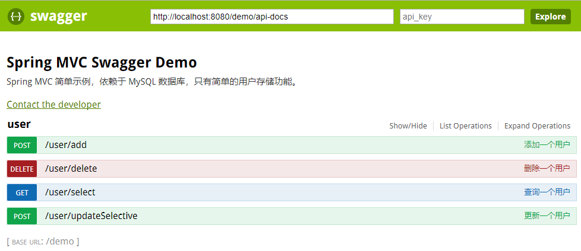

步骤：


1. 搭建SSM框架；


2. 引入maven依赖：

```xml
    <dependency>
      <groupId>com.mangofactory</groupId>
      <artifactId>swagger-springmvc</artifactId>
      <version>1.0.2</version>
    </dependency>
```

3. 拷贝dist目录下文件到webapp下面，并修改index.html中的url指向自己的地址；

4. 启动服务，页面输入: http://localhost:8080/demo/swagger/index.html

5. 成功显示如下



附录：

代码托管在github：

https://github.com/SincerelyUnique/ssm-swagger2


参考地址：

https://github.com/albertchendao/demos/tree/master/java/spring/HelloWorld-MVC-Swagger

注：swagger3-ui有变动，配置时需按照要求来
