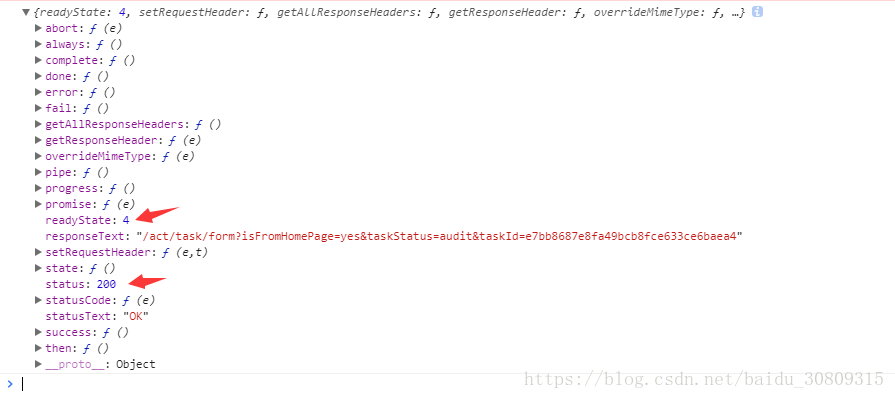
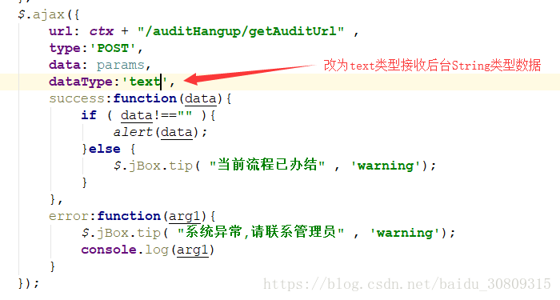

# ajax请求

```javascript
    $.ajax({
        url: ctx + "/auditHangup/getAuditUrl" ,
        type:'POST',
        data: params,
        dataType:'json',
        success:function(data){
            if ( data!=="" ){
                alert(data);
            }else {
                $.jBox.tip( "当前流程已办结" , 'warning');
            }
        },
        error:function(arg1){
            $.jBox.tip( "系统异常,请联系管理员" , 'warning');
            console.log(arg1)
        }
    });
```

# 后台接口

```java
    /**
     * 跳转到审核页面
     * @param projectId 项目id
     * @return 页面
     */
    @RequestMapping("getAuditUrl")
    @ResponseBody
    public String redirectAuditUrl( String projectId ){
        return auditHangupService.getAndAssembleAuditPageUrl(projectId);
    }
```

# ajax error

执行后打印ajax方法的error参数arg1信息，返回的状态是正常的200



# 解决方式

因为后台返回的是String类型数据，所以前台ajax接收数据时，需将dataType定义为text形式，如下



# 再次尝试请求，请求成功

附：

1. ajax的readyState状态值说明

在AJAX实际运行当中，对于访问XMLHttpRequest（XHR）时并不是一次完成的，而是分别经历了多种状态后取得的结果，对于这种状态在AJAX中共有5种，分别是。
0 - (未初始化)还没有调用send()方法
1 - (载入)已调用send()方法，正在发送请求
2 - (载入完成)send()方法执行完成，
3 - (交互)正在解析响应内容
4 - (完成)响应内容解析完成，可以在客户端调用了
对于上面的状态，其中“0”状态是在定义后自动具有的状态值，而对于成功访问的状态（得到信息）我们大多数采用“4”进行判断。

 

2. AJAX的status状态码说明

1**：请求收到，继续处理
2**：操作成功收到，分析、接受
3**：完成此请求必须进一步处理
4**：请求包含一个错误语法或不能完成
5**：服务器执行一个完全有效请求失败
100——客户必须继续发出请求
101——客户要求服务器根据请求转换HTTP协议版本
200——交易成功
201——提示知道新文件的URL
202——接受和处理、但处理未完成
203——返回信息不确定或不完整
204——请求收到，但返回信息为空
205——服务器完成了请求，用户代理必须复位当前已经浏览过的文件
206——服务器已经完成了部分用户的GET请求
300——请求的资源可在多处得到
301——删除请求数据
302——在其他地址发现了请求数据
303——建议客户访问其他URL或访问方式
304——客户端已经执行了GET，但文件未变化
305——请求的资源必须从服务器指定的地址得到
306——前一版本HTTP中使用的代码，现行版本中不再使用
307——申明请求的资源临时性删除
400——错误请求，如语法错误
401——请求授权失败
402——保留有效ChargeTo头响应
403——请求不允许
404——没有发现文件、查询或URl
405——用户在Request-Line字段定义的方法不允许
406——根据用户发送的Accept拖，请求资源不可访问
407——类似401，用户必须首先在代理服务器上得到授权
408——客户端没有在用户指定的饿时间内完成请求
409——对当前资源状态，请求不能完成
410——服务器上不再有此资源且无进一步的参考地址
411——服务器拒绝用户定义的Content-Length属性请求
412——一个或多个请求头字段在当前请求中错误
413——请求的资源大于服务器允许的大小
414——请求的资源URL长于服务器允许的长度
415——请求资源不支持请求项目格式
416——请求中包含Range请求头字段，在当前请求资源范围内没有range指示值，请求也不包含If-Range请求头字段
417——服务器不满足请求Expect头字段指定的期望值，如果是代理服务器，可能是下一级服务器不能满足请求
500——服务器产生内部错误
501——服务器不支持请求的函数
502——服务器暂时不可用，有时是为了防止发生系统过载
503——服务器过载或暂停维修
504——关口过载，服务器使用另一个关口或服务来响应用户，等待时间设定值较长
505——服务器不支持或拒绝支请求头中指定的HTTP版本
