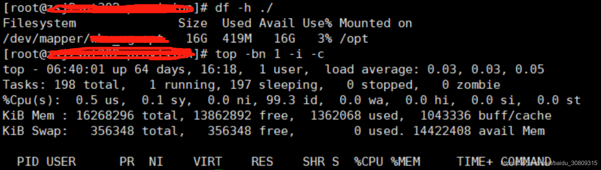

背景：

flask项目，gunicorn server，apscheduler定时框架

Server配置：1个worker，timeout设置为900s（15min），单点

apscheduler定时任务配置：max thread 20， max process 5，misfire_grace_time 900，当前job几百个

 

问题：

运行时遇到有些job莫名其妙中断，job本身code没有问题 

日志：

日志1：

```log
2019-08-08 09:22:18,410 base.py:120:WARNING:Run time of job "Monitor Job (trigger: interval[1 day, 0:00:00], next run at: 2019-08-08 09:07:07 GMT)" was missed by 0:15:10.588683
```

日志2：

```log
2019-08-08 09:06:56,435 __init__.py:184:INFO:Job update sql:insert xx into xxx
[2019-08-08 09:21:56 +0000] [9765] [CRITICAL] WORKER TIMEOUT (pid:10176)
[2019-08-08 09:21:57 +0000] [10440] [INFO] Booting worker with pid: 10440
2019-08-08 09:21:57,935 base.py:433:INFO:Adding job tentatively -- it will be properly scheduled when the scheduler starts
2019-08-08 09:21:58,055 base.py:867:INFO:Added job "manage_backend_jobs" to job store "default"
2019-08-08 09:21:58,055 base.py:159:INFO:Scheduler started
```

分析：

日志1原因：根据配置观察，可能因为当前线程池线程数量达到上限，该job持续等待，超过了900s仍未执行，job中断

日志2原因：查看日志时间有个较大幅度的变化，正好符合配置中的15min超时设置，可以认为该job在运行阶段因网络IO或其他原因阻塞，导致worker达到超时上限，scheduler重启

解决：

（1）查询服务器当前性能，适当提高进程池，线程池配置



（2）分布式Job 

参考：

https://github.com/benoitc/gunicorn/issues/1801
