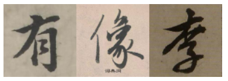
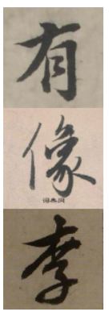

# canvas拼接图片

## 效果

### 横向拼接



### 纵向拼接



## 代码

### html

```html
<!DOCTYPE html>
<html lang="en">
<head>
    <meta charset="UTF-8">
    <title>Title</title>
    <script src="https://code.jquery.com/jquery-3.2.1.min.js"></script>
    <script type="text/javascript" src="test.js"></script>
</head>
<body>
</body>
</html>
```

### js

```js
$(function(){
  debugger
  const urlList = [
    './img/1.jpg',
    './img/2.jpg',
    './img/3.jpg'
  ]

  // mergeImgsRow(urlList).then(base64 => {
  //   const imgDom = document.createElement('img')
  //   imgDom.src = base64
  //   document.body.appendChild(imgDom)
  // })

  mergeImgsColumn(urlList).then(base64 => {
    const imgDom = document.createElement('img')
    imgDom.src = base64
    document.body.appendChild(imgDom)
  })
})

/**
 * 合并多张图片，返回新的图片
 * @param {Array} list 图片url数组
 * @param {Number} cwith 画布宽度 默认500
 * @param {Number} cheight 画布高度 默认500
 */
function mergeImgsColumn(list, cwith = 100, cheight = 100) {
  debugger
  return new Promise((resolve, reject) => {
    const baseList = []

    // 创建 canvas 节点并初始化
    const canvas = document.createElement('canvas')
    canvas.width = cwith
    canvas.height = cheight * list.length
    const context = canvas.getContext('2d')

    list.map((item, index) => {
      const img = new Image()
      img.src = item
      // 跨域
      img.crossOrigin = 'Anonymous'

      img.onload = () => {
        context.drawImage(img, 0, cheight * index, cwith, cheight)
        const base64 = canvas.toDataURL('image/png')
        baseList.push(base64)

        if (baseList[list.length - 1]) {
          console.log(baseList)
          // 返回新的图片
          resolve(baseList[list.length - 1])
        }
      }
    })
  })
}

/**
 * 合并多张图片，返回新的图片
 * @param {Array} list 图片url数组
 * @param {Number} cwith 画布宽度 默认500
 * @param {Number} cheight 画布高度 默认500
 */
function mergeImgsRow(list, cwith = 100, cheight = 100) {
  debugger
  return new Promise((resolve, reject) => {
    const baseList = []

    // 创建 canvas 节点并初始化
    const canvas = document.createElement('canvas')
    canvas.width = cwith * list.length
    canvas.height = cheight
    const context = canvas.getContext('2d')

    list.map((item, index) => {
      const img = new Image()
      img.src = item
      // 跨域
      img.crossOrigin = 'Anonymous'

      img.onload = () => {
        context.drawImage(img, cwith * index, 0, cwith, cheight)
        const base64 = canvas.toDataURL('image/png')
        baseList.push(base64)

        if (baseList[list.length - 1]) {
          console.log(baseList)
          // 返回新的图片
          resolve(baseList[list.length - 1])
        }
      }
    })
  })
}
```

## 图片下载地址

https://c.cidianwang.com/file/shufa/xingshu/a/2021108162951c2d38.jpg

https://c.cidianwang.com/file/shufa/xingshu/zhaomengfu/20197251657326f9ae.jpg

https://c.cidianwang.com/file/shufa/xingshu/a/20211081156390fdd4.jpg

http://fabricjs.com/ (这个也蛮好玩的)
