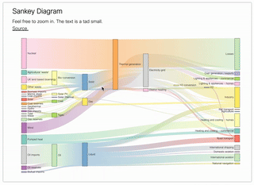

# effect



# reference 

  d3 version: 5.7.0

  d3-sankey version: 0.7.1

  - https://codepen.io/borntofrappe/pen/KrBypK

# dependency

├── d3-sankey@0.12.3
├── d3@7.2.1
├── dagre-d3@0.6.4

```json
{
  "dependencies": {
    "d3": "^7.2.1",
    "d3-sankey": "^0.12.3",
    "dagre-d3": "^0.6.4"
  }
}
```

# implementation

```vue 
<template>
  <div class="sankey-d3-demo">
    <div class="container"></div>
  </div>
</template>
<script>
import * as d3 from "d3";
import * as d3Sankey from 'd3-sankey';
import { zoom } from 'd3-zoom';

export default {
  name: "SankeyD3Demo",
  data() {
    return {

    };
  },
  components: {},
  created() {

  },
  mounted() {
    this.initChart()
  },
  methods: {
    initChart(){
      const container = d3.select('.container');

      // visualization based on the example at the provided url
      const source = 'https://beta.observablehq.com/@mbostock/d3-sankey-diagram';
      const url = 'https://gist.githubusercontent.com/mbostock/ca9a0bb7ba204d12974bca90acc507c0/raw/398136b7db83d7d7fd89181b080924eb76041692/energy.json';

      container
          .append('h2')
          .text('Sankey Diagram');

      container
          .append('p')
          .text('Feel free to zoom in. The text is a tad small.');

      container
          .append('a')
          .attr('href', source)
          .text('Source.');

      const tooltip = container
          .append('div')
          .attr('id', 'tooltipaaa');

      // SVG frame
      // the same margin, width and height are used for both visualizations
      const margin = {
        top: 20,
        right: 20,
        bottom: 20,
        left: 20,
      };

      const width = 1000 + (margin.left + margin.right);
      const height = 600 + (margin.top + margin.bottom);

      const containerFrame = container
          .append('svg')
          .attr('viewBox', `0 0 ${width + (margin.left + margin.right)} ${height + (margin.top + margin.bottom)}`)
          .append('g')
          .attr('transform', `translate(${margin.left}, ${margin.top})`);

      // ZOOM feature
      // include a rectangle spanning the entire container, as to allow a translation on the wrapping group
      containerFrame
          .append('rect')
          .attr('x', 0)
          .attr('y', 0)
          .attr('width', width)
          .attr('height', height)
          .attr('fill', 'transparent');


      function zoomed(event) {
        // 从事件对象中获取缩放的转换信息
        const { x, y, k } = event.transform;
        // 使用缩放信息来进行操作
        containerFrame.attr('transform', `translate(${x} ${y}) scale(${k})`);
      }
      const zoomBehavior = zoom().on("zoom", zoomed);
      containerFrame
          .call(zoomBehavior);


      // function creating the sankey diagram, based on an input data and frame (in which the visualization is plotted)
      function createSankeyDiagram(data, frame) {
        // detail a color scale
        const color = d3
            .scaleOrdinal(d3.schemeSet3);

        // detail the sankey function
        const sankey = d3Sankey
            .sankey()
            // limit the nodes and links within the containing group
            .extent([[0, 0], [width, height]]);

        // destructure the two arrays for the nodes and links in two variables
        const { nodes, links } = sankey(data);

        // detail in a defs block one linear gradient for each link
        // detail a unique identifier as to later call the id with the specified index
        const defs = frame
            .append('defs');

        const linearGradients = defs
            .selectAll('linearGradient')
            .data(links)
            .enter()
            .append('linearGradient')
            .attr('id', d => `gradient${d.index}`)
            .attr('x1', '0%')
            .attr('y1', '50%')
            .attr('x2', '100%')
            .attr('y2', '50%');

        // linear gradient going from left to right and detailing a color based on the source and target values
        linearGradients
            .append('stop')
            .attr('offset', '0%')
            .attr('stop-color', d => color(d.source.index));

        linearGradients
            .append('stop')
            .attr('offset', '100%')
            .attr('stop-color', d => color(d.target.index));

        // detail a generator function for the links
        const sankeyLinks = d3Sankey
            .sankeyLinkHorizontal();

        // append a path element for each link
        // using the generator function
        frame
            .selectAll('path.link')
            .data(links)
            .enter()
            .append('path')
            .attr('class', 'link')
            .attr('d', sankeyLinks)
            .attr('fill', 'none')
            // stroke using the gradient
            .attr('stroke', d => `url(#gradient${d.index})`)
            // stroke width based on the width of each data point
            .attr('stroke-width', d => d.width)
            // alter the opacity on hover
            // detail also the data through a simple tooltip
            .attr('opacity', 0.5)
            .on('mouseenter', function (event, d) {
              d3
                  .select(this)
                  .transition()
                  .attr('opacity', 1);
              tooltip
                  .append('p')
                  .html(`<strong>${d.source.name}</strong> - <strong>${d.target.name}</strong>`);

              tooltip
                  .append('p')
                  .html(`Value: <strong>${d.value}</strong>`);

              const mouseX = event.pageX;
              const mouseY = event.pageY;
              tooltip
                  .style('opacity', 1)
                  .style('left', `${mouseX}px`)
                  .style('top', `${mouseY}px`);
            })
            .on('mouseout', function () {
              d3
                  .select(this)
                  .transition()
                  .attr('opacity', 0.5);

              tooltip
                  .style('opacity', 0)
                  .selectAll('p')
                  .remove();
            });

        // append a rectangle for each node
        // using the fabricated values and the color based on the index
        frame
            .selectAll('rect.node')
            .data(nodes)
            .enter()
            .append('rect')
            .attr('class', 'node')
            .attr('x', d => d.x0)
            .attr('y', d => d.y0)
            .attr('width', d => (d.x1 - d.x0))
            .attr('height', d => (d.y1 - d.y0))
            .attr('pointer-events', 'none')
            .attr('stroke', '#555')
            .attr('stroke-width', '1px')
            .attr('fill', d => color(d.index));

        // for each node append also a text element, detailing the respective value
        // horizontally position the text after or before the rectangle elements for each node
        frame
            .selectAll('text.node')
            .data(nodes)
            .enter()
            .append('text')
            .text(d => d.name)
            .attr('font-size', '0.75rem')
            .attr('fill', '#111')
            .attr('x', (d) => {
              if (d.sourceLinks.length > 0) {
                return d.x0 + sankey.nodeWidth() + 5;
              }
              return d.x0 - 5;
            })
            .attr('y', d => (d.y1 + d.y0) / 2)
            .attr('pointer-events', 'none')
            .attr('alignment-baseline', 'middle')
            .attr('text-anchor', d => ((d.sourceLinks.length > 0) ? 'start' : 'end'));
      }

      fetch(url)
          .then(response => response.json())
          .then(json => createSankeyDiagram(json, containerFrame));

    }
  },
};
</script>
<style lang="scss">
.sankey-d3-demo{
  .container{
    max-width: 800px;
    margin: 1rem auto;
    padding: 1rem 2rem;
    border-radius: 2px;
    background: #FFFFFF;
    box-shadow: 0 0 2px #2D2C35;

    div {
      margin-bottom: 1.5rem
    }

    p {
      margin: 0.8rem 0 0.4rem
    }

    a {
      color: inherit
    }


  }
}
#tooltipaaa {
  pointer-events: none;
  position: absolute;
  opacity: 0;
  padding: 1rem;
  background: #FFFFFF;
  box-shadow: 0 0 4px rgba(#42424E, 0.2);
  line-height: 2;
  transition: all 0.2s ease-out;
}
</style>
```


