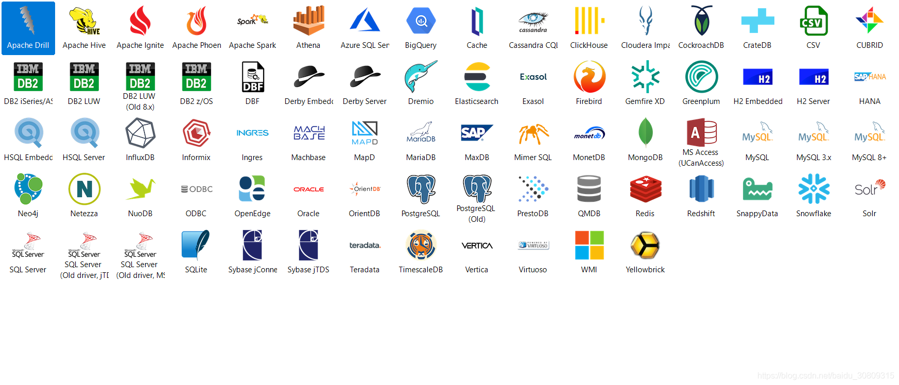

# dbeaver ee install记录

dbeaver支持连接多种关系db或no sql

```shell script
Enterprise Edition features:
 
Support of NoSQL databases:
    MongoDB
    Cassandra
    InfluxDB
    Redis
    Amazon DynamoDB
    Amazon DocumentDB
    Amazon Keyspaces
    Google Bigtable
    Couchbase
    CouchDB
Advanced extensions for:
    Oracle
    SQL Server
    Netezza
    Informix
AWS IAM, Kerberos and Active Directory authentication support
Advanced security (secure storage for user credentials, configuration encryption, master password, etc)
Additional drivers configuration for BigData/Cloud databases (Hadoop).
Most popular JDBC drivers are included in distribution and can be used in offline/limited internet access environment.
Additional EE plugins:
    Visual SQL query builder
    Task scheduler
    Analytical charts generation
    Mock data generator
    Advanced schema compare/migration tools
    Data compare tool
    Office formats support (XLS) for data export
    Advanced SQL execution plan viewer
    Integrated Git (version control for scripts and configuration)
    Persistent Query Manager database (allows to track SQL history)
    Time series charts renderer
    Eclipse Marketplace (allows to easily install 3rd party plugins)
    All CE features of course
    Online customer support
```

6.0.0版本支持连接如下



安装参考

https://zhile.io/2019/05/08/dbeaver-license-crack.html

https://dbeaver.com/files/   （尽量下载6.0.0版本）
