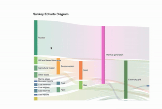

# effect



# reference

1. sankey diagram not support zoom
   - https://www.highcharts.com/forum/viewtopic.php?t=51666
   - https://github.com/apache/echarts/issues/12203

   New feature (roaming):
   - https://github.com/apache/echarts/issues/17432

2. highcharts sankey example
    - https://codepen.io/x444/pen/vYmPdqg

3. current reference
   - https://blog.csdn.net/ztwelve/article/details/128649174

# package.json

```json 
{
  "dependencies": {
    "echarts": "^5.2.2",
    "vue-echarts": "^6.0.0"
  }
}
```

# vue component

```vue 
<template>
  <div class="sankey-echarts-zoom-demo">
    <div class="chartBox">
      <v-chart
          class="boxaaaa"
          v-loading="loading"
          ref="chart"
          style="width: 100%; min-width: 600px; min-height: 550px"
          autoresize
          :option="options"
      ></v-chart>
    </div>
  </div>
</template>
<script>

import VChart from "vue-echarts";
import {data} from "./data"

export default {
  name: "SankeyEchartsDemo",
  data() {
    return {
      options: {},
      loading: false,
      chartBox: {},
    };
  },
  components: {VChart},
  created() {

  },
  mounted() {
    this.initChart()

    //鼠标滚轮事件
    let charData = this.options
    this.chartBox = document.getElementsByClassName("chartBox")[0]
    window.onmousewheel = (event) => {
      //容器位置，{ x, y } 为鼠标位置，{ top, bottom, left, right }容器边界位置
      let { x, y } = event,
          { top, bottom, left, right } = this.chartBox.getClientRects()[0]
      //画布DOM
      let box = document.getElementsByClassName("boxaaaa")[0]
      if (x > left && x < right && y > top && y < bottom) { //判断鼠标滚动事件是否在容器内
        if (event.deltaY < 0) {//小于0，向上滚动
          box.style.height = box.clientHeight + 20 + 'px'//画布高度+20
          box.style.width = box.clientWidth + 30 + 'px'//画布宽度+20
          charData.series[0].nodeGap += 2 //桑基图节点间距+2，默认为8
        } else {
          box.style.height = box.clientHeight - 20 + 'px'
          box.style.width = box.clientWidth - 30 + 'px'//画布宽度+20
          charData.series[0].nodeGap = charData.series[0].nodeGap < 10 ? 8 : charData.series[0].nodeGap - 2
        }
        //画布高度小于容器高度后，节点间距不再缩小
        if (box.style.height.split("px")[0] - this.chartBox.style.maxHeight.split("px")[0] <= 0) {
          charData.series[0].nodeGap = 8
        }
        //chart.setOption(charData)
        this.options = charData
        //chart.resize()
      }
    }


    let dragging = false
    let position = null
    let box = document.getElementsByClassName("boxaaaa")[0]
    box.addEventListener('mousedown', function (e) {
      dragging = true
      position = [e.clientX, e.clientY]
    })
    document.addEventListener('mousemove', function (e) {
      if (dragging === false)  return
      const x = e.clientX
      const y = e.clientY
      const deltaX = x - position[0]
      const deltaY = y - position[1]
      const left = parseInt(box.style.left || 0)
      const top = parseInt(box.style.top || 0)
      box.style.left = left + deltaX + 'px'
      box.style.top = top + deltaY + 'px'
      position = [x, y]
    })
    document.addEventListener('mouseup', function (e) {
      dragging = false
    })

  },
  destroyed() {
    window.onmousewheel = null
  },
  methods: {
    initChart(){
      this.options = {
        title: {
          text: 'Sankey Echarts Diagram'
        },
        tooltip: {
          trigger: 'item',
          triggerOn: 'mousemove'
        },
        series: [
          {
            type: 'sankey',
            left: 10.0,
            top: 50.0,
            right: 200.0,
            bottom: 25.0,
            data: data.nodes,
            links: data.links,
            emphasis: {
              focus: 'adjacency'
            },
            lineStyle: {
              color: 'gradient',
              curveness: 0.5
            }
          }
        ]
      }
    }
  },
};
</script>
<style scoped lang="scss">
.sankey-echarts-zoom-demo{
  width: 900px;
  height: 600px;
  overflow: hidden;
}
</style>
```

```js 
export const data = {
  "nodes": [
    {"name": "Agricultural 'waste'"},
    {"name": "Bio-conversion"},
    {"name": "Liquid"},
    {"name": "Losses"},
    {"name": "Solid"},
    {"name": "Gas"},
    {"name": "Biofuel imports"},
    {"name": "Biomass imports"},
    {"name": "Coal imports"},
    {"name": "Coal"},
    {"name": "Coal reserves"},
    {"name": "District heating"},
    {"name": "Industry"},
    {"name": "Heating and cooling - commercial"},
    {"name": "Heating and cooling - homes"},
    {"name": "Electricity grid"},
    {"name": "Over generation / exports"},
    {"name": "H2 conversion"},
    {"name": "Road transport"},
    {"name": "Agriculture"},
    {"name": "Rail transport"},
    {"name": "Lighting & appliances - commercial"},
    {"name": "Lighting & appliances - homes"},
    {"name": "Gas imports"},
    {"name": "Ngas"},
    {"name": "Gas reserves"},
    {"name": "Thermal generation"},
    {"name": "Geothermal"},
    {"name": "H2"},
    {"name": "Hydro"},
    {"name": "International shipping"},
    {"name": "Domestic aviation"},
    {"name": "International aviation"},
    {"name": "National navigation"},
    {"name": "Marine algae"},
    {"name": "Nuclear"},
    {"name": "Oil imports"},
    {"name": "Oil"},
    {"name": "Oil reserves"},
    {"name": "Other waste"},
    {"name": "Pumped heat"},
    {"name": "Solar PV"},
    {"name": "Solar Thermal"},
    {"name": "Solar"},
    {"name": "Tidal"},
    {"name": "UK land based bioenergy"},
    {"name": "Wave"},
    {"name": "Wind"}
  ],
  "links": [
    {"source": "Agricultural 'waste'", "target": "Bio-conversion", "value": 124.729},
    {"source": "Bio-conversion", "target": "Liquid", "value": 0.597},
    {"source": "Bio-conversion", "target": "Losses", "value": 26.862},
    {"source": "Bio-conversion", "target": "Solid", "value": 280.322},
    {"source": "Bio-conversion", "target": "Gas", "value": 81.144},
    {"source": "Biofuel imports", "target": "Liquid", "value": 35},
    {"source": "Biomass imports", "target": "Solid", "value": 35},
    {"source": "Coal imports", "target": "Coal", "value": 11.606},
    {"source": "Coal reserves", "target": "Coal", "value": 63.965},
    {"source": "Coal", "target": "Solid", "value": 75.571},
    {"source": "District heating", "target": "Industry", "value": 10.639},
    {"source": "District heating", "target": "Heating and cooling - commercial", "value": 22.505},
    {"source": "District heating", "target": "Heating and cooling - homes", "value": 46.184},
    {"source": "Electricity grid", "target": "Over generation / exports", "value": 104.453},
    {"source": "Electricity grid", "target": "Heating and cooling - homes", "value": 113.726},
    {"source": "Electricity grid", "target": "H2 conversion", "value": 27.14},
    {"source": "Electricity grid", "target": "Industry", "value": 342.165},
    {"source": "Electricity grid", "target": "Road transport", "value": 37.797},
    {"source": "Electricity grid", "target": "Agriculture", "value": 4.412},
    {"source": "Electricity grid", "target": "Heating and cooling - commercial", "value": 40.858},
    {"source": "Electricity grid", "target": "Losses", "value": 56.691},
    {"source": "Electricity grid", "target": "Rail transport", "value": 7.863},
    {"source": "Electricity grid", "target": "Lighting & appliances - commercial", "value": 90.008},
    {"source": "Electricity grid", "target": "Lighting & appliances - homes", "value": 93.494},
    {"source": "Gas imports", "target": "Ngas", "value": 40.719},
    {"source": "Gas reserves", "target": "Ngas", "value": 82.233},
    {"source": "Gas", "target": "Heating and cooling - commercial", "value": 0.129},
    {"source": "Gas", "target": "Losses", "value": 1.401},
    {"source": "Gas", "target": "Thermal generation", "value": 151.891},
    {"source": "Gas", "target": "Agriculture", "value": 2.096},
    {"source": "Gas", "target": "Industry", "value": 48.58},
    {"source": "Geothermal", "target": "Electricity grid", "value": 7.013},
    {"source": "H2 conversion", "target": "H2", "value": 20.897},
    {"source": "H2 conversion", "target": "Losses", "value": 6.242},
    {"source": "H2", "target": "Road transport", "value": 20.897},
    {"source": "Hydro", "target": "Electricity grid", "value": 6.995},
    {"source": "Liquid", "target": "Industry", "value": 121.066},
    {"source": "Liquid", "target": "International shipping", "value": 128.69},
    {"source": "Liquid", "target": "Road transport", "value": 135.835},
    {"source": "Liquid", "target": "Domestic aviation", "value": 14.458},
    {"source": "Liquid", "target": "International aviation", "value": 206.267},
    {"source": "Liquid", "target": "Agriculture", "value": 3.64},
    {"source": "Liquid", "target": "National navigation", "value": 33.218},
    {"source": "Liquid", "target": "Rail transport", "value": 4.413},
    {"source": "Marine algae", "target": "Bio-conversion", "value": 4.375},
    {"source": "Ngas", "target": "Gas", "value": 122.952},
    {"source": "Nuclear", "target": "Thermal generation", "value": 839.978},
    {"source": "Oil imports", "target": "Oil", "value": 504.287},
    {"source": "Oil reserves", "target": "Oil", "value": 107.703},
    {"source": "Oil", "target": "Liquid", "value": 611.99},
    {"source": "Other waste", "target": "Solid", "value": 56.587},
    {"source": "Other waste", "target": "Bio-conversion", "value": 77.81},
    {"source": "Pumped heat", "target": "Heating and cooling - homes", "value": 193.026},
    {"source": "Pumped heat", "target": "Heating and cooling - commercial", "value": 70.672},
    {"source": "Solar PV", "target": "Electricity grid", "value": 59.901},
    {"source": "Solar Thermal", "target": "Heating and cooling - homes", "value": 19.263},
    {"source": "Solar", "target": "Solar Thermal", "value": 19.263},
    {"source": "Solar", "target": "Solar PV", "value": 59.901},
    {"source": "Solid", "target": "Agriculture", "value": 0.882},
    {"source": "Solid", "target": "Thermal generation", "value": 400.12},
    {"source": "Solid", "target": "Industry", "value": 46.477},
    {"source": "Thermal generation", "target": "Electricity grid", "value": 525.531},
    {"source": "Thermal generation", "target": "Losses", "value": 787.129},
    {"source": "Thermal generation", "target": "District heating", "value": 79.329},
    {"source": "Tidal", "target": "Electricity grid", "value": 9.452},
    {"source": "UK land based bioenergy", "target": "Bio-conversion", "value": 182.01},
    {"source": "Wave", "target": "Electricity grid", "value": 19.013},
    {"source": "Wind", "target": "Electricity grid", "value": 289.366}
  ]
}
```


