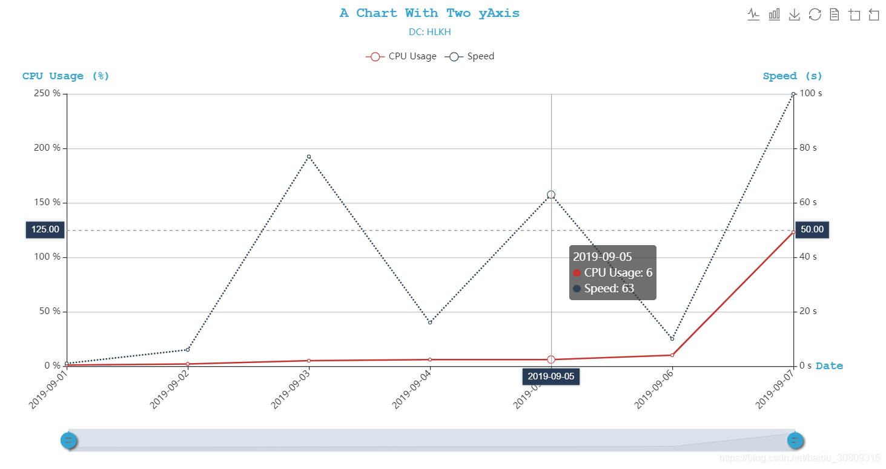

```html
<!DOCTYPE html>
<html lang="en">
<head>
    <meta charset="UTF-8">
    <title>Echarts</title>
    <script type="text/javascript" src="https://cdnjs.cloudflare.com/ajax/libs/jquery/3.1.1/jquery.min.js"></script>
    <script src="https://cdnjs.cloudflare.com/ajax/libs/echarts/4.1.0/echarts.min.js"></script>
    <script type="text/javascript">
        $(function () {
            showChart();
        });
        function showChart() {
            let chart = echarts.init(document.getElementById("chartDiv"));
            let option = {
                title: {
                    left: 'center',
                    subtext: 'DC: HLKH',
                    text: 'A Chart With Two yAxis',
                    textStyle: {
                        color: '#37a3cf',
                        fontFamily: 'Courier New',
                        textShadowColor: 'blue'
                    },
                    subtextStyle: {
                        color: '#37a3cf'
                    }
                },
                grid: {
                    top: '20%',
                    bottom: '20%'
                },
                tooltip: {
                    trigger: 'axis',
                    axisPointer: {
                        type: 'cross',
                        label: {
                            backgroundColor: '#283b56'
                        }
                    }
                },
                legend: {
                    top: '10%',
                    data: ['CPU Usage', 'Speed']
                },
                toolbox: {
                    feature: {
                        magicType: {
                            show: true,
                            type: ['line', 'bar'],
                            title: {
                                line: 'line chart',
                                bar: 'bar chart'
                            }
                        },
                        saveAsImage: {
                            show: true,
                            title: 'save as image'
                        },
                        restore: {
                            show: true,
                            title: 'restore'
                        },
                        dataView: {
                            show: true,
                            title: 'data view',
                            lang: ['data view', 'close', 'refresh'],
                            backgroundColor: '#37a3cf'
                        },
                        dataZoom: {
                            show: true,
                            title: {
                                zoom: 'zoom in area',
                                back: 'restore zoom'
                            }
                        }
                    },
                    x: 'right'
                },
                dataZoom: [{
                    type: 'inside',
                    start: 0,
                    end: 100
                }, {
                    start: 0,
                    end: 10,
                    handleIcon: 'M10.7,11.9v-1.3H9.3v1.3c-4.9,0.3-8.8,4.4-8.8,9.4c0,5,3.9,9.1,8.8,9.4v1.3h1.3v-1.3c4.9-0.3,8.8-4.4,8.8-9.4C19.5,16.3,15.6,12.2,10.7,11.9z M13.3,24.4H6.7V23h6.6V24.4z M13.3,19.6H6.7v-1.4h6.6V19.6z',
                    handleSize: '80%',
                    handleStyle: {
                        color: '#37a3cf',
                        shadowBlur: 3,
                        shadowColor: 'rgba(0, 0, 0, 0.6)',
                        shadowOffsetX: 2,
                        shadowOffsetY: 2
                    }
                }],
                xAxis: [
                    {
                        type: 'category',
                        name: "Date",
                        nameGap: 30,
                        nameTextStyle: {
                            color: '#37a3cf',
                            fontWeight: 'bold',
                            fontFamily: 'Courier New',
                            fontSize: 15
                        },
                        boundaryGap: false,
                        axisLabel: {
                            interval: 0,
                            rotate: 45
                        },
                        data: ['2019-09-01', '2019-09-02', '2019-09-03', '2019-09-04',
                            '2019-09-05', '2019-09-06', '2019-09-07']
                    }
                ],
                yAxis: [
                    {
                        type: 'value',
                        name: 'CPU Usage (%)',
                        axisLabel: {
                            formatter: '{value} %'
                        },
                        nameTextStyle: {
                            color: '#37a3cf',
                            fontWeight: 'bold',
                            fontFamily: 'Courier New',
                            fontSize: 15
                        },
                        boundaryGap: [0, '100%']
                    },
                    {
                        type: 'value',
                        name: 'Speed (s)',
                        max: 100,
                        min: 0,
                        axisLabel: {
                            formatter: '{value} s'
                        },
                        nameTextStyle: {
                            color: '#37a3cf',
                            fontWeight: 'bold',
                            fontFamily: 'Courier New',
                            fontSize: 15
                        },
                        boundaryGap: [0, '100%']
                    }
                ],
                series: [
                    {
                        name: 'CPU Usage',
                        type: 'line',
                        smooth: false,
                        yAxisIndex: 0,
                        data: [1, 2, 5, 6, 6, 10, 123]
                    },
                    {
                        name: 'Speed',
                        type: 'line',
                        smooth: false,
                        yAxisIndex: 1,
                        itemStyle: {
                            normal: {
                                lineStyle: {
                                    width: 2,
                                    type: 'dotted'
                                }
                            }
                        },
                        data: [1, 6, 77, 16, 63, 10, 100]
                    }
                ]
            };
            chart.setOption(option, true);
        }
    </script>
</head>
<body>
    <div id="chartDiv" style="width: 1200px;height: 600px"></div>
</body>
</html>
```
