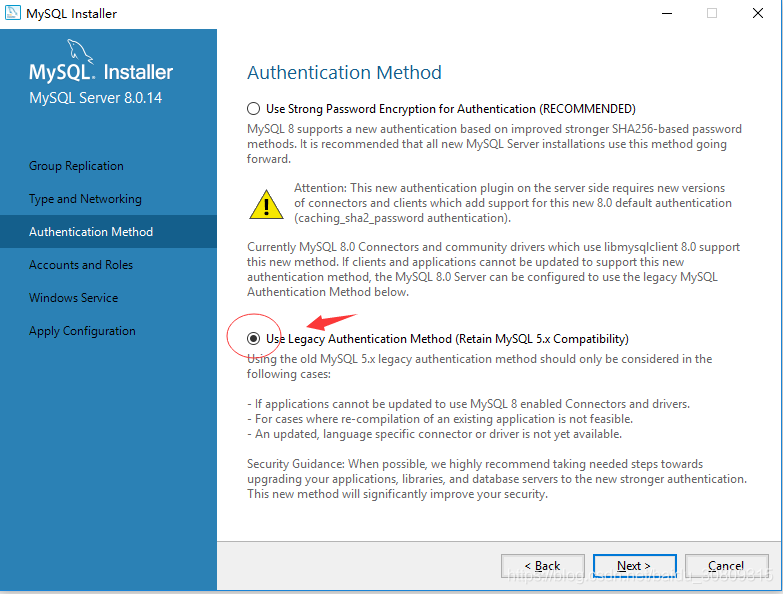
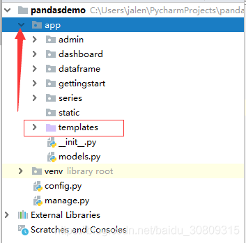
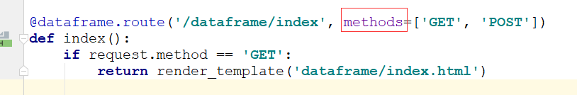
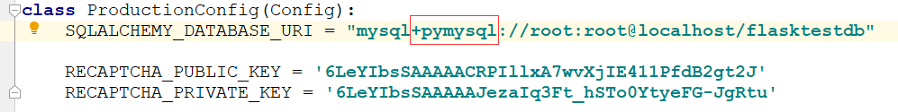

1. MySQL 8 1251 client does no support authentic...

参考：https://blog.csdn.net/baidu_30809315/article/details/88599054

解决：更新密码

2. sqlalchemy.exc.NotSupportedError: (mysql.connector.errors.NotSupportedError) Authentication plugin 'caching_sha2_password' is not supported

参考：https://www.jianshu.com/p/8b241ad93c1c

解决: 

3. F:\Envs\movie\lib\site-packages\pymysql\cursors.py:170: Warning: (1366, "Incorrect string value: '\\xD6\\xD0\\xB9\\xFA\\xB1\\xEA...' for column 'VARIABLE_VALUE' at row 481")

参考：https://blog.csdn.net/licheetools/article/details/82946317

解决：pip install mysql-connector

4. D:\Python27\lib\site-packages\flask_sqlalchemy\__init__.py:794: FSADeprecationWarning: SQLALCHEMY_TRACK_MODIFICATIONS adds significant overhead and will be disabled by default in the future.  Set it to True or False to suppress this warning

参考：https://blog.csdn.net/gbz2000/article/details/79506110

解决：

```python
SQLALCHEMY_TRACK_MODIFICATIONS = True
SQLALCHEMY_COMMIT_TEARDOWN = True
```

5. jinja2.exceptions.TemplateNotFound...

参考：https://blog.csdn.net/zlhn55/article/details/52107749

解决：

6. TypeError: __init__() got an unexpected keyword argument 'method'... 

参考：https://blog.csdn.net/qq_33528613/article/details/75075249

解决：

7. ModuleNotFoundError: No module named 'MySQLdb'

参考：https://blog.csdn.net/qq_25046261/article/details/78991442

解决：


