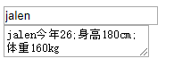

data-*是一个好东西，有时候我们可以将后台获取的值绑定在某个自定义data属性上，这样可以防止再次使用ajax去后台获取数据，非常方便。

这里记录一下data-*的使用方法，写一个小栗子，作备忘。

关于data-*属性的了解可以参考

[菜鸟教程](http://www.runoob.com/tags/att-global-data.html)

[W3school](https://www.w3school.com.cn/tags/att_global_data.asp)

栗子：

```html
<!DOCTYPE html>
<html>
<head>
	<title>data-options测试</title>
	<script type="text/javascript" src="https://cdn.staticfile.org/jquery/1.11.2/jquery.min.js"></script>
</head>
<body>
	<form action="" method="get">
		<input id="name" type="text" name="name" οnchange="pop();" data-age="26" data-height="" data-weight="">
 
		<br>
 
		<textarea id="areaA" style="display: none;">
			
		</textarea>
	</form>
 
	<script type="text/javascript">
		function setHeightByJavascript() {
			var node = document.getElementById('name');
			node.dataset.height = '180cm';
		}
 
		function setWeightByJquery() {
			$("#name").attr("data-weight","160kg");
		}
 
		function pop() {
			var node = $("#name");
			var name = node.val();				// name是捕获的输入值
			var age = node.attr("data-age");	// age事先已赋好值
 
 
			// 举例说明向data-*赋值
			setHeightByJavascript();			//使用原生的JavaScript向data-height赋值
			setWeightByJquery();  				//使用jquery向data-weight赋值
 
 
			// 举例说明js、jQuery取data-*的值
			//var height = node.attr("data-height");  		//使用jQuery取data-height的值
			var height = node.data("height"); 
			//var weight = document.getElementById('name').dataset.weight;  		//使用原生JavaScript取data-weight的值
			var weight = document.getElementById('name').getAttribute("data-weight");
 
 
			// 显示隐藏的text area
			var area = $("#areaA");
			area.show();
			area.val( name + "今年" + age + ";身高" + height + ";体重" + weight );
		}
	</script>
</body>
</html>
```

（说明：包含jquery和原生js两种操作，使用时注意区分）

程序主要是一个输入框，输入框中默认已绑定一个属性age为26，剩下的height属性和weight属性初始为空，这两个属性的赋值操作是分别通过JavaScript、jQuery两种方式赋值，textarea是一个隐藏区域，当输入完名字时会自动显示出age，height，weight的值，效果如下：


