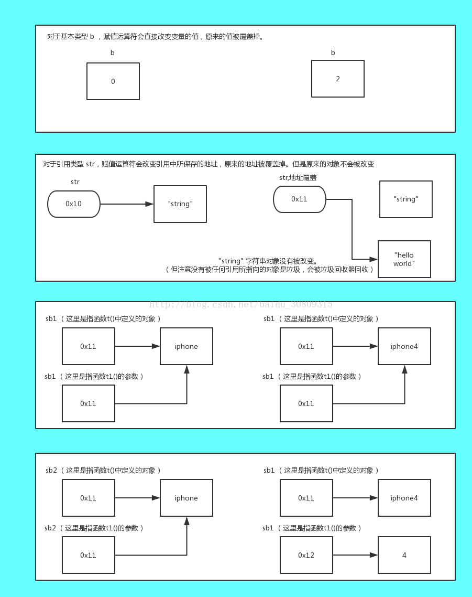
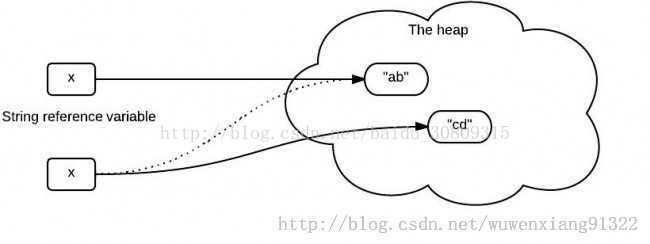

```java
import java.util.ArrayList;
import java.util.List;
 
/**
 * <p>
 * <code>TtT</code>
 * </p>
 * Description:
 *
 * @author Mcchu
 * @date 2017/12/7 15:50
 */
public class TtT {
 
    /**
     * 1. 参数传递本质就是一种 = 操作；
     * 2. 对于基本数据类型变量，= 操作是完整地复制了变量的值。
     * 3. 非基本数据类型变量，= 操作是复制了变量的引用
     *
     * 注意t1()方法中的参数名字不要被我写得和原来t()函数中定义的对象一致而被误导，它可以起任意名字
     *
     * 值传递是指将该值复制一份出来使用，比如a复制一份a1出来，a1做的操作不会影响到a,
     * 引用传递是将该值的地址传递给方法，比如取sb1的地址值b，b指向sb1，可以通过b找到sb1并对sb1进行修改。这时候sb1的值就会改变。
     */
    private void t(){
        Integer a = 0;                                  //没有提供可以改变自身方法的引用类型
        int b = 0;                                      //基本类型
        String str = "string";
        StringBuilder sb1 = new StringBuilder("iphone"); //提供了改变自身方法的引用类型
        StringBuilder sb2 = new StringBuilder("iphone");
        List<String> list = new ArrayList<>();
 
        this.t1( a, b, str, sb1, sb2, list );
        System.out.println(a);                          //没有被改变
        System.out.println(b);                          //没有被改变
        System.out.println(str);                        //没有被改变
        System.out.println(sb1.toString());             //改变
        System.out.println(sb2.toString());             //没有被改变
        System.out.println(list.size());                //改变
    }
 
 
    private void t1( Integer a,
                     int b,
                     String str,
                     StringBuilder sb1,
                     StringBuilder sb2,
                     List<String> list){
        a = 2;                                  //引用类型，复制引用，a放弃了原有引用
        b = 3;                                  //基本类型，复制原值，此时b已不再是当初的b了
        str = "hello world";                    //引用类型，复制引用，str放弃了原有引用
 
        sb1.append("4");                        //引用类型，执行了可以改变自身的方法
        sb2 = new StringBuilder("4");           //引用类型，复制引用,sb2放弃了原有引用,并且指向了新的对象实例
 
        list.add("123");                        //引用类型，执行了可以改变自身的方法
    }
 
    public static void main(String[] args) {
        TtT tt = new TtT();
        tt.t();
    }
}
```





参考：[知乎](https://www.zhihu.com/question/31203609)

java核心技术卷里说：java是值传递
