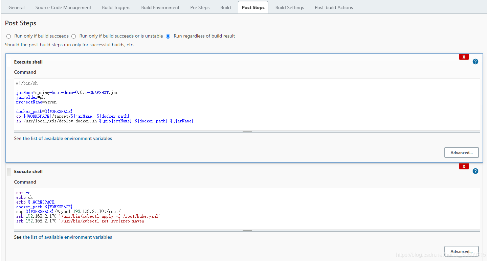

# centos registry+jenkins+k8s+maven 简单部署(待续)

## node节点安装registry并启动registry

```bash
[root@node conf]# docker pull registry
Using default tag: latest
latest: Pulling from library/registry
ddad3d7c1e96: Pull complete 
6eda6749503f: Pull complete 
363ab70c2143: Pull complete 
5b94580856e6: Pull complete 
12008541203a: Pull complete 
Digest: sha256:121baf25069a56749f249819e36b386d655ba67116d9c1c6c8594061852de4da
Status: Downloaded newer image for registry:latest
docker.io/library/registry:latest
[root@node conf]# docker images
REPOSITORY               TAG             IMAGE ID       CREATED        SIZE
chumingcheng/kube-demo   latest          e98023d7fb9b   8 hours ago    673MB
k8s.gcr.io/kube-proxy    v1.21.3         adb2816ea823   2 weeks ago    103MB
registry                 latest          1fd8e1b0bb7e   3 months ago   26.2MB
hello-world              latest          d1165f221234   4 months ago   13.3kB
k8s.gcr.io/pause         3.4.1           0f8457a4c2ec   6 months ago   683kB
quay.io/coreos/flannel   v0.11.0-amd64   ff281650a721   2 years ago    52.6MB
[root@node conf]# docker run -p 5000:5000 -v /home/registry_images:/var/lib/registry -d registry
149e8e17d7f1caa9aa3a01256fa462cb46c1f898613a42bcf4c3c62ee2e49050
[root@node conf]# 
```

## 将nginx镜像下载下来后重新打tag后push到registry上 （测试）

```shell script
[root@master docker]# cat /etc/docker/daemon.json 
{
    "insecure-registries": ["192.168.2.174:5000", "registry-scu.cloudtogo.cn"],
    "registry-mirrors": ["https://dcwzscc0.mirror.aliyuncs.com"]
}
[root@master docker]# systemctl daemon-reload
[root@master docker]# systemctl restart docker
[root@master docker]# docker pull nginx
Using default tag: latest
latest: Pulling from library/nginx
33847f680f63: Pull complete 
dbb907d5159d: Pull complete 
8a268f30c42a: Pull complete 
b10cf527a02d: Pull complete 
c90b090c213b: Pull complete 
1f41b2f2bf94: Pull complete 
Digest: sha256:8f335768880da6baf72b70c701002b45f4932acae8d574dedfddaf967fc3ac90
Status: Downloaded newer image for nginx:latest
docker.io/library/nginx:latest
[root@master docker]# docker images
REPOSITORY                           TAG             IMAGE ID       CREATED         SIZE
chumingcheng/kube-demo               latest          e98023d7fb9b   8 hours ago     673MB
kube-demo                            latest          e98023d7fb9b   8 hours ago     673MB
chumingcheng/myhello                 latest          dea3c5956e88   4 days ago      7.44MB
myhello                              latest          dea3c5956e88   4 days ago      7.44MB
<none>                               <none>          ad1e2da24557   4 days ago      303MB
nginx                                latest          08b152afcfae   10 days ago     133MB
mysql                                5.6             eb0e825dc3cf   10 days ago     303MB
k8s.gcr.io/kube-apiserver            v1.21.3         3d174f00aa39   2 weeks ago     126MB
k8s.gcr.io/kube-scheduler            v1.21.3         6be0dc1302e3   2 weeks ago     50.6MB
k8s.gcr.io/kube-proxy                v1.21.3         adb2816ea823   2 weeks ago     103MB
k8s.gcr.io/kube-controller-manager   v1.21.3         bc2bb319a703   2 weeks ago     120MB
golang                               1.14-alpine     32dc91e030ac   5 months ago    287MB
k8s.gcr.io/pause                     3.4.1           0f8457a4c2ec   6 months ago    683kB
k8s.gcr.io/coredns/coredns           v1.8.0          296a6d5035e2   9 months ago    42.5MB
k8s.gcr.io/etcd                      3.4.13-0        0369cf4303ff   11 months ago   253MB
quay.io/coreos/flannel               v0.12.0-amd64   4e9f801d2217   16 months ago   52.8MB
quay.io/coreos/flannel               v0.11.0-amd64   ff281650a721   2 years ago     52.6MB
node                                 8.11.2          baf6417c4cac   3 years ago     673MB
[root@master docker]# docker tag nginx 192.168.2.174:5000/nginx:test
[root@master docker]# docker push 192.168.2.174:5000/nginx:test
The push refers to repository [192.168.2.174:5000/nginx]
e3135447ca3e: Pushed 
b85734705991: Pushed 
988d9a3509bb: Pushed 
59b01b87c9e7: Pushed 
7c0b223167b9: Pushed 
814bff734324: Pushed 
test: digest: sha256:3f13b4376446cf92b0cb9a5c46ba75d57c41f627c4edb8b635fa47386ea29e20 size: 1570
 
-----------------------------------------------------------------------------
[root@node conf]# vi /etc/docker/daemon.json
[root@node conf]# systemctl daemon-reload
[root@node conf]# systemctl restart docker
[root@node conf]# cat /etc/docker/daemon.json 
{
    "insecure-registries": ["192.168.2.174:5000", "registry-scu.cloudtogo.cn"],
    "registry-mirrors": ["https://dcwzscc0.mirror.aliyuncs.com"]
}
[root@node conf]# 
```

## jenkins创建maven项目，配置Post Steps，在build好jar包后执行下面的shell脚本

```shell script
#!/bin/sh
 
jarName=spring-boot-demo-0.0.1-SNAPSHOT.jar
jarFolder=ph
projectName=maven
 
docker_path=${WORKSPACE}
cp ${WORKSPACE}/target/${jarName} ${docker_path}
sh /usr/local/k8s/deploy_docker.sh ${projectName} ${docker_path} ${jarName}
```

创建deploy_docker.sh，主要是打包成docker镜像

```shell script
#!/bin/sh
set -e
projectName=$1
docker_path=$2
appName=$3
 
tag=$(date +%s)
sever_path=192.168.2.174:5000
target_image=${projectName}:${tag}
echo ${target_image}
 
cd ${docker_path}
docker build --build-arg app=${appName} -t ${target_image} .
 
docker tag ${target_image} ${sever_path}/${projectName}
echo The name of image is "${sever_path}\/${target_image}"
docker push ${sever_path}/${projectName}:latest
docker rmi -f $(docker images | grep ${projectName} | grep ${tag} | awk '{print $3}' | head -n 1)
```

再次设置一个post steps，也是shell脚本，这里需要先设置ssh免密登录（让node可以免密登录master）

```shell script
set -e
echo ok
echo ${WORKSPACE}
docker_path=${WORKSPACE}
scp ${WORKSPACE}/*.yaml 192.168.2.170:/root/
ssh 192.168.2.170 '/usr/bin/kubectl apply -f /root/kube.yaml'
ssh 192.168.2.170 '/usr/bin/kubectl get svc|grep maven'
```



## 设置jenkins服务器到k8s master ssh免密登录，在jenkins服务器执行

```shell script
[root@node k8s]# ssh-keygen -t rsa
Generating public/private rsa key pair.
Enter file in which to save the key (/root/.ssh/id_rsa): 
Created directory '/root/.ssh'.
Enter passphrase (empty for no passphrase): 
Enter same passphrase again: 
Your identification has been saved in /root/.ssh/id_rsa.
Your public key has been saved in /root/.ssh/id_rsa.pub.
The key fingerprint is:
SHA256:beS3BCVUzK7nwhuur6L2ccGS3vQ4Ahmou+pFCoyXxHc root@node
The key''s randomart image is:
+---[RSA 2048]----+
|         .o+o    |
| . .       oo    |
|  + o E   o.     |
|oo o + o + ..    |
|+.o.o o S +.o    |
|.oo  o + =.o..   |
|.. .  + =.oo.    |
| .. . .+ oo..    |
|=. ..o..o++o     |
+----[SHA256]-----+
[root@node ~]# ssh-copy-id -i ~/.ssh/id_rsa.pub root@192.168.2.170
/usr/bin/ssh-copy-id: INFO: Source of key(s) to be installed: "/root/.ssh/id_rsa.pub"
The authenticity of host '192.168.2.170 (192.168.2.170)' can't be established.
ECDSA key fingerprint is SHA256:H8BPYcOWbGTnKmhOS9Try0D3gsMTziU9KO6Tnkae5lw.
ECDSA key fingerprint is MD5:84:95:f1:e2:89:8d:5e:87:dd:12:55:e8:1a:1c:db:b2.
Are you sure you want to continue connecting (yes/no)? yes
/usr/bin/ssh-copy-id: INFO: attempting to log in with the new key(s), to filter out any that are already installed
/usr/bin/ssh-copy-id: INFO: 1 key(s) remain to be installed -- if you are prompted now it is to install the new keys
root@192.168.2.170's password: 
 
Number of key(s) added: 1
 
Now try logging into the machine, with:   "ssh 'root@192.168.2.170'"
and check to make sure that only the key(s) you wanted were added.
 
[root@node ~]# ssh root@192.168.2.170   # 测试免密登录
Last login: Sun Aug  1 20:36:23 2021 from ps2021urjnjrmj.lan
[root@master ~]# exit
logout
Connection to 192.168.2.170 closed.
[root@node ~]# 
```

## jenkins build时候报错，master/node将Dockerfile里设置的这个url配到不安全的registry地址列表中予以通过

```shell script
[test] $ /bin/sh /usr/local/tomcat9/tomcat9/temp/jenkins7299389644735256735.sh
cp: cannot stat ‘/root/.jenkins/workspace/test/target/spring-boot-demo-0.0.1-SNAPSHOT.jar’: No such file or directory
maven:1627883041
Sending build context to Docker daemon  222.7kB
 
Step 1/4 : FROM registry-scu.cloudtogo.cn/ubuntu:jdk
Get https://registry-scu.cloudtogo.cn/v2/: dial tcp 106.75.145.94:443: connect: connection refused
Build step 'Execute shell' marked build as failure
ERROR: Maven JVM terminated unexpectedly with exit code 137
Finished: FAILURE
 
 
[root@node ~]# cat /etc/docker/daemon.json 
{
    "insecure-registries": ["192.168.2.174:5000", "registry-scu.cloudtogo.cn"],
    "registry-mirrors": ["https://dcwzscc0.mirror.aliyuncs.com"]
}
[root@node ~]# systemctl daemon-reload
[root@node ~]# systemctl restart docker
[root@node ~]# docker ps -a | grep registry
149e8e17d7f1   registry                 "/entrypoint.sh /etc…"   32 hours ago         Exited (2) 31 hours ago                musing_swartz
[root@node ~]# docker start 149e8e17d7f1
149e8e17d7f1
[root@node ~]# docker ps -a | grep registry
149e8e17d7f1   registry                 "/entrypoint.sh /etc…"   32 hours ago    Up 4 seconds                 0.0.0.0:5000->5000/tcp, :::5000->5000/tcp   musing_swartz
[root@node ~]# 
```

## 新问题，jenkins log 报 jar包找不到... ...

```shell script
Started by user test
Running as SYSTEM
Building in workspace /root/.jenkins/workspace/test
The recommended git tool is: NONE
No credentials specified
 > /usr/bin/git rev-parse --resolve-git-dir /root/.jenkins/workspace/test/.git # timeout=10
Fetching changes from the remote Git repository
 > /usr/bin/git config remote.origin.url git://github.com/SincerelyUnique/SpringBootDemo.git # timeout=10
Fetching upstream changes from git://github.com/SincerelyUnique/SpringBootDemo.git
 > /usr/bin/git --version # timeout=10
 > git --version # 'git version 1.8.3.1'
 > /usr/bin/git fetch --tags --progress git://github.com/SincerelyUnique/SpringBootDemo.git +refs/heads/*:refs/remotes/origin/* # timeout=10
 > /usr/bin/git rev-parse refs/remotes/origin/master^{commit} # timeout=10
Checking out Revision a841fe9c20349a8d9ef523b6f0ad32e410a32687 (refs/remotes/origin/master)
 > /usr/bin/git config core.sparsecheckout # timeout=10
 > /usr/bin/git checkout -f a841fe9c20349a8d9ef523b6f0ad32e410a32687 # timeout=10
Commit message: "Update Dockerfile"
 > /usr/bin/git rev-list --no-walk a841fe9c20349a8d9ef523b6f0ad32e410a32687 # timeout=10
Parsing POMs
Established TCP socket on 46575
[test] $ /usr/local/jdk/jdk1.8.0_301/bin/java -cp /root/.jenkins/plugins/maven-plugin/WEB-INF/lib/maven35-agent-1.13.jar:/usr/local/maven/maven3/boot/plexus-classworlds-2.6.0.jar:/usr/local/maven/maven3/conf/logging jenkins.maven3.agent.Maven35Main /usr/local/maven/maven3 /usr/local/tomcat9/tomcat9/webapps/jenkins/WEB-INF/lib/remoting-4.10.jar /root/.jenkins/plugins/maven-plugin/WEB-INF/lib/maven35-interceptor-1.13.jar /root/.jenkins/plugins/maven-plugin/WEB-INF/lib/maven3-interceptor-commons-1.13.jar 46575
<===[JENKINS REMOTING CAPACITY]===>channel started
Executing Maven:  -B -f /root/.jenkins/workspace/test/pom.xml clean package
[INFO] Scanning for projects...
[INFO] 
[INFO] --------------------< com.example:spring-boot-demo >--------------------
[INFO] Building spring-boot-demo 0.0.1-SNAPSHOT
[INFO] --------------------------------[ jar ]---------------------------------
[INFO] 
[INFO] --- maven-clean-plugin:2.6.1:clean (default-clean) @ spring-boot-demo ---
[INFO] Deleting /root/.jenkins/workspace/test/target
[INFO] 
[INFO] --- maven-resources-plugin:2.6:resources (default-resources) @ spring-boot-demo ---
[INFO] Using 'UTF-8' encoding to copy filtered resources.
[INFO] Copying 1 resource
[INFO] Copying 0 resource
[INFO] 阿里云Maven中央仓库为阿里云云效提供的公共代理仓库，云效也提供了免费、可靠的Maven私有仓库Packages，欢迎您体验使用。https://www.aliyun.com/product/yunxiao/packages?channel=pd_maven_download
[INFO] 
[INFO] --- maven-compiler-plugin:3.1:compile (default-compile) @ spring-boot-demo ---
[INFO] Changes detected - recompiling the module!
[INFO] Compiling 3 source files to /root/.jenkins/workspace/test/target/classes
[INFO] 
[INFO] --- maven-resources-plugin:2.6:testResources (default-testResources) @ spring-boot-demo ---
[INFO] Using 'UTF-8' encoding to copy filtered resources.
[INFO] skip non existing resourceDirectory /root/.jenkins/workspace/test/src/test/resources
[INFO] 阿里云Maven中央仓库为阿里云云效提供的公共代理仓库，云效也提供了免费、可靠的Maven私有仓库Packages，欢迎您体验使用。https://www.aliyun.com/product/yunxiao/packages?channel=pd_maven_download
[INFO] 
[INFO] --- maven-compiler-plugin:3.1:testCompile (default-testCompile) @ spring-boot-demo ---
[INFO] Changes detected - recompiling the module!
[INFO] Compiling 1 source file to /root/.jenkins/workspace/test/target/test-classes
[INFO] 
[INFO] --- maven-surefire-plugin:2.18.1:test (default-test) @ spring-boot-demo ---
[INFO] Surefire report directory: /root/.jenkins/workspace/test/target/surefire-reports
 
-------------------------------------------------------
 T E S T S
-------------------------------------------------------
[test] $ /bin/sh /usr/local/tomcat9/tomcat9/temp/jenkins4673465351159808518.sh
1
2
/root/.jenkins/workspace/test
cp: cannot stat ‘/root/.jenkins/workspace/test/target/spring-boot-demo-0.0.1-SNAPSHOT.jar’: No such file or directory
3
maven:1627996064
Sending build context to Docker daemon  250.9kB
 
Step 1/4 : FROM registry-scu.cloudtogo.cn/ubuntu:jdk
 ---> 599a3bee7783
Step 2/4 : ARG app
 ---> Using cache
 ---> b1898e65eea7
Step 3/4 : ADD $app app.jar
ADD failed: file not found in build context or excluded by .dockerignore: stat spring-boot-demo-0.0.1-SNAPSHOT.jar: file does not exist
Build step 'Execute shell' marked build as failure
ERROR: Maven JVM terminated unexpectedly with exit code 137
Finished: FAILURE
```
