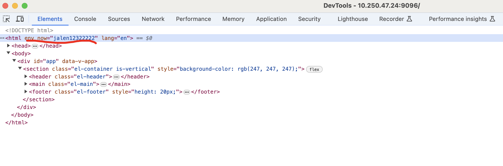
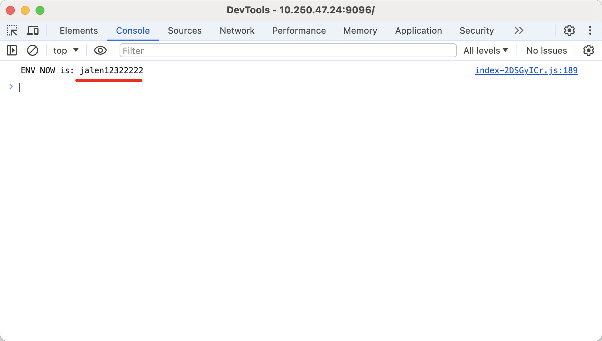

# Background

We want to get the `ENV` value which set from the `docker run -e ENV='xxxx' --name xxx-container xxx-image'` in client js script, so we need to expose it to client

# Environment

- framework: vue3 + vite
- detail
    ```shell
    ➜  dcc_front git:(develop) ✗ npm ls
    ├── @element-plus/icons-vue@2.3.1
    ├── @tsconfig/node20@20.1.2
    ├── @types/node@20.11.26
    ├── @vitejs/plugin-vue@5.0.4
    ├── @vue/tsconfig@0.5.1
    ├── date-fns@3.6.0
    ├── element-plus@2.6.3
    ├── npm-run-all2@6.1.2
    ├── pinia@2.1.7
    ├── rollup@4.13.2
    ├── typescript@5.4.2
    ├── vite@5.1.6
    ├── vue-tsc@2.0.6
    ├── vue@3.4.21
    └── xlsx@0.18.5
    ```

# Implement

## main.ts (or main.js)

```javascript
// 1.append attribute to html tag
// 2.set the attribute to global property
const htmlNode = document.querySelector("html");
let ENV_NOW
if (htmlNode != null){
    ENV_NOW = htmlNode.getAttribute("env_now")
}
if (ENV_NOW) {
    app.config.globalProperties.$ENV_NOW = `${ENV_NOW}`;
}
console.log("ENV NOW is: " + ENV_NOW)
```

## Dockerfile

```dockerfile
FROM nginx

# here the code tar generate steps are
# 1.npm run build
# 2.cd dist && tar zcvf code.tar.gz * 
# 3.upload to docker build server: scp code.tar.gz user@x.x.x.x:/users/xxx
ADD code.tar.gz /etc/nginx/html

EXPOSE 443/tcp 8080/tcp

# please be attention about the html path
CMD ["/bin/bash", "-c", "sed -i \"s@<html@<html env_now=\"$ENV\"@\" /etc/nginx/html/index.html; nginx"]
```

## Build & Run

```bash
docker image build --platform linux/amd64 -f Dockerfile  -t {image}:{tag} ./ --no-cache
docker push {image}:{tag}
docker run -idt --privileged -p 9090:8080 -e ENV='jalen12322222' --name test-env {image}:{tag}
```

# Demo






# Reference

https://juejin.cn/post/6901944817106812942
