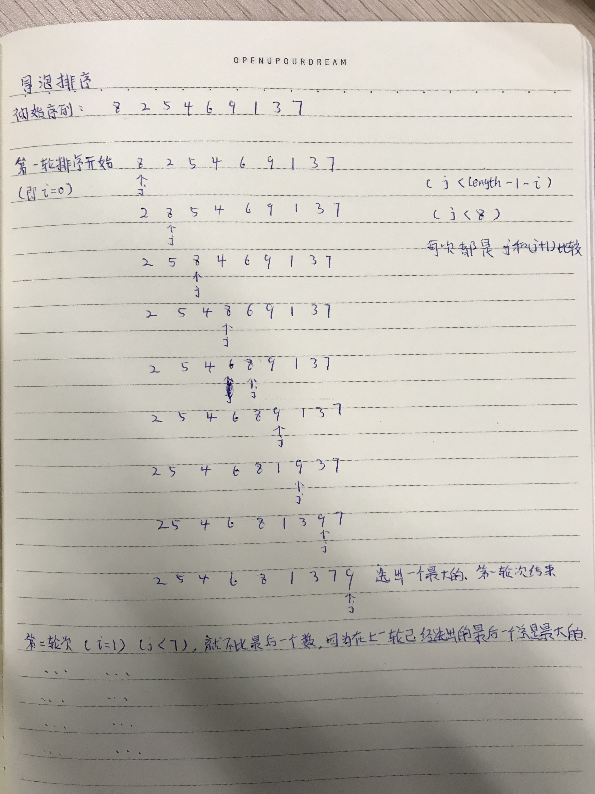

代码：

```java
/**
 * <p>
 * <code>TT</code>
 * </p>
 * Description:
 *
 * @author Mcchu
 * @date 2017/12/8 10:43
 */
public class TT {
 
    /**
     * 冒泡排序
     *
     * 比较相邻的元素。如果第j指针指向的数比第（j+1）指针指向的数大，就交换他们两个。
     * n个数字要排序完成，总共进行n-1趟排序，每i趟的排序次数为(n-i)次，所以可以用双重循环语句;
     * 每跑一趟，排在最后的数一定是最大的；
     * 冒泡排序总的平均时间复杂度为：O(n2)
     *
     * 相同元素的前后顺序并没有改变，所以冒泡排序是一种稳定排序算法
     */
    private static void bubbleSort( int[] arr ){
        int length = arr.length;
 
        for ( int i=0; i<length; i++ ){
 
            System.out.println("第"+(i+1)+"轮次");
            System.out.println("比较次数："+(length-1-i));
 
            for ( int j=0; j<length-1-i; j++ ){
 
                if ( arr[j] > arr[j+1] ){
                    int temp = arr[j];
                    arr[j] = arr[j+1];
                    arr[j+1] = temp;
                }
 
            }
 
            System.out.print("排序后数组：");
            for ( int in: arr ){
                System.out.print(in);
                System.out.print(",");
            }
            System.out.println();
        }
 
    }
 
    public static void main(String[] args) {
        int[] arr = new int[]{8,2,5,4,6,9,1,3,7};
        bubbleSort(arr);
    }
}
```

输出：

```
第1轮次
比较次数：8
排序后数组：2,5,4,6,8,1,3,7,9,
第2轮次
比较次数：7
排序后数组：2,4,5,6,1,3,7,8,9,
第3轮次
比较次数：6
排序后数组：2,4,5,1,3,6,7,8,9,
第4轮次
比较次数：5
排序后数组：2,4,1,3,5,6,7,8,9,
第5轮次
比较次数：4
排序后数组：2,1,3,4,5,6,7,8,9,
第6轮次
比较次数：3
排序后数组：1,2,3,4,5,6,7,8,9,
第7轮次
比较次数：2
排序后数组：1,2,3,4,5,6,7,8,9,
第8轮次
比较次数：1
排序后数组：1,2,3,4,5,6,7,8,9,
第9轮次
比较次数：0
排序后数组：1,2,3,4,5,6,7,8,9,
```


