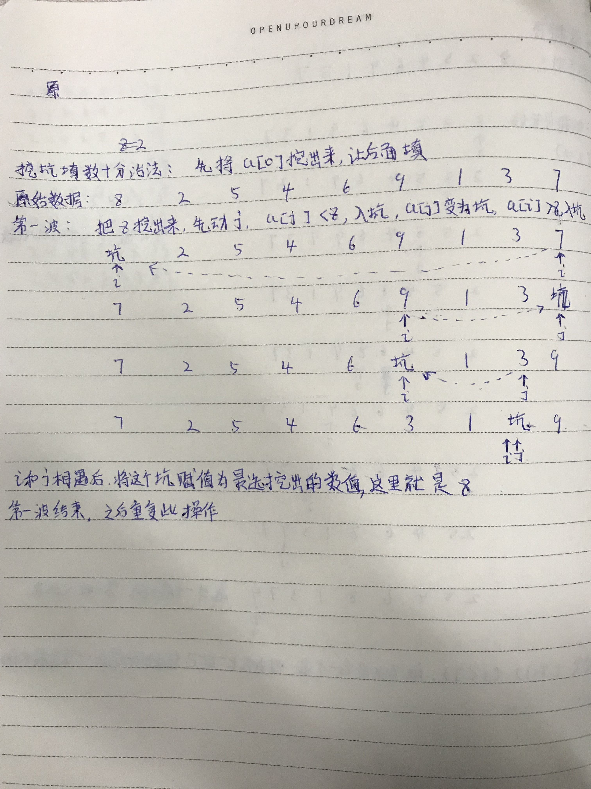

这里主要是参考网上的博客做的学习笔记，有不对之处请指正，其实本人现在对于快速排序还是不够清晰。

```java
/**
 * <p>
 * <code>Test</code>
 * </p>
 * Description:
 *
 * @author Mcchu
 * @date 2017/12/5 15:57
 */
public class Test {
 
    /**
     * 快速排序轮次计数器1
     */
    private static int quickSortCount1 = 0;
 
    /**
     * 快速排序轮次计数器2
     */
    private static int quickSortCount2 = 0;
 
    /**
     * 快速排序
     * 参考：百度百科
     *
     * 快排简述-分治法
     * 1．先从数列中取出一个数作为基准数。
     * 2．分区过程，将比这个数大的数全放到它的右边，小于或等于它的数全放到它的左边。
     * 3．再对左右区间重复第二步，直到各区间只有一个数。
     *
     * 程序解释
     * 1. 设置两个变量i、j，排序开始的时候：i=0，j=N-1；
     * 2. 以第一个数组元素作为关键数据，赋值给key，即key=A[0]；
     * 3. 从j开始向前搜索，即由后开始向前搜索(j--)，找到第一个小于key的值A[j]，将A[j]和A[i]互换；
     * 4. 从i开始向后搜索，即由前开始向后搜索(i++)，找到第一个大于key的A[i]，将A[i]和A[j]互换；
     * 5. 重复第3、4步，直到i=j；
     * (3,4步中，没找到符合条件的值，即3中A[j]不小于key,4中A[i]不大于key的时候改变j、i的值，使得j=j-1，i=i+1，直至找到为止。
     * 找到符合条件的值，进行交换的时候i， j指针位置不变。另外，i==j这一过程一定正好是i+或j-完成的时候，此时令循环结束）。
     *
     * 注意：快速排序不是一种稳定的排序算法，也就是说，多个相同的值的相对位置也许会在算法结束时产生变动。
     * 快速排序时间复杂度：O (nlogn)
     * @param arr 排序数据
     * @param low 每次排序时第一个数字的下标
     * @param high 每次排序时最后一个数字的下标
     */
    private static void quickSort1(int[] arr,int low,int high){
        if ( low < high ){
            int i = low;   // 左指针（以下标为计数）,由右向左移动
            int j = high;  // 右指针（以下标为计数）,由左向右移动
            int k = arr[low];   // k为基准数
 
            quickSortCount1++;
            System.out.println("第"+ quickSortCount1 +"轮次");
            System.out.println("指针i指向：arr["+i+"]");
            System.out.println("指针j指向：arr["+j+"]");
            System.out.println("基准数k值："+k);
 
            while( i < j ){
 
                // 从右向左找第一个小于基准数的数
                while ( i < j && k <= arr[j] )
                    j--;
 
                // 执行i和j交换
                if ( i < j ){
                    int temp = arr[j];
                    arr[j] = arr[i];
                    arr[i] = temp;
                    i++;
                }
 
                // 从左向右找第一个大于基准数的数
                while ( i < j && k >= arr[i] )
                    i++;
 
                // 执行i和j交换
                if ( i < j ){
                    int temp = arr[i];
                    arr[i] = arr[j];
                    arr[j] = temp;
                    j--;
                }
            }
 
            System.out.print("排序后数组：");
            for ( int in: arr ){
                System.out.print(in);
                System.out.print(",");
            }
            System.out.println();
 
            if(i>low)   quickSort1(arr,low,i-1);
            if(j<high)  quickSort1(arr,j+1,high);
        }
    }
 
    /**
     * 快速排序
     * 挖坑填数+分治法
     * 参考：CSDN（http://blog.csdn.net/morewindows/article/details/6684558）
     *
     * 1. 以一个数组作为示例，取区间第一个数为基准数
     * 2. 初始时，i = 0;  j = arr.length-1;   k = a[0] (k为基准数)
     * 3. 可以理解为：首先在 a[0] 上挖了一个坑
     * 4. 从j开始向前搜索，即由后开始向前搜索(j--)，找到第一个小于k的值a[j]，将a[j]挖出填到a[0]，
     *    第一个坑就被填上了，需再找一个数字填a[j]的坑，该轮到i找了（即i++）
     * 5. 从i开始向后搜索，即由前开始向后搜索(i++)，找到第一个大于k的值a[i]，将a[i]挖出填到刚刚的a[j]，
     *    继续找j（即j--）
     *
     * @param arr 排序数据
     * @param low 每次排序时第一个数字的下标
     * @param high 每次排序时最后一个数字的下标
     */
    private static void quickSort2( int[] arr, int low, int high ){
        if (low < high) {
            int i = low;
            int j = high;
            int k = arr[low];
 
            quickSortCount2++;
            System.out.println("第"+ quickSortCount2 +"轮次");
            System.out.println("指针i指向：arr["+i+"]");
            System.out.println("指针j指向：arr["+j+"]");
            System.out.println("基准数k值："+k);
 
            while (i < j)
            {
                while(i < j && arr[j] >= k) // 从右向左找第一个小于k的数
                    j--;
                if(i < j)
                    arr[i++] = arr[j];
 
                while(i < j && arr[i] < k) // 从左向右找第一个大于等于k的数
                    i++;
                if(i < j)
                    arr[j--] = arr[i];
            }
            arr[i] = k;
 
            System.out.print("排序后数组：");
            for ( int in: arr ){
                System.out.print(in);
                System.out.print(",");
            }
            System.out.println();
 
            quickSort2(arr, low, i - 1); // 递归调用
            quickSort2(arr, i + 1, high);
        }
    }
 
 
    private static int[] arr = {8,2,5,4,6,9,1,3,7};
    /**
     * 快速排序
     * 参考：《啊哈算法》
     * 参考：CSDN （http://blog.csdn.net/binyao02123202/article/details/20051391）
     *
     * 1. j指针一步一步向左移动，找到一个小于k的值后，停下，此时j指向a[j]
     * 2. i指针开始一步一步向右移动，找到一个大于k的值后，停下，此时i指向a[i]
     * 3. 交换a[i]和a[j]的值
     * 4. 再次轮到j行动，重复上面的步骤，直到i和j相遇
     * 5. i和j相遇后的动作是：
     *        第一个值（起始值）赋值为此时他们相遇指向的那个值；
     *        而他们指向的那个值赋值为k
     * 6. 重复上面的步骤
     *
     * @param low 每次排序时第一个数字的下标
     * @param high 每次排序时最后一个数字的下标
     */
    private static  void quickSort3( int low,int high ){
        if ( low<high ){
            int i = low;
            int j = high;
            int k = arr[low];
            while ( i!=j ){
                while ( arr[j]>=k && i<j )
                    j--;
 
                while ( arr[i]<=k && i<j )
                    i++;
 
                if ( i<j ){
                    int temp = arr[i];
                    arr[i] = arr[j];
                    arr[j] = temp;
                }
            }
            arr[low] = arr[i];
            arr[i] = k;
 
            quickSort3(low,i-1);
            quickSort3(i+1,high);
        }
    }
 
    public static void main(String[] args) {
        // 测试快速排序1
        int[] arr1 = {8,2,5,4,6,9,1,3,7};
        int low1 = 0;
        int high1 = arr1.length-1;
        quickSort1(arr1,low1,high1);
 
        System.out.println("\n\n---------我是分割线-----------\n\n");
 
        // 测试快速排序2
        int[] arr2 = {8,2,5,4,6,9,1,3,7};
        int low2 = 0;
        int high2 = arr2.length-1;
        quickSort2(arr2,low2,high2);
 
        System.out.println("\n\n---------我是分割线-----------\n\n");
 
        // 测试快速排序3
        quickSort3(0,arr.length-1);
        System.out.print("排序后数组：");
        for ( int in: arr ){
            System.out.print(in);
            System.out.print(",");
        }
        System.out.println();
    }
 
}
 
```

输出：

```
第1轮次
指针i指向：arr[0]
指针j指向：arr[8]
基准数k值：8
排序后数组：7,2,5,4,6,3,1,8,9,
第2轮次
指针i指向：arr[0]
指针j指向：arr[6]
基准数k值：7
排序后数组：1,2,5,4,6,3,7,8,9,
第3轮次
指针i指向：arr[0]
指针j指向：arr[5]
基准数k值：1
排序后数组：1,2,5,4,6,3,7,8,9,
第4轮次
指针i指向：arr[1]
指针j指向：arr[5]
基准数k值：2
排序后数组：1,2,5,4,6,3,7,8,9,
第5轮次
指针i指向：arr[2]
指针j指向：arr[5]
基准数k值：5
排序后数组：1,2,3,4,5,6,7,8,9,
第6轮次
指针i指向：arr[2]
指针j指向：arr[3]
基准数k值：3
排序后数组：1,2,3,4,5,6,7,8,9,
 
 
---------我是分割线-----------
 
 
第1轮次
指针i指向：arr[0]
指针j指向：arr[8]
基准数k值：8
排序后数组：7,2,5,4,6,3,1,8,9,
第2轮次
指针i指向：arr[0]
指针j指向：arr[6]
基准数k值：7
排序后数组：1,2,5,4,6,3,7,8,9,
第3轮次
指针i指向：arr[0]
指针j指向：arr[5]
基准数k值：1
排序后数组：1,2,5,4,6,3,7,8,9,
第4轮次
指针i指向：arr[1]
指针j指向：arr[5]
基准数k值：2
排序后数组：1,2,5,4,6,3,7,8,9,
第5轮次
指针i指向：arr[2]
指针j指向：arr[5]
基准数k值：5
排序后数组：1,2,3,4,5,6,7,8,9,
第6轮次
指针i指向：arr[2]
指针j指向：arr[3]
基准数k值：3
排序后数组：1,2,3,4,5,6,7,8,9,
 
 
---------我是分割线-----------
 
 
排序后数组：1,2,3,4,5,6,7,8,9,
```

附一个挖坑填数的草图（就是上面第二个测试的）：


