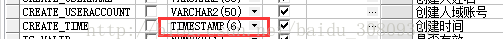
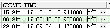
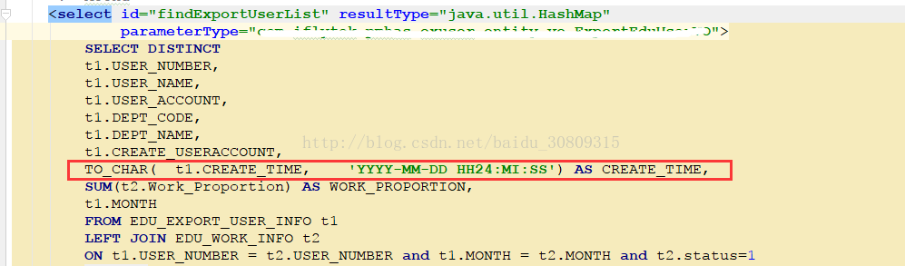
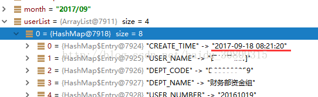

今天做Excel导出，需要从数据库导出一个时间类型的字段create_time

然后就遇到一个oracle的时间类型转换的问题，不进行转换的话，导出的时间类似于这样`oracle.sql.TIMESTAMP@57c8f82b`

在数据库中，create_time这个字段的类型为`TIMESTAMP(6)`

  

因为我们是SSM框架，所以从映射文件做一下转换

此时我们执行这条sql就会看到如下结果（我是用idea的debug模式查看的）

