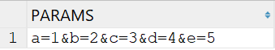
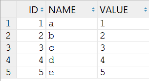
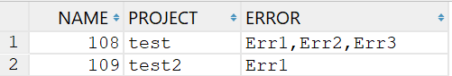
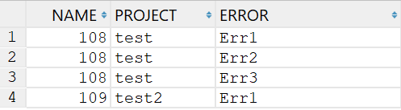

## 效果





## SQL

```sql
with t1 as (select 'a=1&b=2&c=3&d=4&e=5' as params from dual)
select id,
       SUBSTR(data, 1, INSTR(data, '=') - 1) AS name,
       SUBSTR(data, INSTR(data, '=') + 1) AS value
from (select LEVEL AS id, REGEXP_SUBSTR(params, '[^&]+', 1, LEVEL) AS data
      from (select params from t1)
      CONNECT BY REGEXP_SUBSTR(params, '[^&]+', 1, LEVEL) IS NOT NULL);
```

## 效果





## SQL

```sql
with temp as (select 108 Name, 'test' Project, 'Err1,Err2,Err3' Error from dual
              union all
              select 109, 'test2', 'Err1' from dual)
select t.name, t.project,
       regexp_substr(t.error, '[^,]+', 1, levels.column_value) as error
from temp t,
     table (cast(multiset(select level from dual connect by level <= length(regexp_replace(t.error, '[^,]+')) + 1) as
                 sys.OdciNumberList)) levels
order by name
```

## 参考

https://stackoverflow.com/questions/28677070/split-function-in-oracle-to-comma-separated-values-with-automatic-sequence

https://stackoverflow.com/questions/24033336/sql-divide-single-column-in-multiple-columns

https://stackoverflow.com/questions/14328621/splitting-string-into-multiple-rows-in-oracle
