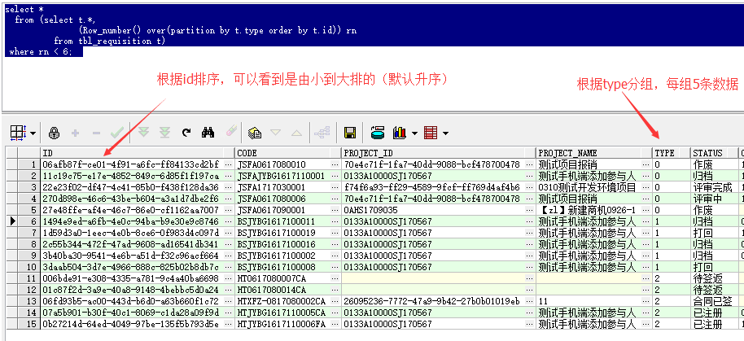

语句如下：

```sql
 select *  
  from (select t.*,  
               (Row_number() over(partition by 分组字段 order by 排序字段)) rn  
          from 表名字 t)  
 where rn < 6;  
```

示例：

```sql
select *  
  from (select t.*,  
               (Row_number() over(partition by t.type order by t.id)) rn  
          from tbl_requisition t)  
 where rn < 6;  
```

意思是：根据tbl_requisition表中的type类型进行分组，取前5条，且这5条数据是根据id排序的

来个截图（查找结果）



