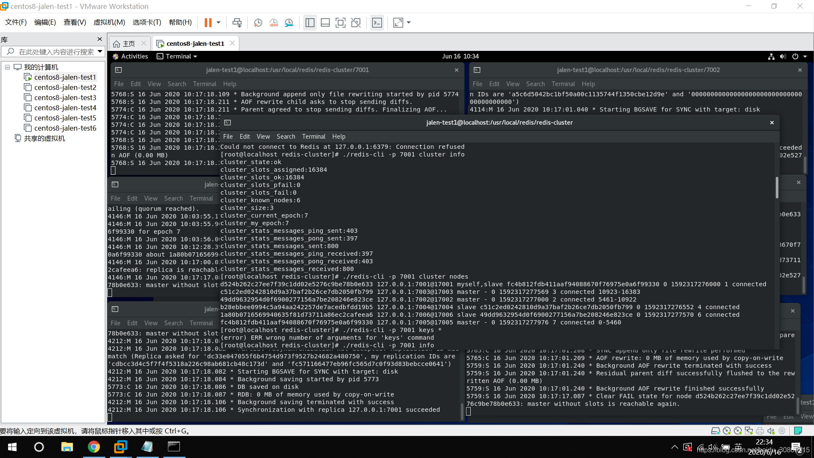

```
说明：redis集群的安装最好参考官网，讲的很详细的（https://redis.io/topics/cluster-tutorial）
redis集群至少3个master节点和3个slave节点共6个节点，我们可以用1台server开启6个redis端口模拟，在redis开启集群时会提示我们当前master和slave在同一台机器上，忽略即可
（本来是装了6台虚拟机，想绑定6个ip的，真实模拟一下，但是虚拟机同时打开电脑真的带不动, 所以虚拟机网络设置和修改虚拟机ip地址这些环节可以忽略）
 
环境：
windows10 x64 
VMware Workstation Pro15.5.1  （VMware-workstation-full-15.5.1-15018445.exe,  500M+）
Centos8  (CentOS-8.1.1911-x86_64-dvd1.iso,   7G+)
redis6.0.5 (stable， 2M+)
 
1. 安装centos8镜像（注：第一次安装可能会报pane is dead，此时先将当前虚拟机关闭，右键该虚拟机->设置->CD/DVD不要选择autoinst.iso，切换为我们自己下载的iso镜像，重启）
2. 虚拟机网络设置：vmware->我的计算机下右键虚拟机->设置->网络适配器->网络连接->桥接模式（不要使用NAT模式，或者设置为自定义中的vmnet0--未尝试）
3. 修改虚拟机ip地址：
（1）sudo vi /etc/sysconfig/network-scripts/ifcfg-ens33 
	BOOTPROTO=static       （默认是dhcp，改为static，即使用静态ip）
	ONBOOT=yes      （默认是no，改为yes，设置为开机生效）
	IPADDR=192.168.2.191     （新增，自定义ip地址）
	NETMASK=255.255.255.0     （新增，和windows主机子网掩码一致）
	GATEWAY=192.168.2.1     （新增，和windows主机默认网关一致）
	DNS1=114.114.114.114     （新增DNS）
	DNS2=8.8.8.8     （新增DNS）
（2）重启虚拟机，使用ifconfig查看ip是否修改成功，修改成功后使用windows主机ping虚拟机ip, 再尝试使用虚拟机ip去ping windows主机。
     （如果虚拟机ping windows发现ping后很久没有response，则尝试修改windows系统防火墙->高级设置->入站规则->文件和打印机共享(回显请求 - ICMPv4-In)->开启，
        ICMPv4-In我这边有2个，都打开即可）
4. 安装redis
（1）各版本镜像地址：http://download.redis.io/releases/，复制想要下载的地址链接，我选择的是最下面的stable稳定版本
（2）我自己下载该镜像时特别慢，我选择把下载链接贴到迅雷，下好后，使用sftp传到虚拟机，可安装xshell&xftp工具   
        $ wget http://download.redis.io/releases/redis-stable.tar.gz 
        $  cd /usr/local
        $ mkdir redis
        $ cp redis-stable.tar.gz /usr/local/redis
        $ chmod -R 777 redis-stable.tar.gz
        $ tar -zxvf redis-stable.tar.gz
        $ cd redis-stable
        $ make
        $ cd src
        $ ./redis-server ../redis.conf
        $ ./redis-cli
        输入info
5. 集群 
（1）创建文件夹redis-cluster, 在里面创建6个子文件夹
          $ mkdir redis-cluster
          $ cd redis-cluster
          $ mkdir 7001 7002 7003 7004 7005 7006
（2）在7001文件夹创建文件redis.conf,编辑redis.conf（内容如下）, 其他7002、7003... 类似，按对应文件夹名改下端口号，保持一致即可
         port 7001
         cluster-enabled yes
         cluster-config-file nodes.conf
         cluster-node-timeout 5000
         appendonly yes
（3）将第四步安装好的redis-server和redis-cli复制到redis-cluster目录下
（4）打开6个终端，使用redis-server redis.conf依次启动，启动后对应7001~7006目录下分别生成nodes.conf(注意这里有节点的唯一id)和appendonly.aof, 使用ps查看下redis进程是否正常
（5）redis3/4启动集群：需要执行redis-trib.rb，依赖ruby环境，yum install ruby，同时下载gem，https://rubygems.org/gems/redis/versions/4.1.3，gem install redis-4.1.3.gem  (未测试)
         $ cp redis-stable/src/redis-trib.rb redis-cluster
         $ ./redis-trib.rb create --replicas 1 127.0.0.1:7001 127.0.0.1:7002 127.0.0.1:7003 127.0.0.1:7004 127.0.0.1:7005 127.0.0.1:7006
（6）redis5/6启动集群：执行redis-cli，输入yes（我这边默认将前7001/7002/7003作为master，后三个作为master对应的slave），最终输出All 16384 slots covered
         $ ./redis-cli --cluster create 127.0.0.1:7001 127.0.0.1:7002 127.0.0.1:7003 127.0.0.1:7004 127.0.0.1:7005 127.0.0.1:7006 --cluster-replicas 1
（7）测试集群
        [root@localhost redis-cluster]# ./redis-cli -c -p 7001
        127.0.0.1:7001> set name jalen
        -> Redirected to slot [5798] located at 127.0.0.1:7002
        OK
        127.0.0.1:7002> get name
        "jalen"
        127.0.0.1:7002> exit
        [root@localhost redis-cluster]# ./redis-cli -c -p 7006
        127.0.0.1:7006> get name
        -> Redirected to slot [5798] located at 127.0.0.1:7002
        "jalen"
        127.0.0.1:7002> 
（8）ctrl + c 关闭redis 7001 master节点，可以看到7005节点log： Failover election won: I'm the new master.
（9）ctrl + c 关闭redis 7006 slave节点，可以看到其他几个节点有较少log刷新，说明7006节点关掉了
（10）重新打开7001节点，发现7001不再是master节点，沦为7005的slave节点
 
 
 
问题一：新装的centos make命令不能用，解决：yum -y install gcc automake autoconf libtool make
[root@localhost redis-stable]# make
bash: make: command not found...
Failed to search for file: Cannot update read-only repo
 
问题二：集群执行后返回All 16384 slots covered，为什么redis集群的最大槽数是16384个
redis作者回复：https://github.com/antirez/redis/issues/2576
 
问题三：使用aliyun安装执行make编译时报很多类似：error: ‘struct redisServer’ has no member named ‘sentinel_mode’的错（参考https://blog.csdn.net/hello_cmy/article/details/106062327）
$ yum -y install centos-release-scl
$ yum -y install devtoolset-9-gcc devtoolset-9-gcc-c++ devtoolset-9-binutils
$ scl enable devtoolset-9 bash
$ echo "source /opt/rh/devtoolset-9/enable" >>/etc/profile
 
 
 
参考：
1. vmware安装centos8网络设置：https://blog.csdn.net/qq_25650463/article/details/103436611
2. redis集群搭建：https://blog.csdn.net/qq_42815754/article/details/82912130
3. https://redis.io/topics/cluster-tutorial
 
 
 
 
 
 
[root@localhost redis-cluster]# ps -efl|grep redis
4 S root       4098   4052  0  80   0 - 16086 do_epo 08:51 pts/1    00:00:06 ../redis-server *:7001 [cluster]
4 S root       4114   4077  0  80   0 - 16086 do_epo 08:51 pts/0    00:00:06 ../redis-server *:7002 [cluster]
4 S root       4146   4128  0  80   0 - 16086 do_epo 08:52 pts/2    00:00:05 ../redis-server *:7003 [cluster]
4 S root       4175   4157  0  80   0 - 16086 do_epo 08:52 pts/3    00:00:05 ../redis-server *:7004 [cluster]
4 S root       4212   4186  0  80   0 - 16086 do_epo 08:52 pts/4    00:00:05 ../redis-server *:7005 [cluster]
4 S root       4244   4223  0  80   0 - 16086 do_epo 08:52 pts/5    00:00:05 ../redis-server *:7006 [cluster]
0 R root       5205   4592  0  80   0 -  3027 -      09:42 pts/6    00:00:00 grep --color=auto redis
[root@localhost redis-cluster]# 
 
[root@localhost redis-cluster]# cat redis-cluster/7001/nodes.conf
d524b262c27ee7f39c1dd02e5276c9be78b0e633 :0@0 myself,master - 0 0 0 connected
vars currentEpoch 0 lastVoteEpoch 0
[root@localhost redis-cluster]# cat redis-cluster/7002/nodes.conf
49dd9632954d0f6900277156a7be208246e823ce :0@0 myself,master - 0 0 0 connected
vars currentEpoch 0 lastVoteEpoch 0
[root@localhost redis-cluster]# cat redis-cluster/7003/nodes.conf
c51c2ed0242810d9a37baf2b26ce7db2050fb799 :0@0 myself,master - 0 0 0 connected
vars currentEpoch 0 lastVoteEpoch 0
[root@localhost redis-cluster]# cat redis-cluster/7004/nodes.conf
b28ebbee0994c5a94aa242257de7acedbfdd19b5 :0@0 myself,master - 0 0 0 connected
vars currentEpoch 0 lastVoteEpoch 0
[root@localhost redis-cluster]# cat redis-cluster/7005/nodes.conf
fc4b812fdb411aaf94088670f76975e0a6f99330 :0@0 myself,master - 0 0 0 connected
vars currentEpoch 0 lastVoteEpoch 0
[root@localhost redis-cluster]# cat redis-cluster/7006/nodes.conf
1a80b0716569940635f81d73711a86ec2cafeea6 :0@0 myself,master - 0 0 0 connected
vars currentEpoch 0 lastVoteEpoch 0
 
[root@localhost redis-cluster]# ./redis-cli --cluster create 127.0.0.1:7001 127.0.0.1:7002 127.0.0.1:7003 127.0.0.1:7004 127.0.0.1:7005 127.0.0.1:7006 --cluster-replicas 1
>>> Performing hash slots allocation on 6 nodes...
Master[0] -> Slots 0 - 5460
Master[1] -> Slots 5461 - 10922
Master[2] -> Slots 10923 - 16383
Adding replica 127.0.0.1:7005 to 127.0.0.1:7001
Adding replica 127.0.0.1:7006 to 127.0.0.1:7002
Adding replica 127.0.0.1:7004 to 127.0.0.1:7003
>>> Trying to optimize slaves allocation for anti-affinity
[WARNING] Some slaves are in the same host as their master
M: d524b262c27ee7f39c1dd02e5276c9be78b0e633 127.0.0.1:7001
   slots:[0-5460] (5461 slots) master
M: 49dd9632954d0f6900277156a7be208246e823ce 127.0.0.1:7002
   slots:[5461-10922] (5462 slots) master
M: c51c2ed0242810d9a37baf2b26ce7db2050fb799 127.0.0.1:7003
   slots:[10923-16383] (5461 slots) master
S: b28ebbee0994c5a94aa242257de7acedbfdd19b5 127.0.0.1:7004
   replicates c51c2ed0242810d9a37baf2b26ce7db2050fb799
S: fc4b812fdb411aaf94088670f76975e0a6f99330 127.0.0.1:7005
   replicates d524b262c27ee7f39c1dd02e5276c9be78b0e633
S: 1a80b0716569940635f81d73711a86ec2cafeea6 127.0.0.1:7006
   replicates 49dd9632954d0f6900277156a7be208246e823ce
Can I set the above configuration? (type 'yes' to accept): yes
>>> Nodes configuration updated
>>> Assign a different config epoch to each node
>>> Sending CLUSTER MEET messages to join the cluster
Waiting for the cluster to join
.
>>> Performing Cluster Check (using node 127.0.0.1:7001)
M: d524b262c27ee7f39c1dd02e5276c9be78b0e633 127.0.0.1:7001
   slots:[0-5460] (5461 slots) master
   1 additional replica(s)
M: c51c2ed0242810d9a37baf2b26ce7db2050fb799 127.0.0.1:7003
   slots:[10923-16383] (5461 slots) master
   1 additional replica(s)
S: 1a80b0716569940635f81d73711a86ec2cafeea6 127.0.0.1:7006
   slots: (0 slots) slave
   replicates 49dd9632954d0f6900277156a7be208246e823ce
M: 49dd9632954d0f6900277156a7be208246e823ce 127.0.0.1:7002
   slots:[5461-10922] (5462 slots) master
   1 additional replica(s)
S: fc4b812fdb411aaf94088670f76975e0a6f99330 127.0.0.1:7005
   slots: (0 slots) slave
   replicates d524b262c27ee7f39c1dd02e5276c9be78b0e633
S: b28ebbee0994c5a94aa242257de7acedbfdd19b5 127.0.0.1:7004
   slots: (0 slots) slave
   replicates c51c2ed0242810d9a37baf2b26ce7db2050fb799
[OK] All nodes agree about slots configuration.
>>> Check for open slots...
>>> Check slots coverage...
[OK] All 16384 slots covered.
[root@localhost redis-cluster]# 
 
redis 7001 master log
4098:M 16 Jun 2020 08:51:22.632 * Ready to accept connections
4098:M 16 Jun 2020 09:24:18.214 # configEpoch set to 1 via CLUSTER SET-CONFIG-EPOCH
4098:M 16 Jun 2020 09:24:18.267 # IP address for this node updated to 127.0.0.1
4098:M 16 Jun 2020 09:24:20.844 * Replica 127.0.0.1:7005 asks for synchronization
4098:M 16 Jun 2020 09:24:20.844 * Partial resynchronization not accepted: Replication ID mismatch (Replica asked for 'b093f8ad2c1d8603ccdfbf1f34dbe49cbe7d0a98', my replication IDs are '703d4ce334b44c721e63784f8aab1e1749b8b203' and '0000000000000000000000000000000000000000')
4098:M 16 Jun 2020 09:24:20.844 * Replication backlog created, my new replication IDs are 'fc571166477eb96fc565d7c0f93d83bebcce0641' and '0000000000000000000000000000000000000000'
4098:M 16 Jun 2020 09:24:20.844 * Starting BGSAVE for SYNC with target: disk
4098:M 16 Jun 2020 09:24:20.847 * Background saving started by pid 4931
4931:C 16 Jun 2020 09:24:20.863 * DB saved on disk
4931:C 16 Jun 2020 09:24:20.864 * RDB: 2 MB of memory used by copy-on-write
4098:M 16 Jun 2020 09:24:20.946 * Background saving terminated with success
4098:M 16 Jun 2020 09:24:20.946 * Synchronization with replica 127.0.0.1:7005 succeeded
4098:M 16 Jun 2020 09:24:23.195 # Cluster state changed: ok
对应slave
redis 7005 log
4212:M 16 Jun 2020 08:52:27.109 * Ready to accept connections
4212:M 16 Jun 2020 09:24:18.215 # configEpoch set to 5 via CLUSTER SET-CONFIG-EPOCH
4212:M 16 Jun 2020 09:24:18.377 # IP address for this node updated to 127.0.0.1
4212:S 16 Jun 2020 09:24:20.230 * Before turning into a replica, using my own master parameters to synthesize a cached master: I may be able to synchronize with the new master with just a partial transfer.
4212:S 16 Jun 2020 09:24:20.230 # Cluster state changed: ok
4212:S 16 Jun 2020 09:24:20.842 * Connecting to MASTER 127.0.0.1:7001
4212:S 16 Jun 2020 09:24:20.842 * MASTER <-> REPLICA sync started
4212:S 16 Jun 2020 09:24:20.842 * Non blocking connect for SYNC fired the event.
4212:S 16 Jun 2020 09:24:20.844 * Master replied to PING, replication can continue...
4212:S 16 Jun 2020 09:24:20.844 * Trying a partial resynchronization (request b093f8ad2c1d8603ccdfbf1f34dbe49cbe7d0a98:1).
4212:S 16 Jun 2020 09:24:20.847 * Full resync from master: fc571166477eb96fc565d7c0f93d83bebcce0641:0
4212:S 16 Jun 2020 09:24:20.847 * Discarding previously cached master state.
4212:S 16 Jun 2020 09:24:20.947 * MASTER <-> REPLICA sync: receiving 175 bytes from master to disk
4212:S 16 Jun 2020 09:24:20.947 * MASTER <-> REPLICA sync: Flushing old data
4212:S 16 Jun 2020 09:24:20.947 * MASTER <-> REPLICA sync: Loading DB in memory
4212:S 16 Jun 2020 09:24:20.947 * Loading RDB produced by version 6.0.5
4212:S 16 Jun 2020 09:24:20.947 * RDB age 0 seconds
4212:S 16 Jun 2020 09:24:20.947 * RDB memory usage when created 2.52 Mb
4212:S 16 Jun 2020 09:24:20.947 * MASTER <-> REPLICA sync: Finished with success
4212:S 16 Jun 2020 09:24:20.947 * Background append only file rewriting started by pid 4933
4212:S 16 Jun 2020 09:24:21.031 * AOF rewrite child asks to stop sending diffs.
4933:C 16 Jun 2020 09:24:21.032 * Parent agreed to stop sending diffs. Finalizing AOF...
4933:C 16 Jun 2020 09:24:21.032 * Concatenating 0.00 MB of AOF diff received from parent.
4933:C 16 Jun 2020 09:24:21.032 * SYNC append only file rewrite performed
4933:C 16 Jun 2020 09:24:21.032 * AOF rewrite: 0 MB of memory used by copy-on-write
4212:S 16 Jun 2020 09:24:21.046 * Background AOF rewrite terminated with success
4212:S 16 Jun 2020 09:24:21.046 * Residual parent diff successfully flushed to the rewritten AOF (0.00 MB)
4212:S 16 Jun 2020 09:24:21.046 * Background AOF rewrite finished successfully
 
redis 7002 master log
4114:M 16 Jun 2020 09:24:18.214 # configEpoch set to 2 via CLUSTER SET-CONFIG-EPOCH
4114:M 16 Jun 2020 09:24:18.372 # IP address for this node updated to 127.0.0.1
4114:M 16 Jun 2020 09:24:20.844 * Replica 127.0.0.1:7006 asks for synchronization
4114:M 16 Jun 2020 09:24:20.844 * Partial resynchronization not accepted: Replication ID mismatch (Replica asked for '36ad26429daeb065e56bd60183ca297bf9ad92c1', my replication IDs are '199ba2e942b9200981bfbeb0050d0568baa0e965' and '0000000000000000000000000000000000000000')
4114:M 16 Jun 2020 09:24:20.844 * Replication backlog created, my new replication IDs are 'a5c6d5042bc1bf50a00c1135744f1350cbe12d9e' and '0000000000000000000000000000000000000000'
4114:M 16 Jun 2020 09:24:20.844 * Starting BGSAVE for SYNC with target: disk
4114:M 16 Jun 2020 09:24:20.844 * Background saving started by pid 4930
4930:C 16 Jun 2020 09:24:20.864 * DB saved on disk
4930:C 16 Jun 2020 09:24:20.865 * RDB: 0 MB of memory used by copy-on-write
4114:M 16 Jun 2020 09:24:20.946 * Background saving terminated with success
4114:M 16 Jun 2020 09:24:20.946 * Synchronization with replica 127.0.0.1:7006 succeeded
4114:M 16 Jun 2020 09:24:23.195 # Cluster state changed: ok
对应slave
redis 7006 log
4244:S 16 Jun 2020 09:24:20.232 # Cluster state changed: ok
4244:S 16 Jun 2020 09:24:20.842 * Connecting to MASTER 127.0.0.1:7002
4244:S 16 Jun 2020 09:24:20.842 * MASTER <-> REPLICA sync started
4244:S 16 Jun 2020 09:24:20.842 * Non blocking connect for SYNC fired the event.
4244:S 16 Jun 2020 09:24:20.844 * Master replied to PING, replication can continue...
4244:S 16 Jun 2020 09:24:20.844 * Trying a partial resynchronization (request 36ad26429daeb065e56bd60183ca297bf9ad92c1:1).
4244:S 16 Jun 2020 09:24:20.847 * Full resync from master: a5c6d5042bc1bf50a00c1135744f1350cbe12d9e:0
4244:S 16 Jun 2020 09:24:20.847 * Discarding previously cached master state.
4244:S 16 Jun 2020 09:24:20.946 * MASTER <-> REPLICA sync: receiving 175 bytes from master to disk
4244:S 16 Jun 2020 09:24:20.946 * MASTER <-> REPLICA sync: Flushing old data
4244:S 16 Jun 2020 09:24:20.946 * MASTER <-> REPLICA sync: Loading DB in memory
4244:S 16 Jun 2020 09:24:20.946 * Loading RDB produced by version 6.0.5
4244:S 16 Jun 2020 09:24:20.946 * RDB age 0 seconds
4244:S 16 Jun 2020 09:24:20.946 * RDB memory usage when created 2.53 Mb
4244:S 16 Jun 2020 09:24:20.946 * MASTER <-> REPLICA sync: Finished with success
4244:S 16 Jun 2020 09:24:20.947 * Background append only file rewriting started by pid 4932
4244:S 16 Jun 2020 09:24:21.031 * AOF rewrite child asks to stop sending diffs.
4932:C 16 Jun 2020 09:24:21.032 * Parent agreed to stop sending diffs. Finalizing AOF...
4932:C 16 Jun 2020 09:24:21.032 * Concatenating 0.00 MB of AOF diff received from parent.
4932:C 16 Jun 2020 09:24:21.032 * SYNC append only file rewrite performed
4932:C 16 Jun 2020 09:24:21.032 * AOF rewrite: 0 MB of memory used by copy-on-write
4244:S 16 Jun 2020 09:24:21.046 * Background AOF rewrite terminated with success
4244:S 16 Jun 2020 09:24:21.046 * Residual parent diff successfully flushed to the rewritten AOF (0.00 MB)
4244:S 16 Jun 2020 09:24:21.046 * Background AOF rewrite finished successfully
 
redis 7003 master log
4146:M 16 Jun 2020 08:52:08.193 * Ready to accept connections
4146:M 16 Jun 2020 09:24:18.214 # configEpoch set to 3 via CLUSTER SET-CONFIG-EPOCH
4146:M 16 Jun 2020 09:24:18.374 # IP address for this node updated to 127.0.0.1
4146:M 16 Jun 2020 09:24:20.538 * Replica 127.0.0.1:7004 asks for synchronization
4146:M 16 Jun 2020 09:24:20.538 * Partial resynchronization not accepted: Replication ID mismatch (Replica asked for '90396c5c98bbf5e72c611683ef000d9d09dc3f9a', my replication IDs are '6c7493905539808b289310d9e65180a44242d185' and '0000000000000000000000000000000000000000')
4146:M 16 Jun 2020 09:24:20.538 * Replication backlog created, my new replication IDs are '196fd958855d9285a05590dcc4c1dc13d8180e10' and '0000000000000000000000000000000000000000'
4146:M 16 Jun 2020 09:24:20.538 * Starting BGSAVE for SYNC with target: disk
4146:M 16 Jun 2020 09:24:20.538 * Background saving started by pid 4928
4928:C 16 Jun 2020 09:24:20.669 * DB saved on disk
4928:C 16 Jun 2020 09:24:20.669 * RDB: 0 MB of memory used by copy-on-write
4146:M 16 Jun 2020 09:24:20.738 * Background saving terminated with success
4146:M 16 Jun 2020 09:24:20.738 * Synchronization with replica 127.0.0.1:7004 succeeded
4146:M 16 Jun 2020 09:24:23.195 # Cluster state changed: ok
对应slave
redis 7004 log
4175:M 16 Jun 2020 08:52:16.640 * Ready to accept connections
4175:M 16 Jun 2020 09:24:18.214 # configEpoch set to 4 via CLUSTER SET-CONFIG-EPOCH
4175:M 16 Jun 2020 09:24:18.375 # IP address for this node updated to 127.0.0.1
4175:S 16 Jun 2020 09:24:20.228 * Before turning into a replica, using my own master parameters to synthesize a cached master: I may be able to synchronize with the new master with just a partial transfer.
4175:S 16 Jun 2020 09:24:20.229 # Cluster state changed: ok
4175:S 16 Jun 2020 09:24:20.537 * Connecting to MASTER 127.0.0.1:7003
4175:S 16 Jun 2020 09:24:20.537 * MASTER <-> REPLICA sync started
4175:S 16 Jun 2020 09:24:20.537 * Non blocking connect for SYNC fired the event.
4175:S 16 Jun 2020 09:24:20.538 * Master replied to PING, replication can continue...
4175:S 16 Jun 2020 09:24:20.538 * Trying a partial resynchronization (request 90396c5c98bbf5e72c611683ef000d9d09dc3f9a:1).
4175:S 16 Jun 2020 09:24:20.539 * Full resync from master: 196fd958855d9285a05590dcc4c1dc13d8180e10:0
4175:S 16 Jun 2020 09:24:20.539 * Discarding previously cached master state.
4175:S 16 Jun 2020 09:24:20.738 * MASTER <-> REPLICA sync: receiving 175 bytes from master to disk
4175:S 16 Jun 2020 09:24:20.738 * MASTER <-> REPLICA sync: Flushing old data
4175:S 16 Jun 2020 09:24:20.738 * MASTER <-> REPLICA sync: Loading DB in memory
4175:S 16 Jun 2020 09:24:20.738 * Loading RDB produced by version 6.0.5
4175:S 16 Jun 2020 09:24:20.738 * RDB age 0 seconds
4175:S 16 Jun 2020 09:24:20.738 * RDB memory usage when created 2.52 Mb
4175:S 16 Jun 2020 09:24:20.738 * MASTER <-> REPLICA sync: Finished with success
4175:S 16 Jun 2020 09:24:20.739 * Background append only file rewriting started by pid 4929
4175:S 16 Jun 2020 09:24:20.820 * AOF rewrite child asks to stop sending diffs.
4929:C 16 Jun 2020 09:24:20.820 * Parent agreed to stop sending diffs. Finalizing AOF...
4929:C 16 Jun 2020 09:24:20.820 * Concatenating 0.00 MB of AOF diff received from parent.
4929:C 16 Jun 2020 09:24:20.820 * SYNC append only file rewrite performed
4929:C 16 Jun 2020 09:24:20.820 * AOF rewrite: 0 MB of memory used by copy-on-write
4175:S 16 Jun 2020 09:24:20.842 * Background AOF rewrite terminated with success
4175:S 16 Jun 2020 09:24:20.842 * Residual parent diff successfully flushed to the rewritten AOF (0.00 MB)
4175:S 16 Jun 2020 09:24:20.842 * Background AOF rewrite finished successfully
 
 
ctrl + c关闭redis7001节点时
7003/7004 log一致，指出重新选举master
4114:M 16 Jun 2020 10:03:55.170 * Marking node d524b262c27ee7f39c1dd02e5276c9be78b0e633 as failing (quorum reached).
4114:M 16 Jun 2020 10:03:55.172 # Cluster state changed: fail
4114:M 16 Jun 2020 10:03:55.962 # Failover auth granted to fc4b812fdb411aaf94088670f76975e0a6f99330 for epoch 7
4114:M 16 Jun 2020 10:03:56.004 # Cluster state changed: ok
7005 log，可以看到选举为master，摆脱slave地位
4212:S 16 Jun 2020 09:24:21.046 * Background AOF rewrite finished successfully
4212:S 16 Jun 2020 10:03:47.604 # Connection with master lost.
4212:S 16 Jun 2020 10:03:47.604 * Caching the disconnected master state.
4212:S 16 Jun 2020 10:03:47.803 * Connecting to MASTER 127.0.0.1:7001
4212:S 16 Jun 2020 10:03:47.803 * MASTER <-> REPLICA sync started
4212:S 16 Jun 2020 10:03:47.803 # Error condition on socket for SYNC: Operation now in progress
4212:S 16 Jun 2020 10:03:48.820 * Connecting to MASTER 127.0.0.1:7001
4212:S 16 Jun 2020 10:03:48.820 * MASTER <-> REPLICA sync started
4212:S 16 Jun 2020 10:03:48.821 # Error condition on socket for SYNC: Operation now in progress
4212:S 16 Jun 2020 10:03:49.832 * Connecting to MASTER 127.0.0.1:7001
4212:S 16 Jun 2020 10:03:49.832 * MASTER <-> REPLICA sync started
4212:S 16 Jun 2020 10:03:49.832 # Error condition on socket for SYNC: Operation now in progress
4212:S 16 Jun 2020 10:03:50.856 * Connecting to MASTER 127.0.0.1:7001
4212:S 16 Jun 2020 10:03:50.856 * MASTER <-> REPLICA sync started
4212:S 16 Jun 2020 10:03:50.856 # Error condition on socket for SYNC: Operation now in progress
4212:S 16 Jun 2020 10:03:51.888 * Connecting to MASTER 127.0.0.1:7001
4212:S 16 Jun 2020 10:03:51.888 * MASTER <-> REPLICA sync started
4212:S 16 Jun 2020 10:03:51.888 # Error condition on socket for SYNC: Operation now in progress
4212:S 16 Jun 2020 10:03:52.904 * Connecting to MASTER 127.0.0.1:7001
4212:S 16 Jun 2020 10:03:52.904 * MASTER <-> REPLICA sync started
4212:S 16 Jun 2020 10:03:52.904 # Error condition on socket for SYNC: Operation now in progress
4212:S 16 Jun 2020 10:03:53.916 * Connecting to MASTER 127.0.0.1:7001
4212:S 16 Jun 2020 10:03:53.917 * MASTER <-> REPLICA sync started
4212:S 16 Jun 2020 10:03:53.917 # Error condition on socket for SYNC: Operation now in progress
4212:S 16 Jun 2020 10:03:54.832 * Marking node d524b262c27ee7f39c1dd02e5276c9be78b0e633 as failing (quorum reached).
4212:S 16 Jun 2020 10:03:54.832 # Cluster state changed: fail
4212:S 16 Jun 2020 10:03:54.931 * Connecting to MASTER 127.0.0.1:7001
4212:S 16 Jun 2020 10:03:54.931 * MASTER <-> REPLICA sync started
4212:S 16 Jun 2020 10:03:54.931 # Start of election delayed for 995 milliseconds (rank #0, offset 3220).
4212:S 16 Jun 2020 10:03:54.931 # Error condition on socket for SYNC: Operation now in progress
4212:S 16 Jun 2020 10:03:55.955 * Connecting to MASTER 127.0.0.1:7001
4212:S 16 Jun 2020 10:03:55.955 * MASTER <-> REPLICA sync started
4212:S 16 Jun 2020 10:03:55.955 # Starting a failover election for epoch 7.
4212:S 16 Jun 2020 10:03:55.959 # Error condition on socket for SYNC: Operation now in progress
4212:S 16 Jun 2020 10:03:55.965 # Failover election won: I'm the new master.
4212:S 16 Jun 2020 10:03:55.965 # configEpoch set to 7 after successful failover
4212:M 16 Jun 2020 10:03:55.965 * Discarding previously cached master state.
4212:M 16 Jun 2020 10:03:55.965 # Setting secondary replication ID to fc571166477eb96fc565d7c0f93d83bebcce0641, valid up to offset: 3221. New replication ID is cdbcc3d4c5f7f4f5318a226c98ab681cb48c173d
4212:M 16 Jun 2020 10:03:55.965 # Cluster state changed: ok
7004/7006 log，比较悲催，还是slave，只有3条log
4175:S 16 Jun 2020 10:03:54.832 * Marking node d524b262c27ee7f39c1dd02e5276c9be78b0e633 as failing (quorum reached).
4175:S 16 Jun 2020 10:03:54.832 # Cluster state changed: fail
4175:S 16 Jun 2020 10:03:56.002 # Cluster state changed: ok
 
 
 
重新使用redis-server redis.conf启动7001，查看节点状态，发现7005仍是master状态，7001启动后为slave状态，他的master是7005
[root@localhost redis-cluster]# ./redis-cli -p 7001 cluster nodes
d524b262c27ee7f39c1dd02e5276c9be78b0e633 127.0.0.1:7001@17001 myself,slave fc4b812fdb411aaf94088670f76975e0a6f99330 0 1592317276000 1 connected
c51c2ed0242810d9a37baf2b26ce7db2050fb799 127.0.0.1:7003@17003 master - 0 1592317277569 3 connected 10923-16383
49dd9632954d0f6900277156a7be208246e823ce 127.0.0.1:7002@17002 master - 0 1592317277000 2 connected 5461-10922
b28ebbee0994c5a94aa242257de7acedbfdd19b5 127.0.0.1:7004@17004 slave c51c2ed0242810d9a37baf2b26ce7db2050fb799 0 1592317276552 4 connected
1a80b0716569940635f81d73711a86ec2cafeea6 127.0.0.1:7006@17006 slave 49dd9632954d0f6900277156a7be208246e823ce 0 1592317277570 6 connected
fc4b812fdb411aaf94088670f76975e0a6f99330 127.0.0.1:7005@17005 master - 0 1592317277976 7 connected 0-5460
 
 
```


