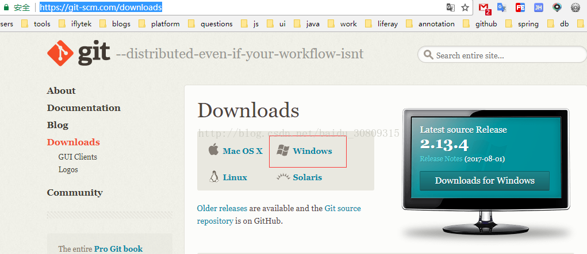
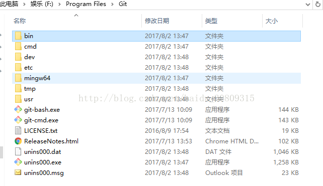
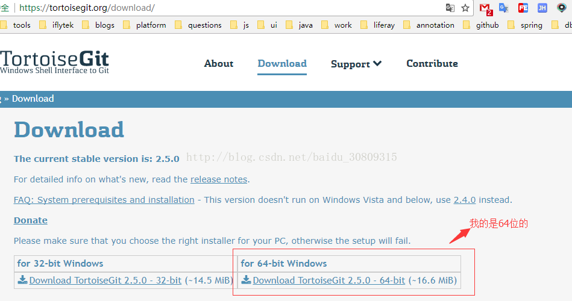
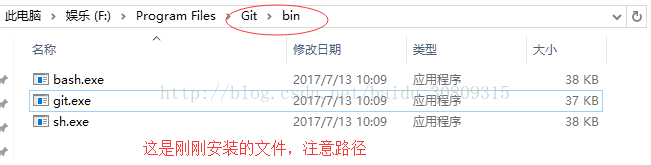
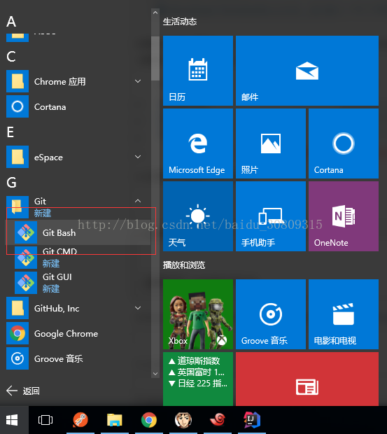
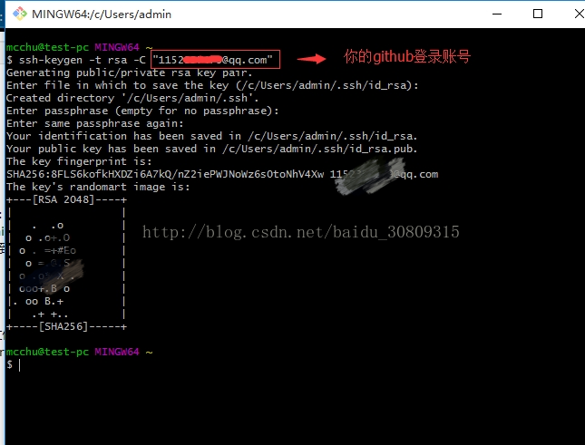
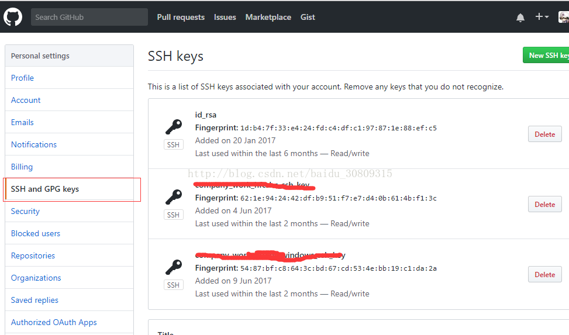

1. 安装git，首先去git官网下载git，https://git-scm.com/downloads，下载.exe格式并安装。

安装完是这样的

2. 安装TortoiseGit，下载地址https://tortoisegit.org/download/，如下

记得安装过程中要添加一个git.exe文件，这个文件在上一个安装文件的路径下面：

3. 从程序目录启动“Git Bash”

4. 键入命令：`ssh-keygen -t rsa -C "email@email.com"`,"email@email.com"是你的github账号

5. 此时，你的C:\Users\admin\.ssh这个路径下会生成两个文件：id_rsa和id_rsa.pub

6. 用记事本打开id_rsa.pub文件，复制内容，在github.com的网站上到ssh密钥管理页面，添加新公钥，随便取个名字，内容粘贴刚才复制的内容。

