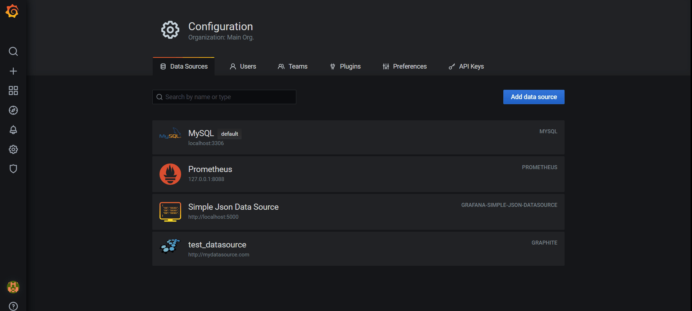

```python
import datetime
import json
import os
import sys
 
from itty import Response, run_itty, get
 
basedir = os.path.abspath(os.path.dirname(__file__))
lib_path = os.path.dirname(os.path.dirname(basedir))
sys.path.append(lib_path)
 
from dashboard import logger
 
 
@get('/api/v1/query')
def ping(request):
    """for Prometheus data source"""
    query = request.GET.get('query')
    timestamp = request.GET.get('time')
    time = datetime.datetime.fromtimestamp(float(timestamp)).strftime("%Y-%m-%d %H:%M:%S")
    logger.info('Query: %s' % query)
    logger.info('Time: %s' % time)
    return Response('success', status=200, content_type='application/json')
 
 
@get('/api/v1/query_range')
def ping(request):
    """for Prometheus data source"""
    query = request.GET.get('query')
    start_timestamp = request.GET.get('start')
    end_timestamp = request.GET.get('end')
    step = request.GET.get('step')
    start_time = datetime.datetime.fromtimestamp(float(start_timestamp)).strftime("%Y-%m-%d %H:%M:%S")
    end_time = datetime.datetime.fromtimestamp(float(end_timestamp)).strftime("%Y-%m-%d %H:%M:%S")
    logger.info('Query: %s' % query)
    logger.info('Start Time: %s' % start_time)
    logger.info('End Time: %s' % end_time)
    logger.info('Step: %s' % step)
    data = {
        "status": "success",
        "data": {
            "resultType": "matrix",
            "result": [
                {
                    "metric": {
                        "__name__": "http_requests_total",
                        "code": "200",
                        "handler": "prometheus",
                        "instance": "node1",
                        "job": "kubernetes-nodes",
                        "method": "get"
                    },
                    "values": [
                        [
                            1542878423.447,  # 2018-11-22 09:20:23
                            "86031"
                        ],
                        [
                            1542878433.447,  # 2018-11-22 09:20:33
                            "86032"
                        ]
                    ]
                }
            ]
        }
    }
    return Response(json.dumps(data), status=200, content_type='application/json')
 
 
run_itty(server='wsgiref', host='0.0.0.0', port=8088)
```

参考：https://blog.csdn.net/weixin_38645718/article/details/84105437
