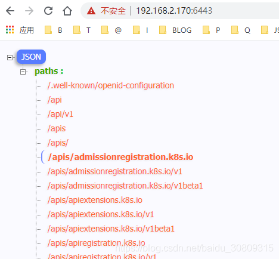

# centos k8s简单了解(集群环境搭建与使用)

环境说明：windows10，vmware16 Pro虚拟机，centos7.6镜像，一共装两台虚拟机模拟（1台master和1台node，实际应更多）

虚拟机网络使用桥接模式（自动），每个虚拟机配置为硬盘20G，内存2G，处理器2个

## 安装kubeadm， kubelet，kubectl

```shell script
[root@master ~]# swapoff -a   # 禁用虚拟内存
[root@master ~]# cat <<EOF > /etc/yum.repos.d/kubernetes.repo
[kubernetes]
name=Kubernetes
baseurl=https://mirrors.aliyun.com/kubernetes/yum/repos/kubernetes-el7-x86_64
enabled=1
gpgcheck=1
repo_gpgcheck=1
gpgkey=https://mirrors.aliyun.com/kubernetes/yum/doc/yum-key.gpg https://mirrors.aliyun.com/kubernetes/yum/doc/rpm-package-key.gpg
EOF
 
[root@master ~]# yum install -y kubectl kubelet kubeadm
[root@master ~]# systemctl enable kubelet  # 开机启动
[root@master ~]# systemctl start kubelet
 
[root@master ~]# echo "1" >/proc/sys/net/bridge/bridge-nf-call-iptables
[root@master ~]# kubeadm init --pod-network-cidr=10.244.0.0/16  # 2处理器，内存>1700M
```

## k8s.gcr.io问题，先通过vps将images push到docker hub，然后再从docker hub pull

```shell script
k8s问题
error execution phase preflight: [preflight] Some fatal errors occurred:
	[ERROR ImagePull]: failed to pull image k8s.gcr.io/kube-apiserver:v1.21.3: output: Error response from daemon: Get https://k8s.gcr.io/v2/: net/http: request canceled while waiting for connection (Client.Timeout exceeded while awaiting headers)
, error: exit status 1
	[ERROR ImagePull]: failed to pull image k8s.gcr.io/kube-controller-manager:v1.21.3: output: Error response from daemon: Get https://k8s.gcr.io/v2/: net/http: request canceled while waiting for connection (Client.Timeout exceeded while awaiting headers)
, error: exit status 1
	[ERROR ImagePull]: failed to pull image k8s.gcr.io/kube-scheduler:v1.21.3: output: Error response from daemon: Get https://k8s.gcr.io/v2/: net/http: request canceled while waiting for connection (Client.Timeout exceeded while awaiting headers)
, error: exit status 1
	[ERROR ImagePull]: failed to pull image k8s.gcr.io/kube-proxy:v1.21.3: output: Error response from daemon: Get https://k8s.gcr.io/v2/: net/http: request canceled while waiting for connection (Client.Timeout exceeded while awaiting headers)
, error: exit status 1
	[ERROR ImagePull]: failed to pull image k8s.gcr.io/pause:3.4.1: output: Error response from daemon: Get https://k8s.gcr.io/v2/: net/http: request canceled while waiting for connection (Client.Timeout exceeded while awaiting headers)
, error: exit status 1
	[ERROR ImagePull]: failed to pull image k8s.gcr.io/etcd:3.4.13-0: output: Error response from daemon: Get https://k8s.gcr.io/v2/: net/http: request canceled while waiting for connection (Client.Timeout exceeded while awaiting headers)
, error: exit status 1
	[ERROR ImagePull]: failed to pull image k8s.gcr.io/coredns/coredns:v1.8.0: output: Error response from daemon: Get https://k8s.gcr.io/v2/: net/http: request canceled while waiting for connection (Client.Timeout exceeded while awaiting headers)
, error: exit status 1
```

```shell script
[root@chumingcheng ~]# docker pull k8s.gcr.io/kube-apiserver:v1.21.3
[root@chumingcheng ~]# docker tag k8s.gcr.io/kube-apiserver:v1.21.3 chumingcheng/kube-apiserver:v1.21.3
[root@chumingcheng ~]# docker push chumingcheng/kube-apiserver:v1.21.3
 
[root@chumingcheng ~]# docker pull k8s.gcr.io/kube-controller-manager:v1.21.3
[root@chumingcheng ~]# docker tag k8s.gcr.io/kube-controller-manager:v1.21.3 chumingcheng/kube-controller-manager:v1.21.3
[root@chumingcheng ~]# docker push chumingcheng/kube-controller-manager:v1.21.3
 
[root@chumingcheng ~]# docker pull k8s.gcr.io/kube-scheduler:v1.21.3
[root@chumingcheng ~]# docker tag k8s.gcr.io/kube-scheduler:v1.21.3 chumingcheng/kube-scheduler:v1.21.3
[root@chumingcheng ~]# docker push chumingcheng/kube-scheduler:v1.21.3
 
[root@chumingcheng ~]# docker pull k8s.gcr.io/kube-proxy:v1.21.3
[root@chumingcheng ~]# docker tag k8s.gcr.io/kube-proxy:v1.21.3 chumingcheng/kube-proxy:v1.21.3
[root@chumingcheng ~]# docker push chumingcheng/kube-proxy:v1.21.3
 
[root@chumingcheng ~]# docker pull k8s.gcr.io/pause:3.4.1
[root@chumingcheng ~]# docker tag k8s.gcr.io/pause:3.4.1 chumingcheng/pause:3.4.1
[root@chumingcheng ~]# docker push chumingcheng/pause:3.4.1
 
[root@chumingcheng ~]# docker pull k8s.gcr.io/etcd:3.4.13-0
[root@chumingcheng ~]# docker tag k8s.gcr.io/etcd:3.4.13-0 chumingcheng/etcd:3.4.13-0
[root@chumingcheng ~]# docker push chumingcheng/etcd:3.4.13-0
 
[root@chumingcheng ~]# docker pull k8s.gcr.io/coredns/coredns:v1.8.0
[root@chumingcheng ~]# docker tag k8s.gcr.io/coredns/coredns:v1.8.0 chumingcheng/coredns/coredns:v1.8.0
[root@chumingcheng ~]# docker push chumingcheng/coredns/coredns:v1.8.0
```

```shell script
[root@master ~]# docker pull chumingcheng/kube-apiserver:v1.21.3
[root@master ~]# docker tag chumingcheng/kube-apiserver:v1.21.3 k8s.gcr.io/kube-apiserver:v1.21.3
[root@master ~]# docker rmi chumingcheng/kube-apiserver:v1.21.3
...
[root@master ~]# docker pull chumingcheng/coredns/coredns:v1.8.0
[root@master ~]# docker tag chumingcheng/coredns/coredns:v1.8.0 k8s.gcr.io/coredns/coredns:v1.8.0
[root@master ~]# docker rmi chumingcheng/coredns/coredns:v1.8.0
```

## 上面问题解决后，执行下面，kubeadm join xxx这条命令备份（后面节点加入需要执行）

```shell script
[root@master ~]# kubeadm init --pod-network-cidr=10.244.0.0/16
  ...
Your Kubernetes control-plane has initialized successfully!
 
To start using your cluster, you need to run the following as a regular user:
 
  mkdir -p $HOME/.kube
  sudo cp -i /etc/kubernetes/admin.conf $HOME/.kube/config
  sudo chown $(id -u):$(id -g) $HOME/.kube/config
 
Alternatively, if you are the root user, you can run:
 
  export KUBECONFIG=/etc/kubernetes/admin.conf
 
You should now deploy a pod network to the cluster.
Run "kubectl apply -f [podnetwork].yaml" with one of the options listed at:
  https://kubernetes.io/docs/concepts/cluster-administration/addons/
 
Then you can join any number of worker nodes by running the following on each as root:
 
kubeadm join 192.168.2.170:6443 --token c9xhek.j1lztmtz06fh7yy7 --discovery-token-ca-cert-hash sha256:e939c045bc5f49e4b7c39b0103f8e704b5f6cb0bbef7677b2f69db9d68cb6de6
 
[root@master ~]# mkdir -p $HOME/.kube
[root@master ~]# sudo cp -i /etc/kubernetes/admin.conf $HOME/.kube/config
[root@master ~]# sudo chown $(id -u):$(id -g) $HOME/.kube/config
[root@master ~]# sysctl net.bridge.bridge-nf-call-iptables=1
[root@master k8s]# curl -O https://raw.githubusercontent.com/coreos/flannel/v0.10.0/Documentation/kube-flannel.yml  # 这里可能拿不到，我直接从github搜了个直接用了，https://github.com/mrlxxx/kube-flannel.yml/edit/master/kube-flannel.yml
[root@master k8s]# kubectl apply -f kube-flannel.yml 
Warning: policy/v1beta1 PodSecurityPolicy is deprecated in v1.21+, unavailable in v1.25+
podsecuritypolicy.policy/psp.flannel.unprivileged created
Warning: rbac.authorization.k8s.io/v1beta1 ClusterRole is deprecated in v1.17+, unavailable in v1.22+; use rbac.authorization.k8s.io/v1 ClusterRole
clusterrole.rbac.authorization.k8s.io/flannel configured
Warning: rbac.authorization.k8s.io/v1beta1 ClusterRoleBinding is deprecated in v1.17+, unavailable in v1.22+; use rbac.authorization.k8s.io/v1 ClusterRoleBinding
clusterrolebinding.rbac.authorization.k8s.io/flannel unchanged
serviceaccount/flannel unchanged
configmap/kube-flannel-cfg configured
daemonset.apps/kube-flannel-ds-amd64 created
daemonset.apps/kube-flannel-ds-arm64 created
daemonset.apps/kube-flannel-ds-arm created
daemonset.apps/kube-flannel-ds-ppc64le created
daemonset.apps/kube-flannel-ds-s390x created
```

## 上面master部署结束，现在去配置节点（另一条非master虚拟机）执行, 报error

```shell script
[root@node ~]# swapoff -a
[root@node ~]# echo "1" >/proc/sys/net/bridge/bridge-nf-call-iptables
[root@slave ~]# kubeadm join 192.168.2.170:6443 --token c9xhek.j1lztmtz06fh7yy7 --discovery-token-ca-cert-hash sha256:e939c045bc5f49e4b7c39b0103f8e704b5f6cb0bbef7677b2f69db9d68cb6de6
[preflight] Running pre-flight checks
	[WARNING IsDockerSystemdCheck]: detected "cgroupfs" as the Docker cgroup driver. The recommended driver is "systemd". Please follow the guide at https://kubernetes.io/docs/setup/cri/
error execution phase preflight: couldn't validate the identity of the API Server: Get "https://192.168.2.170:6443/api/v1/namespaces/kube-public/configmaps/cluster-info?timeout=10s": dial tcp 192.168.2.170:6443: connect: no route to host
To see the stack trace of this error execute with --v=5 or higher
[root@slave ~]# 
```

上面的原因是因为使用vmware安装虚拟机后默认打开了防火墙，执行以下命令即可

```shell script
-----------------------------------------------------------------
[root@node ~]# iptables --flush
[root@node ~]# iptables -tnat --flush
[root@node ~]# systemctl stop firewalld
[root@node ~]# systemctl disable firewalld
Removed symlink /etc/systemd/system/multi-user.target.wants/firewalld.service.
Removed symlink /etc/systemd/system/dbus-org.fedoraproject.FirewallD1.service.
[root@node ~]# systemctl restart docker
[root@node ~]# kubeadm join 192.168.2.170:6443 --token bgsrcq.d5sqfplppncii6sp \
> --discovery-token-ca-cert-hash sha256:7bf637f77ff1e56fa137e0ca1433db22e44fed5e0057b910a8abc4b110b3ec0a
[preflight] Running pre-flight checks
	[WARNING IsDockerSystemdCheck]: detected "cgroupfs" as the Docker cgroup driver. The recommended driver is "systemd". Please follow the guide at https://kubernetes.io/docs/setup/cri/
[preflight] Reading configuration from the cluster...
[preflight] FYI: You can look at this config file with 'kubectl -n kube-system get cm kubeadm-config -o yaml'
[kubelet-start] Writing kubelet configuration to file "/var/lib/kubelet/config.yaml"
[kubelet-start] Writing kubelet environment file with flags to file "/var/lib/kubelet/kubeadm-flags.env"
[kubelet-start] Starting the kubelet
[kubelet-start] Waiting for the kubelet to perform the TLS Bootstrap...
 
This node has joined the cluster:
* Certificate signing request was sent to apiserver and a response was received.
* The Kubelet was informed of the new secure connection details.
 
Run 'kubectl get nodes' on the control-plane to see this node join the cluster.
 
[root@node ~]# 
 
----------------------------------------------------------------------
[root@master k8s]# iptables --flush
[root@master k8s]# iptables -tnat --flush
[root@master k8s]# systemctl stop firewalld
[root@master k8s]# systemctl disable firewalld
[root@master k8s]# systemctl restart docker
[root@master k8s]# kubectl get pods -n kube-system -o wide
NAME                             READY   STATUS              RESTARTS   AGE   IP              NODE     NOMINATED NODE   READINESS GATES
coredns-558bd4d5db-6l2jf         1/1     Running             2          18m   10.244.0.6      master   <none>           <none>
coredns-558bd4d5db-vkrvp         1/1     Running             1          18m   10.244.0.5      master   <none>           <none>
etcd-master                      1/1     Running             1          18m   192.168.2.170   master   <none>           <none>
kube-apiserver-master            1/1     Running             1          18m   192.168.2.170   master   <none>           <none>
kube-controller-manager-master   1/1     Running             1          18m   192.168.2.170   master   <none>           <none>
kube-flannel-ds-amd64-7jq99      0/1     Init:0/1            0          70s   192.168.2.174   node     <none>           <none>
kube-flannel-ds-amd64-vzrlt      1/1     Running             2          13m   192.168.2.170   master   <none>           <none>
kube-proxy-fmrwp                 0/1     ContainerCreating   0          70s   192.168.2.174   node     <none>           <none>
kube-proxy-m7mr4                 1/1     Running             2          18m   192.168.2.170   master   <none>           <none>
kube-scheduler-master            1/1     Running             1          18m   192.168.2.170   master   <none>           <none>
[root@master k8s]# kubectl get nodes
NAME     STATUS     ROLES                  AGE    VERSION
master   Ready      control-plane,master   22m    v1.21.3
node     NotReady   <none>                 5m9s   v1.21.3
[root@master k8s]# 
```

## 重新init master，即断开和node的连接，这样node可以重新join

```shell script
[root@master ~]# sudo kubeadm reset
[root@master ~]# ps -efl|grep kube
[root@master ~]# sudo kubeadm init --pod-network-cidr=10.244.0.0/16
... ...
Your Kubernetes control-plane has initialized successfully!
 
To start using your cluster, you need to run the following as a regular user:
 
  mkdir -p $HOME/.kube
  sudo cp -i /etc/kubernetes/admin.conf $HOME/.kube/config
  sudo chown $(id -u):$(id -g) $HOME/.kube/config
 
Alternatively, if you are the root user, you can run:
 
  export KUBECONFIG=/etc/kubernetes/admin.conf
 
You should now deploy a pod network to the cluster.
Run "kubectl apply -f [podnetwork].yaml" with one of the options listed at:
  https://kubernetes.io/docs/concepts/cluster-administration/addons/
 
Then you can join any number of worker nodes by running the following on each as root:
 
kubeadm join 192.168.2.170:6443 --token bgsrcq.d5sqfplppncii6sp \
	--discovery-token-ca-cert-hash sha256:7bf637f77ff1e56fa137e0ca1433db22e44fed5e0057b910a8abc4b110b3ec0a
[root@master ~]# mkdir -p $HOME/.kube
[root@master ~]# sudo cp -i /etc/kubernetes/admin.conf $HOME/.kube/config
cp: overwrite ‘/root/.kube/config’? y
[root@master ~]# sudo chown $(id -u):$(id -g) $HOME/.kube/config
[root@master ~]# sudo sysctl net.bridge.bridge-nf-call-iptables=1
net.bridge.bridge-nf-call-iptables = 1
[root@master k8s]# sudo kubectl apply -f kube-flannel.yml
```

## 浏览器访问https://192.168.2.170:6443/报403：forbidden: User "system:anonymous" cannot get path "/" 并且status是Failure。（参考：https://blog.csdn.net/baidu_38432732/article/details/106469037）

```shell script
[root@master k8s]# grep 'client-certificate-data' ~/.kube/config | head -n 1 | awk '{print $2}' | base64 -d >> kubecfg.crt
[root@master k8s]# grep 'client-key-data' ~/.kube/config | head -n 1 | awk '{print $2}' | base64 -d >> kubecfg.key
[root@master k8s]# openssl pkcs12 -export -clcerts -inkey kubecfg.key -in kubecfg.crt -out kubecfg.p12 -name "kubernetes-client"
Enter Export Password:
Verifying - Enter Export Password:
[root@master k8s]# ls
demo-master  demo-master.zip  kubecfg.crt  kubecfg.key  kubecfg.p12  kube-flannel1.yml  kube-flannel2.yml  kube-flannel.yml
[root@master k8s]# 
```

浏览器导入上面p12证书，重启浏览器，访问该地址，可以看到返回api所有的path。



## 使用kubectl get pods发现node上2个pod一个一直处于init状态，另一个一直处于ContainerCreating状态，查看具体信息发现pull镜像k8s.gcr.io/pause:3.4.1一直pull不下来，手动去node上pull下，最好把proxy镜像也顺便一块pull下，如果是其他版本镜像，最好从docker hub找找，可以按日期查找找最新的，pull过镜像后可以去master上手动删除这俩pod，然后k8s会自动重新初始化这俩pod。

```shell script
------------------------------master---------------------------------------
[root@master k8s]# kubectl get po --all-namespaces
NAMESPACE     NAME                             READY   STATUS              RESTARTS   AGE
kube-system   coredns-558bd4d5db-6l2jf         1/1     Running             2          46m
kube-system   coredns-558bd4d5db-vkrvp         1/1     Running             1          46m
kube-system   etcd-master                      1/1     Running             1          46m
kube-system   kube-apiserver-master            1/1     Running             1          46m
kube-system   kube-controller-manager-master   1/1     Running             1          46m
kube-system   kube-flannel-ds-amd64-7jq99      0/1     Init:0/1            0          28m
kube-system   kube-flannel-ds-amd64-vzrlt      1/1     Running             2          40m
kube-system   kube-proxy-fmrwp                 0/1     ContainerCreating   0          28m
kube-system   kube-proxy-m7mr4                 1/1     Running             2          46m
kube-system   kube-scheduler-master            1/1     Running             1          46m
[root@master k8s]# kubectl describe pod kube-flannel-ds-amd64-7jq99 -n kube-system
... ... get https://k8s.gcr.io/v2/: net/http: request canceled while waiting for connection ...
 
-------------------------------node---------------------------------------
[root@node ~]# docker pull chumingcheng/pause:3.4.1
3.4.1: Pulling from chumingcheng/pause
fac425775c9d: Pull complete 
Digest: sha256:9ec1e780f5c0196af7b28f135ffc0533eddcb0a54a0ba8b32943303ce76fe70d
Status: Downloaded newer image for chumingcheng/pause:3.4.1
docker.io/chumingcheng/pause:3.4.1
[root@node ~]# docker tag chumingcheng/pause:3.4.1 k8s.gcr.io/pause:3.4.1
[root@node ~]# docker rmi chumingcheng/pause:3.4.1
Untagged: chumingcheng/pause:3.4.1
Untagged: chumingcheng/pause@sha256:9ec1e780f5c0196af7b28f135ffc0533eddcb0a54a0ba8b32943303ce76fe70d
[root@node ~]# docker images
REPOSITORY               TAG             IMAGE ID       CREATED        SIZE
hello-world              latest          d1165f221234   4 months ago   13.3kB
k8s.gcr.io/pause         3.4.1           0f8457a4c2ec   6 months ago   683kB
quay.io/coreos/flannel   v0.11.0-amd64   ff281650a721   2 years ago    52.6MB
[root@node ~]# docker pull chumingcheng/kube-proxy:v1.21.3
v1.21.3: Pulling from chumingcheng/kube-proxy
fe5d561940df: Pull complete 
76d59146d9bf: Pull complete 
Digest: sha256:af5c9bacb913b5751d2d94e11dfd4e183e97b1a4afce282be95ce177f4a0100b
Status: Downloaded newer image for chumingcheng/kube-proxy:v1.21.3
docker.io/chumingcheng/kube-proxy:v1.21.3
[root@node ~]# docker tag chumingcheng/kube-proxy:v1.21.3 k8s.gcr.io/kube-proxy:v1.21.3
[root@node ~]# docker rmi chumingcheng/kube-proxy:v1.21.3
Untagged: chumingcheng/kube-proxy:v1.21.3
Untagged: chumingcheng/kube-proxy@sha256:af5c9bacb913b5751d2d94e11dfd4e183e97b1a4afce282be95ce177f4a0100b
[root@node ~]# docker images
REPOSITORY               TAG             IMAGE ID       CREATED        SIZE
k8s.gcr.io/kube-proxy    v1.21.3         adb2816ea823   2 weeks ago    103MB
hello-world              latest          d1165f221234   4 months ago   13.3kB
k8s.gcr.io/pause         3.4.1           0f8457a4c2ec   6 months ago   683kB
quay.io/coreos/flannel   v0.11.0-amd64   ff281650a721   2 years ago    52.6MB
[root@node ~]# 
 
--------------------------------master------------------------------------------
[root@master k8s]# kubectl delete pod kube-flannel-ds-amd64-7jq99 -n kube-system
pod "kube-flannel-ds-amd64-7jq99" deleted
[root@master k8s]# kubectl delete pod kube-proxy-fmrwp -n kube-system
pod "kube-proxy-fmrwp" deleted
[root@master k8s]# kubectl get po --all-namespaces
NAMESPACE     NAME                             READY   STATUS    RESTARTS   AGE
kube-system   coredns-558bd4d5db-6l2jf         1/1     Running   2          70m
kube-system   coredns-558bd4d5db-vkrvp         1/1     Running   1          70m
kube-system   etcd-master                      1/1     Running   1          70m
kube-system   kube-apiserver-master            1/1     Running   1          70m
kube-system   kube-controller-manager-master   1/1     Running   1          70m
kube-system   kube-flannel-ds-amd64-vzrlt      1/1     Running   2          64m
kube-system   kube-flannel-ds-amd64-z7bs4      1/1     Running   6          5m41s
kube-system   kube-proxy-fx2g6                 1/1     Running   0          5m21s
kube-system   kube-proxy-m7mr4                 1/1     Running   2          70m
kube-system   kube-scheduler-master            1/1     Running   1          70m
[root@master k8s]# 
```

## 创建deployments时候报error: unable to recognize "deployment.yaml": no matches for kind "Deployment" in version "extensions/v1beta1"

```shell script
[root@master k8s]# cat deployment.yaml 
---
apiVersion: extensions/v1beta1
kind: Deployment
metadata:
  name: kube-node
spec:
  replicas: 2
  template:
    metadata:
      labels:
        app: web
    spec:
      containers:
        - name: kube-node-demo-instance
          image: chumingcheng/myhello
          ports:
            - containerPort: 8888
[root@master k8s]# kubectl api-resources | grep deployment
deployments                       deploy       apps/v1                                true         Deployment
```

将上面apiVersion改为apps/v1即可。

## 创建deployment，以一个简单的nodejs server项目为例（参考：https://blog.csdn.net/wucong60/article/details/81586272）

```shell script
[root@master ~]# curl -sL https://rpm.nodesource.com/setup_14.x | sudo bash -
[root@master ~]# sudo yum install -y nodejs
[root@master ~]# mkdir kube-demo
[root@master ~]# cd kube-demo
[root@master kube-demo]# touch server.js
[root@master kube-demo]# vi server.js  # 复制下面内容
[root@master kube-demo]# cat server.js
[root@master kube-demo]# cat server.js
var http = require('http');
 
var handleRequest = function(request, response) {
  console.log('Received request for URL: ' + request.url);
  response.writeHead(200);
  response.end('Hello World!');
};
var www = http.createServer(handleRequest);
www.listen(8081);
[root@master kube-demo]# node server.js  # 启动测试下，浏览器访问8081测试
[root@master kube-demo]# touch Dockerfile
[root@master kube-demo]# docker image build -t kube-demo .
[root@master kube-demo]# vi Dockerfile  #  复制下面内容
[root@master kube-demo]# cat Dockerfile 
FROM node:8.11.2
WORKDIR app
COPY . .
EXPOSE 8081
ENTRYPOINT [ "node","server.js" ]
[root@master kube-demo]# docker tag kube-demo chumingcheng/kube-demo
[root@master kube-demo]# docker image push chumingcheng/kube-demo
[root@master k8s]# vi deployment.yaml   # 复制下面内容
[root@master k8s]# cat deployment.yaml 
---
apiVersion: apps/v1
kind: Deployment
metadata:
  name: kube-node
spec:
  selector:
    matchLabels:
      app: web
  replicas: 2
  template:
    metadata:
      labels:
        app: web
    spec:
      containers:
        - name: kube-node-demo-instance
          image: chumingcheng/kube-demo
          ports:
            - containerPort: 8081
[root@master k8s]# kubectl create -f deployment.yaml
deployment.apps/kube-node created
[root@master k8s]# kubectl get pods
NAME                         READY   STATUS    RESTARTS   AGE
kube-node-6fb65f5d5b-c7966   1/1     Running   0          2m3s
kube-node-6fb65f5d5b-w5qb9   1/1     Running   0          2m3s
[root@master k8s]# kubectl get pods -o wide
NAME                         READY   STATUS    RESTARTS   AGE     IP           NODE   NOMINATED NODE   READINESS GATES
kube-node-6fb65f5d5b-c7966   1/1     Running   0          3m36s   10.244.1.2   node   <none>           <none>
kube-node-6fb65f5d5b-w5qb9   1/1     Running   0          3m36s   10.244.1.3   node   <none>           <none>
[root@master k8s]# curl 10.244.1.2:8081
Hello World!
[root@master k8s]# curl 10.244.1.3:8081
Hello World!
[root@master k8s]# 
```

## 修改和删除deployments，查看pod，services

```shell script
[root@master k8s]# kubectl get pods -o wide
NAME                         READY   STATUS    RESTARTS   AGE   IP           NODE   NOMINATED NODE   READINESS GATES
kube-node-6fb65f5d5b-c7966   1/1     Running   0          10m   10.244.1.2   node   <none>           <none>
kube-node-6fb65f5d5b-w5qb9   1/1     Running   0          10m   10.244.1.3   node   <none>           <none>
[root@master k8s]# kubectl get pods
NAME                         READY   STATUS    RESTARTS   AGE
kube-node-6fb65f5d5b-c7966   1/1     Running   0          11m
kube-node-6fb65f5d5b-w5qb9   1/1     Running   0          11m
[root@master k8s]# kubectl get deployments --all-namespaces
NAMESPACE     NAME        READY   UP-TO-DATE   AVAILABLE   AGE
default       kube-node   2/2     2            2           12m
kube-system   coredns     2/2     2            2           173m
[root@master k8s]# kubectl delete -f deployment.yaml    # 删除，删除后可重新编辑deployment.yaml，然后再次创建
deployment.apps "kube-node" deleted
[root@master k8s]# kubectl get deployments --all-namespaces
NAMESPACE     NAME      READY   UP-TO-DATE   AVAILABLE   AGE
kube-system   coredns   2/2     2            2           174m
[root@master k8s]# kubectl get pods
No resources found in default namespace.
[root@master k8s]# kubectl apply -f deployment.yaml   # 再次创建
deployment.apps/kube-node created
[root@master k8s]# kubectl get deployments --all-namespaces
NAMESPACE     NAME        READY   UP-TO-DATE   AVAILABLE   AGE
default       kube-node   1/2     2            1           6s
kube-system   coredns     2/2     2            2           175m
[root@master k8s]# kubectl get pods
NAME                         READY   STATUS    RESTARTS   AGE
kube-node-6fb65f5d5b-2z6lm   1/1     Running   0          26s
kube-node-6fb65f5d5b-p5wr2   1/1     Running   0          26s
[root@master k8s]# kubectl edit deployments/kube-node  # 实时编辑，保存后会自动生效
Edit cancelled, no changes made.
[root@master k8s]# kubectl get services --all-namespaces   # 查看services，在yaml里定义
NAMESPACE     NAME         TYPE        CLUSTER-IP   EXTERNAL-IP   PORT(S)                  AGE
default       kubernetes   ClusterIP   10.96.0.1    <none>        443/TCP                  3h
kube-system   kube-dns     ClusterIP   10.96.0.10   <none>        53/UDP,53/TCP,9153/TCP   3h
[root@master k8s]# kubectl get pods
NAME                         READY   STATUS    RESTARTS   AGE
kube-node-6fb65f5d5b-2z6lm   1/1     Running   0          8m18s
kube-node-6fb65f5d5b-p5wr2   1/1     Running   0          8m18s
[root@master k8s]# kubectl describe pod kube-node-6fb65f5d5b-2z6lm
Name:         kube-node-6fb65f5d5b-2z6lm
Namespace:    default
Priority:     0
Node:         node/192.168.2.174
Start Time:   Sun, 01 Aug 2021 13:29:04 -0700
Labels:       app=web
              pod-template-hash=6fb65f5d5b
Annotations:  <none>
Status:       Running
IP:           10.244.1.5
IPs:
  IP:           10.244.1.5
Controlled By:  ReplicaSet/kube-node-6fb65f5d5b
Containers:
  kube-node-demo-instance:
    Container ID:   docker://7f7297b7f8b14c76e6563bbf22fe3d4fc7dba6b81f3c02d944058a28576ad4c1
    Image:          chumingcheng/kube-demo
    Image ID:       docker-pullable://chumingcheng/kube-demo@sha256:3426bbcf3f6aa091c0ce328b2f3e2c364db7966af460573fdb97a8893cc8187c
    Port:           8081/TCP
    Host Port:      0/TCP
    State:          Running
      Started:      Sun, 01 Aug 2021 13:29:11 -0700
    Ready:          True
    Restart Count:  0
    Environment:    <none>
    Mounts:
      /var/run/secrets/kubernetes.io/serviceaccount from kube-api-access-698sb (ro)
Conditions:
  Type              Status
  Initialized       True 
  Ready             True 
  ContainersReady   True 
  PodScheduled      True 
Volumes:
  kube-api-access-698sb:
    Type:                    Projected (a volume that contains injected data from multiple sources)
    TokenExpirationSeconds:  3607
    ConfigMapName:           kube-root-ca.crt
    ConfigMapOptional:       <nil>
    DownwardAPI:             true
QoS Class:                   BestEffort
Node-Selectors:              <none>
Tolerations:                 node.kubernetes.io/not-ready:NoExecute op=Exists for 300s
                             node.kubernetes.io/unreachable:NoExecute op=Exists for 300s
Events:
  Type    Reason     Age    From               Message
  ----    ------     ----   ----               -------
  Normal  Scheduled  8m33s  default-scheduler  Successfully assigned default/kube-node-6fb65f5d5b-2z6lm to node
  Normal  Pulling    8m32s  kubelet            Pulling image "chumingcheng/kube-demo"
  Normal  Pulled     8m26s  kubelet            Successfully pulled image "chumingcheng/kube-demo" in 6.371285955s
  Normal  Created    8m26s  kubelet            Created container kube-node-demo-instance
  Normal  Started    8m26s  kubelet            Started container kube-node-demo-instance
[root@master k8s]# 
```

## 重启虚拟机后启动kube（启动master和node，要稍等几分钟才能看到Ready）

```shell script
-----------------------------------------------------------------------
[root@node conf]# swapoff -a
[root@node conf]# systemctl start kubelet
 
-----------------------------------------------------------------------
[root@master ~]# swapoff -a
[root@master ~]# systemctl start kubelet
[root@master ~]# kubectl get nodes
NAME     STATUS   ROLES                  AGE   VERSION
master   Ready    control-plane,master   10h   v1.21.3
node     Ready    <none>                 9h    v1.21.3
```
