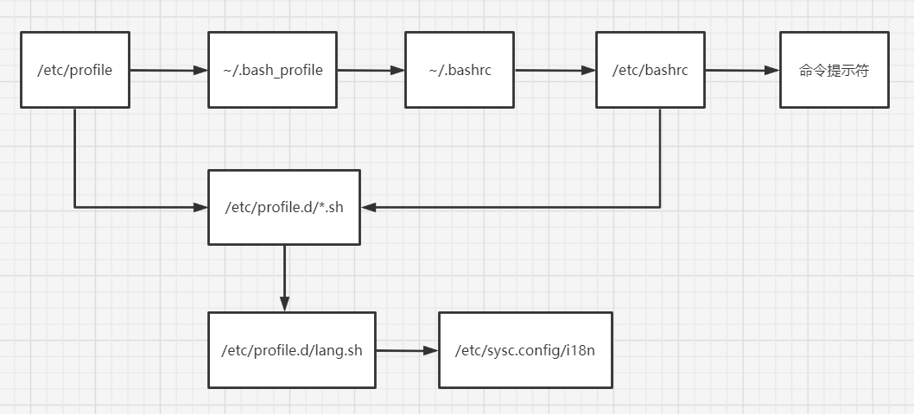

# Shell概述

## Shell是什么？
shell是一个**命令行解释器**，它为用户提供了一个向linux内核发送请求以便运行程序的界面系统级程序，用户可以用shell来启动、挂起、停止甚至是编写一些程序。
> 硬件->内核->shell命令解释器->外层应用程序

shell还是一个功能相当强大的编程语言，易编写，容易调试，灵活性较强。shell是**解释执行**的**脚本语言**，*在shell中可以直接调用linux系统命令*。

## Shell的分类
- Bourne Shell：1979年起unix开始使用Bourne Shell，Bourne Shell的主文件名为sh。
- C Shell：主要在BSD版的unix系统中使用，其语法和c语言相类似而得名。
  > Shell的两种主要语法类型有Bourne和C，这两种语法彼此不兼容。
  
  > (1) Bourne家族主要包括sh、ksh、Bash、psh、zsh；(B家族相对主流，尤其Bash)

  > (2) C家族主要包括：csh、tcsh;

  > Bash: Bash与sh兼容，现在使用的linux就是使用Bash最为用户的基本Shell。

## linux支持的shell
```bash
[root@core-pods-3 webmin-1.997]# cat /etc/shells   # 查看支持的shell
/bin/sh
/bin/bash
/usr/bin/sh
/usr/bin/bash
[root@core-pods-3 webmin-1.997]# sh    # 进入交互模式
sh-4.2# 
sh-4.2# exit
[root@core-pods-3 webmin-1.997]# 
[root@core-pods-3 webmin-1.997]# vi /etc/passwd   #  注意/sbin/nologin
```

# Shell脚本的执行方式
## echo输出命令
> $ echo [选项] [输出内容]

> 选项：-e 支持反斜线控制的字符转换
```bash
[root@core-pods-3 ~]# echo "Hello World"
Hello World
[root@core-pods-3 ~]# echo -e "Hello World"
Hello World
[root@core-pods-3 ~]# echo -e "Hello World\nHello China"
Hello World
Hello China
[root@core-pods-3 ~]# echo -e aaa\nbbb
aaanbbb
[root@core-pods-3 ~]# echo "Hello World\nHello China"
Hello World\nHello China
[root@core-pods-3 ~]# echo "Hello!"   # 不能加!号
-bash: ! event not found
[root@core-pods-3 ~]# echo 'Hello!'   # 单引号可以跟!号
Hello!
[root@core-pods-3 ~]# echo Hello
Hello
[root@core-pods-3 ~]# echo Hello Wrold!
Hello Wrold!

[root@core-pods-3 ~]# echo -e "\e[1;31m abcd  \e[0m"
 abcd
# 上面这条命令输出红色的abcd
# 30m是黑色，31m是红色，32m是绿色，33m是黄色
# 34m是蓝色，35m是洋红，36m是青色，37m是白色  
```
**反斜线转义字符**
|控制字符|作用|
|---|---|
|`\\`|输出\本身|
|\a|输出警告音|
|\b|退格键，向左删除一个字符|
|\c|取消输出行末的换行符，和“-n”选项一致|
|\e|ESCAPE键|
|\f|换页符|
|\n|换行符|
|\r|回车键|
|\t|制表符，也就是Tab键|
|\v|垂直制表符|
|\0nnn|按照八进制ASCII码表输出字符，其中0为数字零，nnn是三位8进制数|
|\xhh|按照十六进制ASCII码表输出字符，其中hh是两位十六进制数|

## 第一个脚本
```bash
[root@core-pods-3 ~]# vi hello.sh  # 这个.sh扩展名也可以不写
#!/bin/bash
#The first program
#Author: Jalen Chu (E-mail: chumingcheng234@gmail.com)

echo -e "Hello World"
[root@core-pods-3 ~]# ll hello.sh 
-rw-r--r-- 1 root root 109 Jul 27 00:35 hello.sh
[root@core-pods-3 ~]# chmod u+x hello.sh    # 想让其他用户可执行，给755权限
[root@core-pods-3 ~]# ll hello.sh 
-rwxr--r-- 1 root root 109 Jul 27 00:35 hello.sh
[root@core-pods-3 ~]# ./hello.sh 
Hello World
[root@core-pods-3 ~]# bash hello.sh   #  这种执行不需要赋予脚本可执行权限
Hello World
[root@core-pods-3 sh]# git clone https://github.com/kt97679/tetris.git
[root@core-pods-3 sh]# cd tetris/
[root@core-pods-3 tetris]# ./tetris.sh 

# 有时候windows格式文件copy到linux上会因为换行符等不同报错，可以使用下面命令转一下
[root@core-pods-3 tetris]# dos2unix tetris.sh    # 可以用yum装一下dos2unix
```

## Bash基本功能
### 历史命令
命令 `history [选项] [历史命令保存文件]`
- -c：清空历史命令，建议不要清。如果是黑客还是清下吧。
- -w：把缓存中的历史命令写入历史命令保存文件`~/.bash_history`,注意这个文件在用户退出后才会写入该用户的操作记录（从内存中读出写入文件）。

历史命令默认会保存**1000条**，可以在环境变量配置文件`/etc/profile`中进行修改（修改HISTSIZE=1000）。删除遵循FIFO原则，

***历史命令的调用***：
- 使用上、下箭头调用以前的历史命令
- 使用`!n`重复执行第n条命令
- 使用`!!`重复执行上一条命令
- 使用`!字串`重复执行最后一条以该字串开头的命令，如果最近执行了`service network restart`, 可以直接`!ser`回车

### 命令与文件补全
在bash中，命令与文件补全是非常方便与常用的功能，我们只需要在输入命令或文件时，按`Tab`键就会自动进行补全（按两下`Tab`键可以查看以该字符串开头的所有命令）。

### 命令别名
- 设定命令别名：`alias 别名='原命令'`，临时别名，当前用户退出后重新登录，别名消失，只适用当前会话
- 查询命令别名：`alias`
- 删除命令别名：`unalias 别名`

```bash
# 演示
[root@core-pods-3 ~]# alias
alias acme.sh='/root/.acme.sh/acme.sh'
alias cp='cp -i'
alias egrep='egrep --color=auto'
alias fgrep='fgrep --color=auto'
alias grep='grep --color=auto'
alias l.='ls -d .* --color=auto'
alias ll='ls -l --color=auto'
alias ls='ls --color=auto'
alias mv='mv -i'
alias rm='rm -i'
alias which='alias | /usr/bin/which --tty-only --read-alias --show-dot --show-tilde'
[root@core-pods-3 ~]# alias vi='vim'
[root@core-pods-3 ~]# alias
alias acme.sh='/root/.acme.sh/acme.sh'
alias cp='cp -i'
alias egrep='egrep --color=auto'
alias fgrep='fgrep --color=auto'
alias grep='grep --color=auto'
alias l.='ls -d .* --color=auto'
alias ll='ls -l --color=auto'
alias ls='ls --color=auto'
alias mv='mv -i'
alias rm='rm -i'   # -i 询问
alias vi='vim'     # vi指向vim
alias which='alias | /usr/bin/which --tty-only --read-alias --show-dot --show-tilde'
[root@core-pods-3 ~]# unalias vi
```

***命令执行时顺序***
- 第一顺位执行用绝对路径或相对路径执行的命令。
- 第二顺位执行别名。
- 第三顺位执行Bash的内部命令。
- 第四顺位执行按照$PATH环境变量定义的目录查找顺序找到的第一个命令
```bash
[root@core-pods-3 ~]# echo $PATH     # 命令在下面目录下可以不用绝对路径来执行
/usr/local/sbin:/usr/local/bin:/usr/sbin:/usr/bin:/root/bin
[root@core-pods-3 ~]# whereis ls
ls: /usr/bin/ls /usr/share/man/man1/ls.1.gz /usr/share/man/man1p/ls.1p.gz
[root@core-pods-3 ~]# 

# 让别名永久生效
[root@core-pods-3 ~]# vi /root/.bashrc 
```

### Bash常用快捷键
|快捷键|作用|
|---|---|
|ctrl+A|把光标移动到命令行开头。如果我们输入的命令行过长，想要把光标移动到命令开头时使用|
|ctrl+E|把光标移动到命令行结尾|
|ctrl+C|强制终止当前命令|
|ctrl+L|清屏，相当于clear命令|
|`ctrl+U`|删除或剪切光标之前的命令。比如我输入了一个很长的命令，不用使用退格键一个字符一个字符的删除|
|ctrl+K|删除或剪切光标之后的内容|
|`ctrl+Y`|粘贴ctrl+U或ctrl+K剪切的内容|
|`ctrl+R`|在历史命令中搜索，按下ctrl+R后，就会出现搜索界面，只需要输入搜索内容，就会从历史命令中搜索|
|`ctrl+D`|退出当前终端|
|ctrl+Z|暂停，并放入后台。这个快捷键牵扯工作管理的内容|
|ctrl+S|暂停屏幕输出|
|ctrl+Q|回复屏幕输出|

### 输入重定向与输出重定向
1. 标准输入输出
    |设备|设备文件名|文件描述符|类型|
    |---|---|---|---|
    |键盘|/dev/stdin|0|标准输入|
    |显示器|/dev/stdout|1|标准输出|
    |显示器|/dev/stderr|2|标准错误输出|
2. 输出重定向（不是输出到屏幕上，而是输出到文件中，保存命令执行结果或日志）
    |类型|符号|作用|
    |---|---|---|
    |标准输出重定向|命令 > 文件|以覆盖的方式，把命令的正确输出输出到指定的文件或设备当中|
    |标准输出重定向|命令 >> 文件|以追加的方式，把命令的正确输出输出到指定的文件或设备当中|
    |标准错误输出重定向|错误命令 2> 文件|以覆盖的方式，把命令的错误输出输出到指定的文件或设备当中|
    |标准错误输出重定向|错误命令 2>> 文件|以追加的方式，把命令的错误输出输出到指定的文件或设备当中|
    ```bash
    [root@core-pods-3 ~]# echo "Jalen Chu" > test
    [root@core-pods-3 ~]# cat test
    Jalen Chu
    [root@core-pods-3 ~]# echo "Jones Zhao" >> test
    [root@core-pods-3 ~]# cat test
    Jalen Chu
    Jones Zhao

    [root@core-pods-3 sh]# ./hello.sh 
    Hello World
    [root@core-pods-3 sh]# ./hello.sh > run.log
    [root@core-pods-3 sh]# cat run.log 
    Hello World
    [root@core-pods-3 sh]# ./hello.sh >> run.log 
    [root@core-pods-3 sh]# cat run.log 
    Hello World
    Hello World

    [root@core-pods-3 ~]# date > test
    [root@core-pods-3 ~]# cat test
    Wed Jul 27 04:44:10 EDT 2022

    [root@core-pods-3 ~]# lst   # 这是一个不存在的命令，会报错
    -bash: lst: command not found
    [root@core-pods-3 ~]# lst >> test  # 我们尝试将错误信息重定向到文件
    -bash: lst: command not found
    [root@core-pods-3 ~]# cat test  # 事实上文件内容没有变化
    Wed Jul 27 04:44:10 EDT 2022

    [root@core-pods-3 ~]# lst 2>test   # 错误重定向，注意2和>要紧密相连
    [root@core-pods-3 ~]# cat test
    -bash: lst: command not found
    [root@core-pods-3 ~]# lst 2>> test
    [root@core-pods-3 ~]# cat test
    -bash: lst: command not found
    -bash: lst: command not found
    ```
3. 正确输出和错误输出同时保存
    |符号|作用|
    |---|---|
    |命令 > 文件 2>&1|以覆盖的方式，把正确输出和错误输出都保存到同一个文件当中|
    |命令 >> 文件 2>&1|以追加的方式，把正确输出和错误输出都保存到同一个文件当中|
    |命令 &> 文件|以覆盖的方式，把正确输出和错误输出都保存到同一个文件当中|
    |命令 &>> 文件|以追加的方式，把正确输出和错误输出都保存到同一个文件当中|
    |命令>>文件1 2>>文件2|把正确的输出追加到文件1中，把错误的输出追加到文件2中|
    ```bash
    [root@core-pods-3 ~]# lst >> bcd 2>&1
    [root@core-pods-3 ~]# cat bcd
    -bash: lst: command not found
    [root@core-pods-3 ~]# ls >> bcd 2>&1
    [root@core-pods-3 ~]# cat bcd
    -bash: lst: command not found
    bcd
    sh
    test
    virt-sysprep-firstboot.log

    [root@core-pods-3 ~]# date &>>cde
    [root@core-pods-3 ~]# cat cde
    Wed Jul 27 10:03:50 EDT 2022
    [root@core-pods-3 ~]# date111 &>>cde
    [root@core-pods-3 ~]# cat cde
    Wed Jul 27 10:03:50 EDT 2022
    -bash: date111: command not found

    [root@core-pods-3 ~]# ls &>/dev/null  # 这个比较有意思，相当于不保存任何数据，比如写shell时有些命令有输出，对于其中一些无意义的输出可以丢到这个位置

    [root@core-pods-3 ~]# ls >> def 2>>efg
    [root@core-pods-3 ~]# cat def
    bcd
    cde
    def
    efg
    sh
    test
    virt-sysprep-firstboot.log
    [root@core-pods-3 ~]# cat efg
    [root@core-pods-3 ~]# lst >> def 2>>efg
    [root@core-pods-3 ~]# cat def
    bcd
    cde
    def
    efg
    sh
    test
    virt-sysprep-firstboot.log
    [root@core-pods-3 ~]# cat efg
    -bash: lst: command not found
    ```
4. 输出重定向

   命令 `wc [选项] [文件名]`，本来执行某些命令的参数应该是通过键盘来写入，现在不再通过键盘来写入，而是通过文件来写入，实际工作中用的不多，一般给源码包打补丁用一用。wc其实是一条统计命令。
    - -c：统计字节数
    - -w：统计单词数
    - -l：统计行数
    - 命令<文件：把文件作为命令的输入
    ```bash
    [root@core-pods-3 ~]# wc  # 统计你输入了3行，6个单词，30个字符（含回车符）
    Jalen Chu
    Jones Zhao
    Moe Zhou
          3       6      30

    [root@core-pods-3 ~]# wc < test   # 1行，5个单词，30个字符
    1  5 30
    [root@core-pods-3 ~]# cat test
    -bash: lst: command not found
    [root@core-pods-3 ~]# wc -l test  # 只有1行
    1 test

    [root@core-pods-3 ~]# wc << hello  # 直到你写入hello时停止统计
    > Jalen Chu
    > Jones Zhao
    > hello
    2  4 21
    ```
## 多命令顺序执行
|多命令执行符|格式|作用|
|---|---|---|
|;|命令1;命令2|多个命令顺序执行，命令之间没有任何逻辑联系|
|&&|命令1&&命令2|逻辑与，当命令1正确执行，则命令2才会执行，当命令1执行错误，则命令2不会执行|
|&vert;&vert;|命令1&vert;&vert;命令2|逻辑或，当命令1执行不正确，则命令2才会执行，当命令1正确执行，则命令2不会执行|
```bash
[root@core-pods-3 ~]# ls; date; cd /user; pwd
sh  test  virt-sysprep-firstboot.log
Wed Jul 27 10:41:14 EDT 2022
-bash: cd: /user: No such file or directory
/root

# dd命令主要用来磁盘复制： dd if=输入文件 of=输出文件 bs=字节数 count=个数
# if=输入文件    指定源文件或源设备
# of=输出文件    指定目标文件或目标设备
# bs=字节数      指定依次输入、输出多少字节，即把这些字节看作一个数据块
# count=个数     指定输入/输出多少个数据块
[root@core-pods-3 ~]# date; dd if=/dev/zero of=/root/testfile bs=1k count=100000; date
Wed Jul 27 10:49:27 EDT 2022
100000+0 records in
100000+0 records out
102400000 bytes (102 MB) copied, 0.701869 s, 146 MB/s
Wed Jul 27 10:49:28 EDT 2022
[root@core-pods-3 ~]# ll -h
total 98M
-rw-r--r-- 1 root root  98M Jul 27 10:49 testfile

[root@core-pods-3 ~]# ls && echo yes
sh  test  testfile  virt-sysprep-firstboot.log
yes
[root@core-pods-3 ~]# lst && echo yes
-bash: lst: command not found

[root@core-pods-3 ~]# ls || echo yes
sh  test  testfile  virt-sysprep-firstboot.log
[root@core-pods-3 ~]# lst || echo yes
-bash: lst: command not found
yes

[root@core-pods-3 ~]# ls && echo yes || echo no
sh  test  testfile  virt-sysprep-firstboot.log
yes
[root@core-pods-3 ~]# lst && echo yes || echo no
-bash: lst: command not found
no
```

## 管道符 
命令格式 `命令1 | 命令2`，命令1的正确输出作为命令2的操作对象，颜色显示。
```bash
[root@core-pods-3 ~]# netstat -an | grep "EST"
[root@core-pods-3 ~]# ls -a /etc/ | more
[root@core-pods-3 ~]# ps -efl | grep java
[root@core-pods-3 ~]# rpm -qa | grep vim

# 这里介绍下grep命令
# grep [选项] "搜索内容" 文件名
# -i： 忽略大小写
# -n： 输出行号
# -v： 反向查找
# --color=auto： 搜索出的关键字用颜色显示
[root@core-pods-3 ~]# grep -n --color=auto "root" /etc/passwd
1:root:x:0:0:root:/root:/bin/bash
10:operator:x:11:0:operator:/root:/sbin/nologin
```

## 通配符
|通配符|作用|
|---|---|
|?|匹配**1个**任意字符|
|*|匹配0个或任意多个任意字符，也就是**可以匹配任何内容**|
|[]|匹配中括号中任意一个字符。例如：[abc]代表**一定匹配一个字符**，或者是a，或者是b，或者是c|
|[-]|匹配中括号中任意一个字符，-代表一个**范围**。例如：[a-z]代表匹配一个小写字母。|
|[^]|逻辑非，表示**匹配不是**中括号内的一个字符。例如：[^0-9]代表匹配一个不是数字的字符。|
```bash
[root@core-pods-3 ~]# cd /tmp/
[root@core-pods-3 tmp]# rm -rf *
[root@core-pods-3 tmp]# touch abc
[root@core-pods-3 tmp]# touch abcd
[root@core-pods-3 tmp]# touch 012
[root@core-pods-3 tmp]# touch 0abc
[root@core-pods-3 tmp]# ls ?abc
0abc
[root@core-pods-3 tmp]# ls [0-9]*
012  0abc
[root@core-pods-3 tmp]# ls [^0-9]*
abc  abcd
[root@core-pods-3 tmp]# ls [^0-9]abc
ls: cannot access [^0-9]abc: No such file or directory
[root@core-pods-3 tmp]# touch aabc
[root@core-pods-3 tmp]# ls [^0-9]abc
aabc
```

## Bash中其他特殊符号
|符号|作用|
|---|---|
|''|单引号。在单引号中所有的特殊符号，如'$'和'`'(反引号)**都没有特殊含义**|
|""|双引号。在双引号中特殊符号都没有特殊意义，**但是"$","`"和"\"是例外**，拥有“调用变量的值”、“引用命令”、和“转义字符”的特殊含义。|
|``|反引号。反引号括起来的内容是系统命令，在bash中会先执行他。和$()作用一样，不过推荐使用$()，因为反引号非常容易看错。|
|$()|和反引号作用一样，用来引用系统命令|
|#|在shell脚本中，#开头表示注释|
|$|用于调用变量的值，如需要调用变量name的值时，需要用$name的方式得到变量的值|
|`\`|转义符。跟在\后的特殊符号将失去特殊含义，变为普通字符。如\$将输出$符号，而不当作是变量引用。|
```bash
# 单引号与双引号测试
[root@core-pods-3 ~]# name=Jalen
[root@core-pods-3 ~]# echo $name
Jalen
[root@core-pods-3 ~]# echo '$name'
$name
[root@core-pods-3 ~]# echo "$name"
Jalen
[root@core-pods-3 ~]# echo '$(name)'
$(name)
[root@core-pods-3 ~]# echo "$(name)"
-bash: name: command not found

[root@core-pods-3 ~]# echo '$(date)'
$(date)
[root@core-pods-3 ~]# echo "$(date)"
Thu Jul 28 00:40:17 EDT 2022
[root@core-pods-3 ~]# 

# 反引号和$()
[root@core-pods-3 ~]# current_date=`date`
[root@core-pods-3 ~]# echo $current_date
Thu Jul 28 00:43:27 EDT 2022
[root@core-pods-3 ~]# current_date=$(date)
[root@core-pods-3 ~]# echo $current_date
Thu Jul 28 00:44:46 EDT 2022
[root@core-pods-3 ~]# echo `date`
Thu Jul 28 00:46:03 EDT 2022
[root@core-pods-3 ~]# echo $(date)
Thu Jul 28 00:46:10 EDT 2022

# 转义符
[root@core-pods-3 ~]# echo \$name
$name
[root@core-pods-3 ~]# echo $name
Jalen
```

## 用户自定义变量

### 什么是变量
变量是计算机内存的单元，其中存放的值可以改变。当shell脚本需要保存一些信息时，如一个文件名或是一个数字，就把它存放在一个变量中。每个变量有一个名字，所以很容易引用它。使用变量可以保存有用信息，使系统获知用户相关配置，变量也可以用于保存暂时信息。

### 变量设置规则
- 变量名称可以由字母、数字和下划线组成，但是**不能以数字开头**。比如“2name”是错误的。
- 在bash中，变量的**默认类型都是字符串型**，如果要进行数值运算，则必须指定变量类型为数值型
- 变量用等号连接值，**等号左右侧不能有空格**
- 变量的值如果有空格，需要使用单引号或双引号包起来
- 在变量的值中，可以使用“\”转义符
- 如果需要增加变量的值，那么可以进行变量值的叠加。不过变量需要用双引号包含"$变量名"或用${变量名}包含。
- 如果是把命令的结果作为变量值赋予变量，则需要使用反引号或$()包含命令
- 环境变量名建议大写，便于区分
```bash
[root@core-pods-3 ~]# name=sc
[root@core-pods-3 ~]# 2name=sc
-bash: 2name=sc: command not found
```

### 变量分类
- 用户自定义变量
- 环境变量：这种变量中主要保存的是和系统操作环境相关的数据
- 位置参数变量：这种变量主要是用来向脚本当中传递参数或数据的，变量名不能自定义，变量作用是固定的
- 预定义变量：是bash中已经定义好的变量，变量名不能自定义，变量作用也是固定的
```bash
[root@core-pods-3 ~]# name="Jalen Chu"
[root@core-pods-3 ~]# aa=123
[root@core-pods-3 ~]# aa="$aa"456
[root@core-pods-3 ~]# aa=${aa}789
[root@core-pods-3 ~]# echo $name
Jalen Chu
[root@core-pods-3 ~]# echo $aa
123456789

[root@core-pods-3 ~]# set   # 查看变量
[root@core-pods-3 ~]# unset name    # 删除变量
```

## 环境变量
### 环境变量是什么
- 用户自定义变量（也可以叫本地变量）只在当前的shell中生效，而环境变量会在当前shell和这个shell的所有子shell当中生效。如果把环境变量写入相应的配置文件，那么这个环境变量就会在所有的shell中生效。

### 设置环境变量
- 声明变量：`export 变量名=变量值`
- 查询变量：`env`
- 删除变量：`unset 变量名`
```bash
# 使用pstree查看父shell和子shell
[root@core-pods-3 ~]# yum install psmisc
[root@core-pods-3 ~]# cat /etc/shells
/bin/sh
/bin/bash
/usr/bin/sh
/usr/bin/bash
[root@core-pods-3 ~]# bash    # 进入子shell
[root@core-pods-3 ~]# pstree
systemd─┬─NetworkManager─┬─2*[dhclient]
        │                └─2*[{NetworkManager}]
        ├─acpid
        ├─agetty
        ├─auditd───{auditd}
        ├─chronyd
        ├─crond
        ├─dbus-daemon
        ├─haveged
        ├─httpd───4*[httpd───26*[{httpd}]]
        ├─irqbalance
        ├─master─┬─pickup
        │        └─qmgr
        ├─miniserv.pl
        ├─polkitd───6*[{polkitd}]
        ├─qemu-ga
        ├─qemu-kvm_ga───qemu-kvm_ga
        ├─rsyslogd───2*[{rsyslogd}]
        ├─sshd─┬─sshd───bash
        │      └─sshd───bash───bash───pstree
        ├─ssserver
        ├─systemd-journal
        ├─systemd-logind
        ├─systemd-udevd
        └─tuned───4*[{tuned}]
[root@core-pods-3 ~]# exit   # 退出子shell
exit
[root@core-pods-3 ~]# pstree
systemd─┬─NetworkManager─┬─2*[dhclient]
        │                └─2*[{NetworkManager}]
        ├─acpid
        ├─agetty
        ├─auditd───{auditd}
        ├─chronyd
        ├─crond
        ├─dbus-daemon
        ├─haveged
        ├─httpd───4*[httpd───26*[{httpd}]]
        ├─irqbalance
        ├─master─┬─pickup
        │        └─qmgr
        ├─miniserv.pl
        ├─polkitd───6*[{polkitd}]
        ├─qemu-ga
        ├─qemu-kvm_ga───qemu-kvm_ga
        ├─rsyslogd───2*[{rsyslogd}]
        ├─sshd─┬─sshd───bash
        │      └─sshd───bash───pstree
        ├─ssserver
        ├─systemd-journal
        ├─systemd-logind
        ├─systemd-udevd
        └─tuned───4*[{tuned}]
[root@core-pods-3 ~]#

# 测试父子shell对于变量的可见性
[root@core-pods-3 ~]# name=jalen      # 本地用户变量，子shell不可见
[root@core-pods-3 ~]# export age=18   # 环境变量，父子shell皆可见
[root@core-pods-3 ~]# sex=man
[root@core-pods-3 ~]# export sex      # 将本地变量重新声明为环境变量，父子shell皆可见
[root@core-pods-3 ~]# set
... ...
age=18
name=jalen
sex=man
[root@core-pods-3 ~]# bash     # 进入子shell
[root@core-pods-3 ~]# pstree
... ...
age=18
sex=man
[root@core-pods-3 ~]# echo $name   # 子shell没有该变量，输出空

[root@core-pods-3 ~]# echo $age
18
[root@core-pods-3 ~]# echo $sex
man
[root@core-pods-3 ~]# exit         # 退出子shell
exit
[root@core-pods-3 ~]# echo $name 
jalen

# 查看变量
[root@core-pods-3 ~]# env
... ...
sex=man
age=18

# 比较重要的2个环境变量
# 1.PATH：系统查找命令的路径，冒号分隔
[root@core-pods-3 ~]# echo $PATH
/usr/local/sbin:/usr/local/bin:/usr/sbin:/usr/bin:/root/bin
[root@core-pods-3 ~]# vi hello.sh        # 输出Hello Jalen
[root@core-pods-3 ~]# chmod u+x hello.sh   # 加执行权限
[root@core-pods-3 ~]# ./hello.sh    # 测试执行
Hello Jalen
[root@core-pods-3 ~]# cp hello.sh /bin/   # 拷贝到/bin下
[root@core-pods-3 ~]# hello.sh    # 直接执行测试
Hello Jalen
[root@core-pods-3 ~]# rm -rf /bin/hello.sh   # 删除
[root@core-pods-3 ~]# hello.sh    # 再执行测试
-bash: /usr/bin/hello.sh: No such file or directory
[root@core-pods-3 ~]# PATH="$PATH":/root/   # 临时写入，重启失效，永久需改配置文件
[root@core-pods-3 ~]# echo $PATH
/usr/local/sbin:/usr/local/bin:/usr/sbin:/usr/bin:/root/bin:/root/
[root@core-pods-3 ~]# hello.sh  # 测试执行
Hello Jalen

# 2.PS1：定义系统提示符的变量，严格说不是环境变量（只能用set查看，env查看不到）
# \d: 显示日期，格式为“星期 月 日”
# \h: 显示简写主机名。如默认主机名“localhost”
# \t: 显示24小时制时间，格式为“HH:MM:SS”
# \T: 显示12小时制时间，格式为“HH:MM:SS”
# \A: 显示24小时制时间，格式为“HH:MM”
# \u: 显示当前用户名
# \w: 显示当前所在目录的完整名称
# \W: 显示当前所在目录的最后一个目录
# \#: 执行的第几个命令
# \$: 提示符。如果是root用户会显示提示符为“#”，如果是普通用户会显示提示符为“$”
# 以下设置都是临时生效，linux如果想永久生效，都是需要改文件的
[root@core-pods-3 ~]# echo $PS1
[\u@\h \W]\$
[root@core-pods-3 ~]# PS1='[\u@\t \w]\$ '
[root@10:34:06 ~]# cd /usr/local/src/
[root@10:34:22 /usr/local/src]# PS1='[\u@\@ \h \# \W]\$ '
[root@10:35 AM core-pods-3 35 src]# PS1='[\u@\h \W]\$ '
```

## 位置参数变量
|位置参数变量|作用|
|$n|n为数字，$0代表命令本身，$1-$9代表第一到第九个参数，十以上的参数需要用大括号包含，如${10}|
|$*|这个变量代表命令行中所有的参数，$*把所有的参数看成一个整体|
|$@|这个变量也代表命令行中所有的参数，不过$@把每个参数区分对待|
|$#|这个变量代表命令行中所有参数的个数|
```bash
[root@core-pods-3 ~]# vi hello.sh
#!/bin/bash

echo 'Hello Jalen'
echo '$0 = '$0
echo '$1 = '$1
echo '$2 = '$2

echo '$* = '$*

echo '$@ = '$@

echo '$# = '$#
[root@core-pods-3 ~]# ./hello.sh 111 222 333
Hello Jalen
$0 = ./hello.sh
$1 = 111
$2 = 222
$* = 111 222 333
$@ = 111 222 333
$# = 3


[root@core-pods-3 ~]# vi hello.sh
#!/bin/bash

# calculate the sum of two number
num1=$1
num2=$2
sum=$(($num1+$num2))
echo $sum
[root@core-pods-3 ~]# ./hello.sh 1 2
3


[root@core-pods-3 ~]# vi hello.sh
#!/bin/bash

for i in "$*"
# $*中的所有参数看成是一个整体，所以这个for循环只会循环一次
    do
        echo "The parameters is: $i"
    done
x=1
for y in "$@"
# $@中的每个参数都看成是独立的，所以“$@”中有几个参数，就会循环几次
    do
        echo "The parameter$x is: $y"
        x=$(( $x + 1 ))
    done
[root@core-pods-3 ~]# ./hello.sh 111 222 333 444
The parameters is: 111 222 333 444
The parameter1 is: 111
The parameter2 is: 222
The parameter3 is: 333
The parameter4 is: 444
[root@core-pods-3 ~]# vi hello.sh 
```

## 预定义变量
|预定义变量|作用|
|---|---|
|$?|最后一次执行的命令的返回状态。如果这个变量的值为0，证明上一个命令正确执行；如果这个变量的值为非0（具体是哪个数，由命令自己来决定），则证明上一个命令执行不正确了|
|$$|当前进程的进程号（pid）|
|$!|后台运行的最后一个进程的进程号（pid）|
```bash
[root@core-pods-3 ~]# ls
hello.sh
[root@core-pods-3 ~]# echo $?
0
[root@core-pods-3 ~]# lst
-bash: lst: command not found
[root@core-pods-3 ~]# echo $?
127
[root@core-pods-3 ~]# ls lst
ls: cannot access lst: No such file or directory
[root@core-pods-3 ~]# echo $?
2


[root@core-pods-3 ~]# vi hello.sh
#!/bin/bash

echo "The current process is $$"
# 输出当前进程的pid
# 这个pid就是hello.sh这个脚本执行时，生成的进程的pid
find /root -name hello.sh &
# 使用find命令在root目录下查找hello.sh文件
# 符号&的意思是把命令放入后台执行，工作管理我们在系统管理章节会详细介绍
echo "The last one Daemon process is $!"
[root@core-pods-3 ~]# ./hello.sh 
The current process is 20870
The last one Daemon process is 20871
[root@core-pods-3 ~]# /root/hello.sh

[root@core-pods-3 ~]#
```

## 接收键盘输入
命令 `read [选项] [变量名]`
- -p： “提示信息”，在等待read输入时，输出提示信息
- -t：秒数，read命令会一直等待用户输入，使用此选项可以指定等待时间
- -n：字符数，read命令只接受指定的字符数，就会执行
- -s：隐藏输入的数据，适用于机密信息的输入
```bash
[root@core-pods-3 ~]# read -p "Please input:"
Please input:Jalen
[root@core-pods-3 ~]# read -p "Please input: " -t 30
Please input: [root@core-pods-3 ~]#

# 脚本测试
[root@core-pods-3 ~]# vi hello.sh 
#!/bin/bash

read -t 30 -p "Please input your name: " name
echo "Name is $name "

read -s -t 30 -p "Please enter your age: " age
echo "Age is $age "
echo -e "\n"

read -n 1 -t 30 -p "Please select your gender[M/F]: " gender
echo -e "\n"
echo "Sex is $gender"
[root@core-pods-3 ~]# ./hello.sh 
Please input your name: Jalen
Name is Jalen 
Please enter your age: Age is 18 


Please select your gender[M/F]: M

Sex is M

```

## 数值运算
### declare声明变量类型
命令 `declare [+/-][选项] 变量名`，选线如下：
- -：给变量设定类型属性
- +：取消变量的类型属性
- -i：将变量声明为整数型（integer）
- -x：将变量声明为环境变量
- -p：显示指定变量的被声明的类型
```bash
# 如果直接相加，默认是字符串操作
[root@core-pods-3 ~]# a=1
[root@core-pods-3 ~]# b=2
[root@core-pods-3 ~]# c=$a+$b
[root@core-pods-3 ~]# echo $c
1+2
[root@core-pods-3 ~]# declare -p a
declare -- a="1"
[root@core-pods-3 ~]# declare -p b
declare -- b="2"
[root@core-pods-3 ~]# declare -p c
declare -- c="1+2"

# 设置环境变量（一种是export，一种是declare）
[root@core-pods-3 ~]# aa=1
[root@core-pods-3 ~]# declare -p aa
declare -- aa="1"
[root@core-pods-3 ~]# export aa
[root@core-pods-3 ~]# declare -p aa
declare -x aa="1"
[root@core-pods-3 ~]# bb=2
[root@core-pods-3 ~]# declare -p bb
declare -- bb="2"
[root@core-pods-3 ~]# declare -x bb
[root@core-pods-3 ~]# declare -p bb
declare -x bb="2"

# 使用declare做数值运算
[root@core-pods-3 ~]# aaa=1
[root@core-pods-3 ~]# bbb=2
[root@core-pods-3 ~]# declare -i ccc=$aaa+$bbb
[root@core-pods-3 ~]# echo $ccc
3
[root@core-pods-3 ~]# declare -p ccc
declare -i ccc="3"
[root@core-pods-3 ~]# declare -i ddd=$bbb-$aaa
[root@core-pods-3 ~]# echo $ddd
1
[root@core-pods-3 ~]# declare -p ddd
declare -i ddd="1"

# 使用expr或let做数值运算
[root@core-pods-3 ~]# a=1
[root@core-pods-3 ~]# b=2
[root@core-pods-3 ~]# c=$(expr $a + $b) # 注意运算符两次要有空格
[root@core-pods-3 ~]# echo $c
3
[root@core-pods-3 ~]# d=$(expr $b-$a)   # 运算符左右没有空格时会转为字符串运算
[root@core-pods-3 ~]# echo $d
2-1
[root@core-pods-3 ~]# d=$(expr $b - $a)
[root@core-pods-3 ~]# echo $d
1
[root@core-pods-3 ~]# echo $a $b $c
1 2 3
[root@core-pods-3 ~]# e=$(expr $c + $b - $a)
[root@core-pods-3 ~]# echo $e
4

# 推荐：“$((运算式))” 或 “$[运算式]”
[root@core-pods-3 ~]# a=1
[root@core-pods-3 ~]# b=2
[root@core-pods-3 ~]# c=$(($a+$b))
[root@core-pods-3 ~]# echo $c
3
[root@core-pods-3 ~]# d=$[$a+$b]
[root@core-pods-3 ~]# echo $d
3
```

### 运算符
|优先级(上面优先级最高)|运算符|说明|
|---|---|---|
|13|-，+|单目负，单目正|
|12|!，~|逻辑非、按位取反或补码|
|11|*，/，%|乘、除、取模|
|10|+，-|加、减|
|9|<<，>>|按位左移、按位右移|
|8|<=，>=，<，>|小于或等于、大于或等于、小于、大于|
|7|==，!=|等于、不等于|
|6|&|按位与|
|5|^|按位异或|
|4|&#x7C;|按位或|
|3|&&|逻辑与|
|2|&#x7C;&#x7C;|逻辑或|
|1|=，+=，-=，*=，/=，%=，&=，^=，&#x7C;=，<<=，>>=|复制、运算且赋值|

```bash
[root@core-pods-3 ~]# aa=$(((11+3)*3/2))
[root@core-pods-3 ~]# echo $aa
21
[root@core-pods-3 ~]# bb=$((14/3))
[root@core-pods-3 ~]# echo $bb
4
[root@core-pods-3 ~]# bb=$((14%3))
[root@core-pods-3 ~]# echo $bb
2
[root@core-pods-3 ~]# cc=$((1&&0))
[root@core-pods-3 ~]# echo $cc
0
[root@core-pods-3 ~]# dd=$((1||0))
[root@core-pods-3 ~]# echo $dd
1
```

### 变量测试与内容置换
> 下面表格不需要背诵，使用时参考即可。

|变量置换方式|变量y没有设置|变量y为空值|变量y设置值|
|---|---|---|---|
|x=${y-新值}|x=新值|x为空|x=$y|
|x=${y:-新值}|x=新值|x=新值|x=$y|
|x=${y+新值}|x为空|x=新值|x=新值|
|x=${y:+新值}|x为空|x为空|x=新值|
|x=${y=新值}|x=新值，y=新值|x为空，y值不变|x=$y，y值不变|
|x=${y:=新值}|x=新值，y=新值|x=新值，y=新值|x=$y，y值不变|
|x=${y?新值}|新值输出到标准错误输出（就是屏幕）|x为空|x=$y|
|x=${y:?新值}|新值输出到标准错误输出|新值输出到标准错误输出|x=$y|
```bash
# 以第一个x=${y-新值}为例
[root@core-pods-3 ~]# unset y        # 变量y没有设置
[root@core-pods-3 ~]# x=${y-new}
[root@core-pods-3 ~]# echo $x
new
[root@core-pods-3 ~]# y=""           # 变量y为空值
[root@core-pods-3 ~]# x=${y-new}
[root@core-pods-3 ~]# echo $x

[root@core-pods-3 ~]# y=old          # 变量y设置值
[root@core-pods-3 ~]# x=${y-new}
[root@core-pods-3 ~]# echo $x
old
[root@core-pods-3 ~]# 

# 比较带冒号和不带冒号
[root@core-pods-3 ~]# y=""
[root@core-pods-3 ~]# x=${y-new}
[root@core-pods-3 ~]# echo $x

[root@core-pods-3 ~]# x=${y:-new}
[root@core-pods-3 ~]# echo $x
new
```

## 环境变量
### 配置文件简介
环境变量可以在父子shell中生效，可以把本地变量声明为环境变量。如果想永久生效，必须写入配置文件。
1. source命令： `source 配置文件`，使配置文件生效，不用重新登录才能生效。`. 配置文件`，也可以用点，和source性质一样。
2. 配置文件简介：环境变量配置文件中主要是定义对系统的操作环境生效的系统默认环境变量，比如PATH、HISTSIZE、PS1、HOSTNAME等默认环境变量。
    ```bash
    [root@core-pods-3 ~]# echo $PATH
    /usr/local/sbin:/usr/local/bin:/usr/sbin:/usr/bin:/root/bin
    [root@core-pods-3 ~]# PATH="$PATH":/root/       # 修改path变量
    [root@core-pods-3 ~]# echo $PATH
    /usr/local/sbin:/usr/local/bin:/usr/sbin:/usr/bin:/root/bin:/root/
    [root@core-pods-3 ~]# 
     ```
3. 五类环境变量配置文件
   - /etc/profile：对所有用户生效，
   - /etc/profile.d/*.sh：对所有用户生效，
   - ~/.bash_profile：Home目录下，只对当前用户生效，
   - ~/.bashrc：Home目录下，只对当前用户生效，
   - /etc/bashrc：对所有用户生效，

### 配置文件作用
1. 配置文件的优先级
2. /etc/profile的作用
   - USER变量：
   - LOGNAME变量：
   - MAIL变量：
   - PATH变量：
   - HOSTNAME变量：
   - HISTSIZE变量：
   - umask：
   - 调用/etc/profile.d/*.sh文件：
3. ~/.bash_profile的作用
   - 调用了~/.bashrc文件
   - 在PATH变量后面加入了“:$HOME/bin”这个目录
4. ~/.bashrc的作用
   - 定义rm、cp、mv命令别名alias
   - 调用了/etc/bashrc
5. /etc/bashrc的作用（we're not a login shell，没有和/etc/profile定义重叠）
   - 定义了我们登录提示符PS1：有登录shell
   - umask：无登录shell
   - PATH变量：无登录shell
   - 调用/etc/profile.d/*.sh文件：无登录shell
6. 后面的会覆盖前面的


### 其他配置文件和登录信息
1. 注销时生效的环境变量配置文件：`~/.bash_logout`，注销时想执行一些命令可以写在这里
2. 历史命令文件：`~/.bash_history`，注销登录后才会将内存中的历史命令写入该文件，排错的重要手段，不建议清除
3. Shell登录信息
   - 本地终端欢迎信息：`/etc/issue`，对远程登录无效
   |转义符|作用|
   |---|---|  
   |\d|显示当前系统日期|
   |\s|显示操作系统名称|
   |\l|显示登录的终端号，这个比较常用|
   |\m|显示硬件体系结构，如i386,i686|
   |\n|显示主机名|
   |\o|显示域名|
   |\r|显示内核版本|
   |\t|显示当前系统时间|
   |\u|显示当前登录用户的序列号|
   - 远程终端欢迎信息：`/etc/issue.net`
      - 转义符在/etc/issue.net文件中不能使用
      - 是否显示此欢迎信息，由ssh的配置文件/etc/ssh/sshd_config决定，加入“Banner/etc/issue.net”行才能显示（记得重启SSH服务）
        ```bash
        [root@core-pods-3 ~]# vi /etc/issue.net 
        [root@core-pods-3 ~]# vi /etc/ssh/sshd_config
        [root@core-pods-3 ~]# service sshd restart
        Redirecting to /bin/systemctl restart sshd.service
        ```
    - **登录后**欢迎信息：`/etc/motd`，不管是本地登录还是远程登录，都可以显示此欢迎信息，尽量写英文，中文会乱码。
        ```bash
        [root@core-pods-3 ~]# vi /etc/motd
        ```


