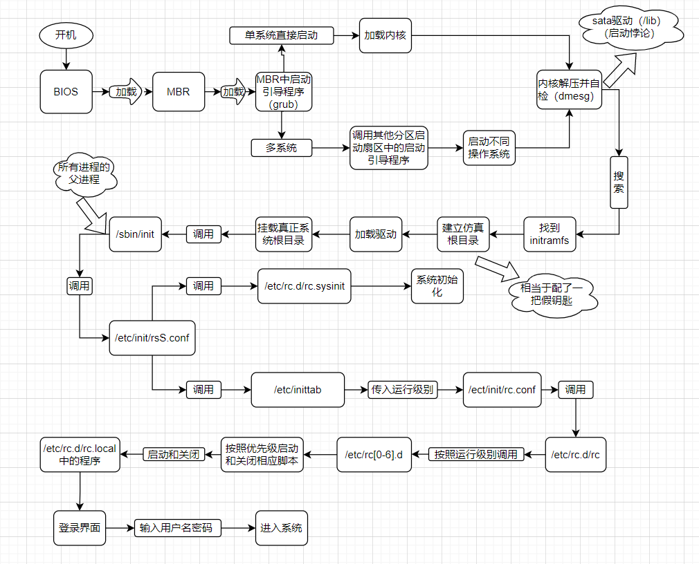

> 注意下面针对centos6.x的，现在centos7和8有很大的变化，下述仅供参考

# Centos6.x启动管理

## 运行级别

1. 运行级别

   |运行级别|含义|
   |---|---|
   |0|关机|
   |1|单用户模式，可以想象为windows的安全模式，主要用于系统修复|
   |2|不完全的命令行模式，不含NFS服务（NFS服务是linux和linux之间的一个文件共享服务）|
   |3|完全的命令行模式，就是标准字符界面，就是我们经常用到的模式|
   |4|系统保留，未使用|
   |5|图形模式|
   |6|重启动|

2. 运行级别命令

   ```bash
   [root@core-pods-3 ~]# runlevel    # 查看运行级别
   N 3              # N 代表我进入3级别之前是哪个级别，这里只我一开机就进入第3级别
   [root@core-pods-3 ~]# init 5      # 改变运行级别，basic server不包括图形界面，是不行的
   [root@core-pods-3 ~]# runlevel
   3 5          # 从字符界面3进入到了图形界面5的意思
   [root@core-pods-3 ~]# init 3
   [root@core-pods-3 ~]# runlevel
   5 3
   [root@core-pods-3 ~]# init 0     # 关机，不安全，不保存正在运行的程序相关信息
   ```

3. 系统默认运行级别

```bash
[root@core-pods-3 ~]# vi /etc/inittab 
id:3:initdefault:
# 系统开机后直接进入哪个运行级别，inittab文件从centos6开始就一直在削弱，centos7 inittab里面已经没有内容了

# for centos7
# To set a default target, run:
# systemctl set-default TARGET.target
```

## 系统启动过程



### initramfs内存文件系统

centos6.x中使用了initramfs内存文件系统取代了centos5.x中的initrd RAM Disk。他们的作用类似，可以通过启动引导程序加载到内存中，然后加载启动过程中所需要的内核模块，比如USB、SATA、SCSI硬盘的驱动和LVM、RAID文件系统的驱动。

```bash
[root@core-pods-3 tmp]# cp /boot/initramfs-3.10.0-514.el7.x86_64.img /tmp/test
[root@core-pods-3 tmp]# cd /tmp/test/
[root@core-pods-3 test]# ls
initramfs-3.10.0-514.el7.x86_64.img
[root@core-pods-3 test]# file initramfs-3.10.0-514.el7.x86_64.img 
initramfs-3.10.0-514.el7.x86_64.img: gzip compressed data, from Unix, last modified: Thu Jul  7 03:08:06 2022, max compression
[root@core-pods-3 test]# mv initramfs-3.10.0-514.el7.x86_64.img initramfs-3.10.0-514.el7.x86_64.img.gz
[root@core-pods-3 test]# gunzip initramfs-3.10.0-514.el7.x86_64.img.gz 
[root@core-pods-3 test]# ls
initramfs-3.10.0-514.el7.x86_64.img
[root@core-pods-3 test]# file initramfs-3.10.0-514.el7.x86_64.img 
initramfs-3.10.0-514.el7.x86_64.img: ASCII cpio archive (SVR4 with no CRC)
You have new mail in /var/spool/mail/root
[root@core-pods-3 test]# cpio -ivcdu < initramfs-3.10.0-514.el7.x86_64.img 
```

### rc.sysinit初始化

由/etc/rc.d/rc.sysinit初始化以下内容

1. 获得网络环境
2. 挂载设备
3. 开机启动画面Plymouth（取替了过往的RHGB）
4. 判断是否启用SELinux
5. 显示于开机过程中的欢迎画面
6. 初始化硬件
7. 用户自定义模块的加载
8. 配置内核的参数
9. 设置主机名
10. 同步存储器
11. 设备映射器及相关的初始化
12. 初始化软件磁盘阵列（RAID）
13. 初始化LVM的文件系统功能
14. 检验磁盘文件系统（fsck）
15. 设置磁盘配额（quota）
16. 重新以可读写模式挂载系统磁盘
17. 更新quota（非必要）
18. 启动系统虚拟随机数生成器
19. 配置机器（非必要）
20. 清除开机过程当中的临时文件
21. 创建ICE目录
22. 启动交换分区（swap）
23. 将开机信息写入/var/log/dmesg文件中

### rc文件
调用/etc/rc.d/rc文件

运行界别参数传入`/etc/rc.d/rc`这个脚本之后，由这个脚本文件按照不同的运行级别启动`/etc/rc[0-6].d/`目录中的相应的程序
- /etc/rc3.d/k??开头的文件（??是数字），会按照数字顺序依次关闭，对应操作-关机
- /etc/rc3.d/S??开头的文件（??是数字），会按照数字顺序依次启动，对应操作-开机

# 启动引导程序grub

## Grub配置文件

1. grub中分区表示

|硬盘|分区|linux中设备文件名|grub中设备文件名|
|---|---|---|---|
|第一块SCSI硬盘|第一个主分区|/dev/sda1|hd(0,0)|
|---|第二个主分区|/dev/sda2|hd(0,1)|
|---|扩展分区|/dev/sda3|hd(0,2)|
|---|第一个逻辑分区|/dev/sda5|hd(0,4)|
|第二块SCSI硬盘|第一个主分区|/dev/sdb1|hd(1,0)|
|---|第二个主分区|/dev/sdb2|hd(1,1)|
|---|扩展分区|/dev/sdb3|hd(1,2)|
|---|第一个逻辑分区|/dev/sdb5|hd(1,4)|

```bash
[root@core-pods-3 grub2]# ll /boot/grub2   # centos7
total 30
-rw-r--r--. 1 root root   84 Mar 13  2017 device.map
drwxr-xr-x. 2 root root 1024 Mar 13  2017 fonts
-rw-r--r--  1 root root 6877 Jul  7 03:07 grub.cfg
-rw-r--r--. 1 root root 5081 Jun 30 05:22 grub.cfg.1657177367.rpmsave
-rw-r--r--. 1 root root 1024 Jul  7 03:07 grubenv
drwxr-xr-x. 2 root root 8192 Mar 13  2017 i386-pc
drwxr-xr-x. 2 root root 1024 Mar 13  2017 locale
You have new mail in /var/spool/mail/root
```

2. grub配置文件

编辑grub配置文件：`vi /boot/grub/grub.conf`

- default=0  默认启动第一个系统
- timeout=5  等待时间，默认是5秒
- splashimage=(hd0,0)/grub/splash.xpm.gz  这里是指定grub启动时的背景图像文件的保存位置
- hiddenmenu  隐藏菜单
- title CentOS（xxxxx）  标题
- root(hd0,0)  是指启动程序的保存分区
- kernel /vmlinuz-xxx.i686 roxxxx  定义内核加载时的选项
- initrd /initramfs-xxx.i686.img 指定了initramfs内存文件系统镜像文件的所在位置
