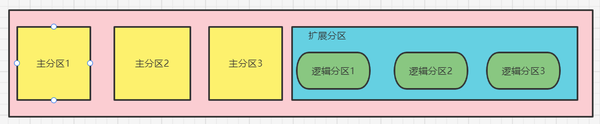
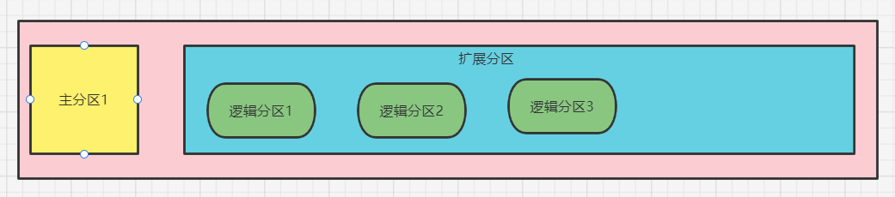

# 回顾分区和文件系统

## 分区类型
分区主要有以下几种类型：
- 主分区：总共最多只能分四个
- 扩展分区：只能有一个，也算作主分区的一种，也就是说主分区+扩展分区最多有四个。但是扩展分区不能存储数据和格式化，必须再划分成逻辑分区才能使用。
- 逻辑分区：逻辑分区是在扩展分区中划分的，如果是IDE硬盘，linux最多支持59个逻辑分区，如果是SCSI硬盘，linux最多支持11个逻辑分区。



分区的设备文件名

|分区|设备文件名|
|---|---|
|主分区1|/dev/sda1|
|主分区2|/dev/sda2|
|主分区3|/dev/sda3|
|扩展分区|/dev/sda4|
|逻辑分区1|/dev/sda5|
|逻辑分区2|/dev/sda6|
|逻辑分区3|/dev/sda7|

通常我们更习惯的分区方式是下面这种，只设一个主分区，剩余全是扩展分区，注意逻辑分区号是从sda**5**开始，也就是1、2、3、4只能给主分区或者扩展分区使用，不能给逻辑分区使用。



|分区|设备文件名|
|---|---|
|主分区1|/dev/sda1|
|扩展分区|/dev/sda2|
|逻辑分区1|/dev/sda5|
|逻辑分区2|/dev/sda6|
|逻辑分区3|/dev/sda7|

有了分区后，我们的硬盘还不能使用，必须格式化后才可以，什么叫格式化呢？格式化就是为了写入文件系统。下面开始介绍文件系统相关知识。

## 文件系统
文件系统有很多种，比如linux的ext2、ext3、ext4，下面主要介绍这几种，对于一些新的文件系统暂不考虑。
- ext2：是ext文件系统的升级版本，redhat linux7.2版本以前的系统默认都是ext2文件系统。1993年发布，最大支持16TB的分区和最大2TB的文件（1TB=1024G=1024 * 1024M）
- ext3：ext3文件系统是ext2文件系统的升级版本，最大的区别就是带日志功能，以在系统突然停止时提高文件系统的可靠性。支持最大16TB的分区和最大2TB的文件。
- ext4：它是ext3文件系统的升级版。ext4在性能、伸缩性和可靠性方面进行了大量改进。ext4的变化可以说是翻天覆地的，比如向下兼容ext3、最大1EB文件系统和16TB文件、无限数量子目录、Extends连续数据块概念、多块分配、延迟分配、持久预分配、快速FSCK、日志校验、无日志模式、在线碎片整理、inode增强、默认启用barrier等。是Centos6.3的默认文件系统。（1EB=1024PB=1024 * 1024TB）

# 文件系统常用命令

## df命令、du命令、fsck命令和dump2fs命令

### df命令
命令是`df [选线] [挂载点]`，选项有：
- -a：显示所有文件系统信息，包括特殊文件系统，如/proc、/sysfs
- -h：使用习惯单位显示容量，如KB、MB或GB等
- -T：显示文件系统类型
- -m：以MB为单位显示容量
- -k：以KB为单位显示容量。默认就是以KB为单位。

```bash
[root@core-pods-3 ~]# df
Filesystem     1K-blocks    Used Available Use% Mounted on
devtmpfs          505336       0    505336   0% /dev
tmpfs             515956       0    515956   0% /dev/shm
tmpfs             515956   32644    483312   7% /run
tmpfs             515956       0    515956   0% /sys/fs/cgroup
/dev/sda2       22236816 3694812  17392780  18% /
/dev/sda1         388480  262377    105623  72% /boot
tmpfs             103192       0    103192   0% /run/user/0

[root@core-pods-3 ~]# df -h
Filesystem      Size  Used Avail Use% Mounted on
devtmpfs        494M     0  494M   0% /dev
tmpfs           504M     0  504M   0% /dev/shm
tmpfs           504M   32M  472M   7% /run
tmpfs           504M     0  504M   0% /sys/fs/cgroup
/dev/sda2        22G  3.6G   17G  18% /
/dev/sda1       380M  257M  104M  72% /boot
tmpfs           101M     0  101M   0% /run/user/0
```

### 统计目录或文件大小
命令是`du [选项] [目录或文件名]`，选项有：
- -a：显示每个子文件的磁盘占用量。默认只统计子目录的磁盘占用量
- -h：使用习惯单位显示磁盘占用量，如KB、MB或GB等
- -s：统计总占用量，而不列出子目录和子文件的占用量

`ll -h` 统计目录有局限性。

服务器高峰期最好不要使用`du -sh /`做磁盘统计。

```bash
[root@core-pods-3 ~]# du -sh ./*
4.0K    ./abc
44K     ./bak
4.0K    ./cde
4.0K    ./cde~
4.0K    ./cdz~
4.0K    ./ls.log
4.0K    ./test
8.0K    ./test2
[root@core-pods-3 ~]# du -sh /etc/
41M     /etc/
[root@core-pods-3 ~]# du -ah ./*
4.0K    ./abc
44K     ./bak
4.0K    ./cde
4.0K    ./cde~
4.0K    ./cdz~
4.0K    ./ls.log
0       ./test/cde
4.0K    ./test
4.0K    ./test2/fgh
8.0K    ./test2
[root@core-pods-3 ~]# du -sh /
du: cannot access /proc/1684/task/1684/fd/4: No such file or directory
du: cannot access /proc/1684/task/1684/fdinfo/4: No such file or directory
du: cannot access /proc/1684/fd/3: No such file or directory
du: cannot access /proc/1684/fdinfo/: No such file or directory
3.7G    /
[root@core-pods-3 ~]# 
```

> du命令和df命令的区别（为什么通常df的占用空间大于du看到的占用空间大小？）
>
> df命令是从**文件系统**考虑的，不光要考虑文件占用的空间，还要统计被命令或程序占用的空间（最常见的就是文件已经删除，但是程序并没有释放空间）
>
> du命令是面向**文件**的，只会计算文件或目录占用的空间
>
> (linux服务器应当定期重启，如果长期不重启，大量被进程占用的空间和删除的空间没有释放，所以df看到的远远大于du看到的，比如游戏服务器、文件下载服务器等)

### 文件系统修复命令fsck
如果出现文件系统异常，可以尝试使用此命令来修复。这个命令其实不需要大家手动执行，我们系统在开机后会自动检测，而且这种是底层修复命令，有时手动执行有可能造成问题（导致系统崩溃等），尽量不要手动执行，了解即可。命令是`fsck [选项] 分区设备文件名`，选项有：
- -a：不用显示用户提示，自动修复文件系统
- -y：自动修复。和-a作用一致，不过有些文件系统只支持-y

### 显示磁盘状态命令dumpe2fs
检测磁盘状态，主要看分区的数据块，主要是超级块的详细信息，命令是`dumpe2fs 分区设备文件名`。

```bash
[root@core-pods-3 ~]# dumpe2fs /dev/sda2 | more
dumpe2fs 1.42.9 (28-Dec-2013)
Filesystem volume name:   ROOTPART
Last mounted on:          /
Filesystem UUID:          3437f1a0-f850-4f1b-8a7c-819c5f6a29e4
Filesystem magic number:  0xEF53
Filesystem revision #:    1 (dynamic)
Filesystem features:      has_journal ext_attr resize_inode dir_index filetype needs_recovery extent 64bit flex_bg sparse_super large_file huge_fil
e uninit_bg dir_nlink extra_isize
Filesystem flags:         signed_directory_hash 
Default mount options:    user_xattr acl
Filesystem state:         clean
Errors behavior:          Continue
Filesystem OS type:       Linux
Inode count:              1411680
Block count:              5664208
Reserved block count:     283210
Free blocks:              5142565
Free inodes:              1381507
First block:              0
Block size:               4096
Fragment size:            4096
Group descriptor size:    64
Reserved GDT blocks:      459
Blocks per group:         32768
Fragments per group:      32768
Inodes per group:         8160
Inode blocks per group:   510
Flex block group size:    16
```

## 挂载命令

### 查询与自动挂载
linux中所有可存储设备，比如U盘、软盘、光盘等都需要挂载后才能使用（注意硬盘是系统自动挂载，所以可直接使用，不需要手动进行挂载），linux中每个硬件都有一个设备名，而且光盘也都有自己的挂载点，我们需要将**设备名**和**挂载点**（类似windows中的盘符，不过windows都是全自动的）联系起来，这个连接过程就是挂载。我们可以使用`mount [-l]`命令查询系统中已经挂载的设备，-l会显示卷标名称。

```bash
[root@core-pods-3 ~]# mount
sysfs on /sys type sysfs (rw,nosuid,nodev,noexec,relatime)
proc on /proc type proc (rw,nosuid,nodev,noexec,relatime)
tmpfs on /dev/shm type tmpfs (rw,nosuid,nodev)
tmpfs on /run type tmpfs (rw,nosuid,nodev,mode=755)
/dev/sda2 on / type ext4 (rw,noatime,discard,data=ordered)
/dev/sda1 on /boot type ext3 (rw,noatime,discard,data=ordered)
... ...
```

从上面结果可以看出，proc和sysfs是内存挂载点，tmpfs是临时文件挂载点，根/挂载的设备名是/dev/sda2，/boot挂载的设备是/dev/sda1

也可以使用`mount -a`依据配置文件/etc/fstab的内容，自动挂载。光盘、u盘、移动硬盘尽量不要做成自动挂载，假如说你的光驱里没有光盘，设置了自动挂载可能会导致系统启动失败。

### 挂载命令格式
命令比较复杂，命令是`mount [-t 文件系统] [-L 卷标名] [-o 特殊选项] 设备文件名 挂载点`。其实前面选项不写也行的（不写有个默认），这个主要就是将设备文件名和挂载点连接起来。选项有：
- -t 文件系统：假如文件系统类型来指定挂载的类型，可以ext3、**ext4**、iso9660（光驱）等文件系统（fat16 - fat， fat32 - vfat）
- -L 卷标名：挂载指定卷标的分区，而不是安装设备文件名挂载。其实就是给你的分区起了个别名，不起也没事，意义不大
- -o 特殊选项：可以指定挂载的额外选项。

|参数|说明|
|---|---|
|atime/noatime|更新访问时间/不更新访问时间。访问分区文件时，是否更新文件的访问时间，默认为更新|
|async/sync|异步/同步，默认为异步|
|auto/noauto|自动/手动，mount -a命令执行时，是否自动安装/etc/fstab文件内容挂载，默认为自动|
|defaults|定义默认值，相当于rw，suid，dev，exec，auto，nouser，async这七个选项|
|++ exec/noexec ++|执行/不执行，设定是否允许在文件系统中执行可执行文件，默认是exec允许|
|++ remount ++|重新挂载已经挂载的文件系统，一般用于指定修改特殊权限|
|rw/ro|读写/只读，文件系统挂载时，是否具有读写权限，默认是rw|
|suid/nosuid|具有/不具有suid权限，设定文件系统是否具有suid和sgid的权限，默认是具有|
|user/nouser|允许/不允许普通用户挂载，设定文件系统是否允许普通用户挂载，默认是不允许，只有root用户可以挂载分区|
|usrquota|写入代表文件系统支持用户磁盘配额，默认不支持|
|grpquota|写入代表文件系统支持组磁盘配额，默认不支持|

```bash
[root@core-pods-3 ~]# vi demo.sh
[root@core-pods-3 ~]# chmod u+x demo.sh 
[root@core-pods-3 ~]# ./demo.sh 
Hello Jalen
[root@core-pods-3 ~]# mv demo.sh /home/
[root@core-pods-3 ~]# /home/demo.sh 
Hello Jalen
[root@core-pods-3 ~]# mount -o remount,noexec /home
[root@core-pods-3 ~]# /home/demo.sh 
-bash: /home/demo.sh 权限不足
[root@core-pods-3 ~]# mount -o remount,exec /home
[root@core-pods-3 ~]# /home/demo.sh 
Hello Jalen
```

## 挂载光盘与U盘

### 挂载（卸载）光盘

1. 建立挂载点：`mkdir /mnt/cdrom/`  （通常：/mnt挂u盘，/media挂光盘，并不强制，看习惯）
2. 把光盘放入光驱：虚拟机-设置-选择光盘 （注意connected勾选）
3. 挂载光盘：`mount -t iso9660 /dev/cdrom /mnt/cdrom/` 或 `mount /dev/sr0 /mnt/cdrom`，注意cdrom其实是sr0的软连接，所以两个命令执行哪个都可以，光盘文件系统默认就是iso9660，其实也可以不用写，直接`mount /dev/cdrom /mnt/cdrom/`
4. 访问光盘：去挂载点下访问，即/mnt/cdrom
5. 弹出光盘：要正常卸载后才能弹出光盘，命令是`umount 设备文件名或挂载点`，设备名或挂载点只能写一个

### 挂载U盘

1. 查看U盘设备文件名：`fdisk -l`，U盘设备名不是固定的，U盘挂载不能用远程工具ssh了，只能直接登录虚拟机后再直接插入U盘，否则是windows检测的U盘，此时才可以切换远程工具。
2. 创建挂载点：找到U盘设备名后，直接用mount挂载即可，命令是`mount -t vfat /dev/sdb1 /mnt/usb/`，注意如果你的U盘是fat16，直接写`-t fat`，如果是fat32，要写`-t vfat`，注意：linux默认是不支持NTFS文件系统的，如果你的移动硬盘是NTFS，那不支持（其实也有支持方法，下一节说明），就像有些移动硬盘接入MacOS只能看不能改。
3. 卸载：`umount /dev/sdb1`

## 支持NTFS文件系统

Linux默认不支持NTFS分区的，所以有些NTFS移动硬盘默认是不支持的。但是我们有几个方法可以是linux支持NTFS。（注意一个区别：linux硬件不需要驱动<linux 内核包含>，而windows需要）

1. 手工编译内核：重新编译内核，把NTFS驱动编译进来，这个很麻烦的，用的很少
2. 利用第三方插件：这个比较简单，比如安装NTFS-3G插件
   ```bash
   [root@core-pods-3 ~]# tar -zxvf ntfs-3g_ntfsprogs-xxxx.tgz
   [root@core-pods-3 ~]# cd ntfs-3g_ntfsprogs-xxxx
   [root@core-pods-3 ~]# ./configure
   [root@core-pods-3 ~]# make
   [root@core-pods-3 ~]# make install

   [root@core-pods-3 ~]# yum install ntfs-3g

   [root@core-pods-3 ~]# fdisk -l
   [root@core-pods-3 ~]# mount -t ntfs-3g /dev/sdb1 /mnt/usb/    # 分区设备文件名 挂载点
   [root@core-pods-3 ~]# umount /mnt/usb/
   ```

# fdisk分区

学习用fdisk给我们的linux新建一个分区

## fdisk命令分区过程

1. 添加新硬盘：虚拟机断电后添加新的硬件，虚拟机-设置-添加 硬盘，添加SCSI硬盘
2. 查询新硬盘是否被识别：`fdisk -l`
3. 使用fdisk命令分区：`fdisk /dev/sdb`，分区完成后sdb后面才会出现数字，比如sdb1、sdb2...
4. fdisk交互指令说明
   
   |命令|说明|
   |---|---|
   |a|设置可引导标记|
   |b|编辑bsd磁盘标签|
   |c|设置DOS操作系统兼容标记|
   |**d**|删除一个分区|
   |**l**|显示已知的文件系统类型。82为linux swap分区，83为linux分区|
   |**m**|显示帮助菜单|
   |**n**|新建分区|
   |o|建立空白DOS分区表|
   |**p**|显示分区列表|
   |**q**|不保存退出|
   |s|新建空白SUN磁盘标签|
   |**t**|改变一个分区的系统ID|
   |u|改变显示记录单位|
   |v|验证分区表|
   |**w**|保存退出|
   |x|附加功能（仅专家）|
   
5. 分区结束：可以重启 或者 执行 `# partprobe` (可以当成分区后必须执行的命令)，此时使用`fdisk -l`可以查看到分区了
6. 格式化分区：扩展分区不能格式化，命令是`mkfs -t ext4 /dev/sdb1`
7. 创建挂载点将分区挂载上：
   ```bash
   # mkdir /disk1
   # mkdir /disk5
   # mount /dev/sdb1 /disk1/
   # mount /dev/sdb5 /disk5/
   # mount
   ```

## 分区自动挂载与fstab文件修复

### /etc/fstab文件
想要分区自动挂载，按格式修改`/etc/fstab`这个文件就行了。

- 第一阶段：分区设备文件名或UUID（硬盘通用唯一识别码,UUID更可靠点，dumpe2fs命令查看）
- 第二阶段：挂载点
- 第三阶段：文件系统名称
- 第四阶段：挂载参数
- 第五阶段：指定分区是否被dump备份，0代表不备份，1代表每天备份，2代表不定期备份
- 第六阶段：指定分区是否被fsck检测，0代表不检测，其他数字代表检测的优先级，1的优先级比2高，一般手工添加的都不要比/boot高。

```bash
[root@core-pods-3 ~]# vi /etc/fstab
# /etc/fstab
# Created by anaconda on Mon Mar 13 20:42:02 2017
#
# Accessible filesystems, by reference, are maintained under '/dev/disk'
# See man pages fstab(5), findfs(8), mount(8) and/or blkid(8) for more info
#
UUID=3437f1a0-f850-4f1b-8a7c-819c5f6a29e4 /                       ext4    defaults,discard,noatime        1 1
UUID=ad1361f7-4ab4-4252-ba00-5d4e5d8590fb /boot                   ext3    defaults,discard,noatime        1 2
/swap  none  swap  sw 0  0
[root@core-pods-3 ~]# mount -a  # 检测你添加的配置是否有问题，有问题会报错

# 如果写错了，重启可以输入root密码，重新挂载
[root@core-pods-3 ~]# mount -o remount,rw
```

# 分配swap分区

swap分区是必须存在的，有时使用时发现我们的swap分区不足，此时需要增加空间。我们可以使用free查看内存与swap分区使用情况。一般交换分区几百兆就够了，使用不多。增加分区可以使用fdisk命令，注意linux swap分区id号是82，不是默认的83，+1G

- cached（缓存）：是指把读取出来的数据保存再内存当中，当再次读取时，不用读取硬盘而直接从内存当中读取，加速了数据的读取过程

- buffer（缓冲）：是指在写入数据时，先把分散的写入操作保存到内存当中，当达到一定程度再集中写入硬盘，减少了磁盘碎片和硬盘的反复寻道，加速了数据的写入过程

```bash
[root@core-pods-3 boot]# free
              total        used        free      shared  buff/cache   available
Mem:        1031912      220112      174992       25620      636808      602040
Swap:        533500        7100      526400
[root@core-pods-3 boot]# free -m
              total        used        free      shared  buff/cache   available
Mem:           1007         215         170          25         621         587
Swap:           520           6         514


[root@core-pods-3 boot]# fdisk /dev/sdb   # 后续一系列fdisk交互命令
[root@core-pods-3 boot]# partprobe   # 报错不用管
[root@core-pods-3 boot]# mkswap /dev/sdb6  # 格式化swap分区，注意不是mkfs
[root@core-pods-3 boot]# swapon /dev/sdb6  # 将新的swap分区加入swap分区
[root@core-pods-3 boot]# free -m   # 再去看swap空间大小
[root@core-pods-3 boot]# swapoff /dev/sdb6  # 将新的swap分区移出swap分区
[root@core-pods-3 boot]# vi /etc/fstab    # 启动自动挂载
/dev/sdb6    swap    swap    defaults    0 0
```


