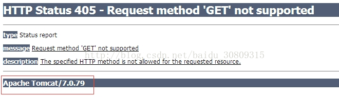
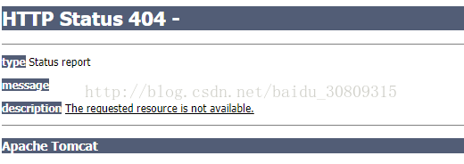

## 正常情况下，tomcat遇到404或500会返回版本信息：



## 有时我们不需要暴露版本信息，像这样：



## 只需要修改apache-tomcat-7.0.59的lib目录下的catalina.jar

## 在linux环境下

进入lib路径后`unzip catalina.jar`

编辑ServerInfo.properties属性文件

```
cd org/apache/catalina/util/
vi ServerInfo.properties 
```

修改成以下信息

```
server.info=Apache Tomcat
server.number=0.0.0.0
server.built=Nov 7 2016 20:05:27 UTC
```

再压缩回去

```
jar uvf catalina.jar org/apache/catalina/util/ServerInfo.properties
```

5.重启服务器

参考：http://jingyan.baidu.com/article/d2b1d102a9dc955c7e37d487.html
