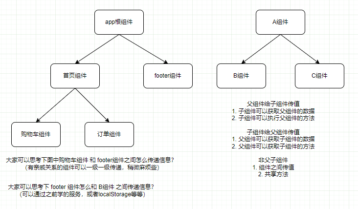
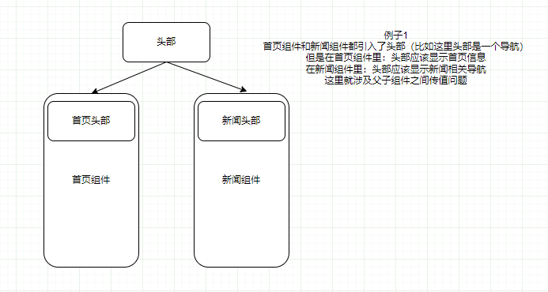
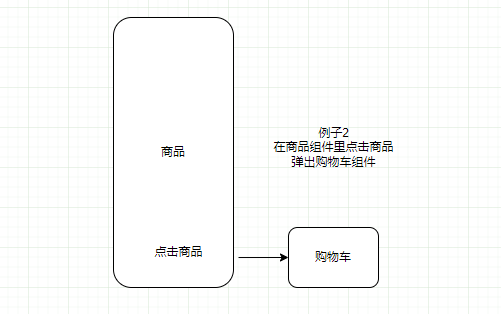

> 父组件不仅可以给子组件传递简单的数据，还可以把自己的方法以及整个父组件传给子组件

# 创建项目与组件

```bash
D:\angular>ng new angulardemo07
D:\angular>cd angulardemo07
D:\angular\angulardemo07>ng g component components/home
D:\angular\angulardemo07>ng g component components/news
D:\angular\angulardemo07>ng g component components/header
D:\angular\angulardemo07>ng g component components/footer
```

# 图示







# 父组件给子组件传值

1. 父组件定义属性title
    ```ts
    public title:string = "首页组件的标题1"
    ```

2. 父组件引用子组件时绑定title
    ```html
    <app-header [title]="title"></app-header>
    ```

3. 子组件需要引入Input装饰器
    ```ts
    import { Input } from '@angular/core';
    ```

4. 子组件通过@Input装饰器获取父组件属性
    ```ts
    @Input() title:any;
    ```

5. 这样子组件页面可以直接使用title属性了
    ```html
    <header>&#123;&#123;title&#125;&#125;</header>
    ```

# 父组件给子组件传递方法

1. 父组件定义方法run
    ```ts
    run(){ alert("我是父组件的run方法") }
    ```

2. 父组件引入子组件时绑定方法
    ```html
    <app-header [run]="run"></app-header>
    ```

3. 子组件使用@Input引入父组件方法run
    ```ts
    @Input() run:any;
    ```

4. 子组件自定义的方法中直接调用父组件的run方法
    ```ts
    getParentRun(){ this.run(); }
    ```

# 父组件直接暴力将自己所有属性和方法传递给子组件

1. 父组件引入子组件时绑定自身
    ```html
    <app-header [home]="this"></app-header>
    ```

2. 子组件引入home组件
    ```ts
    @Input() home:any;
    ```

3. 子组件直接使用父组件中属性和方法
    ```ts
    getParent(){ alert(this.home.msg); this.home.run(); }
    ```

# 父组件通过@ViewChild主动获取子组件的数据和方法

1. 子组件定义属性msg
    ```ts
    public msg:string = "我是一个子组件的msg"
    ```

2. 父组件引入子组件时通过#footer引入该组件
    ```html
    <app-footer #footer></app-footer>
    ```

3. 父组件引入ViewChild装饰器
    ```ts
    import { ViewChild } from '@angular/core';
    ```

4. 父组件引入footer组件
    ```ts
    @ViewChild('footer') footer:any;
    ```

5. 父组件调用子组件属性和方法
    ```ts
    getChild(){ alert(this.footer.msg); this.footer.run(); }
    ```

# 子组件通过@Output触发父组件的方法(广播方式)

1. 子组件添加事件
```html
<button (click)="sendParent()">通过@Output给父组件广播数据</button>
```

2. 子组件中引入Output和EventEmitter
```ts
import { Output, EventEmitter } from '@angular/core';
```

3. 子组件定义@Output装饰器修饰的属性
```ts
@Output() private outer = new EventEmitter();
```

4. 子组件中通过方法广播到父组件
```ts
sendParent(){ this.outer.emit("我是子组件的数据") }
```

5. 父组件中引入该子组件时绑定子组件中outer属性
```html
<app-footer (outer)="run($event)"></app-footer>
```

6. 父组件中run方法获取子组件信息
```ts
run(e:any){ console.log(e) // e是子组件给父组件广播的数据 }
```

# 具体代码

## app根组件

### app.module.ts

```ts
import { NgModule } from '@angular/core';
import { BrowserModule } from '@angular/platform-browser';

import { AppComponent } from './app.component';
import { HomeComponent } from './components/home/home.component';
import { NewsComponent } from './components/news/news.component';
import { HeaderComponent } from './components/header/header.component';
import { FooterComponent } from './components/footer/footer.component';

@NgModule({
  declarations: [
    AppComponent,
    HomeComponent,
    NewsComponent,
    HeaderComponent,
    FooterComponent
  ],
  imports: [
    BrowserModule
  ],
  providers: [],
  bootstrap: [AppComponent]
})
export class AppModule { }
```

### app.component.html

```html
<!-- home和header组件是父组件向子组件传递信息的例子 -->
<!-- <app-home></app-home> -->

<!-- news和footer组件是父组件获取子组件信息的例子 -->
<app-news></app-news>
```

## home组件

### home.component.html

```html
<!-- 讲title属性绑定到子组件 -->
<app-header [title]="title" [msg]="msg" [run]="run" [home]="this"></app-header>
<br/>
<hr/>
<br/>
<div>我是首页组件</div>
```

### home.component.ts

```ts
import { Component, OnInit } from '@angular/core';

@Component({
  selector: 'app-home',
  templateUrl: './home.component.html',
  styleUrls: ['./home.component.scss']
})
export class HomeComponent implements OnInit {

  // 定义title属性
  public title:string = "首页组件的标题1"

  public msg:string = "我是父组件的msg"

  constructor() { }

  ngOnInit(): void {
  }

  run(){
    alert("我是父组件的run方法")
  }
}
```

## header组件

### header.component.html

```html
<header>&#123;&#123;title&#125;&#125; -- &#123;&#123;msg&#125;&#125;</header>
<br>
<button (click)="getParentMsg()">子组件里面获取父组件里传入的msg</button>
<br>
<hr>
<button (click)="getParentRun()">子组件里面执行父组件的方法</button>
<br>
```

### header.component.ts

```ts
// 这里引入Input装饰器
import { Component, OnInit, Input } from '@angular/core';

@Component({
  selector: 'app-header',
  templateUrl: './header.component.html',
  styleUrls: ['./header.component.scss']
})
export class HeaderComponent implements OnInit {

  // 接受父组件传来的数据
  @Input() title:any;
  @Input() msg:any;
  @Input() run:any;
  @Input() home:any;

  constructor() { }

  ngOnInit(): void {
  }

  getParentMsg(){
    //alert(this.msg)
    alert(this.home.msg)
  }

  getParentRun(){
    //this.run();
    this.home.run();
  }
}
```

## news组件

### news.component.html

```html
<app-footer #footer (outer)="run($event)"></app-footer>
<br>
<hr>
<br>
<div>我是一个新闻组件</div>
<button (click)="getChildMsg()">获取子组件的msg</button>
<br>
<br>
<button (click)="getChildRun()">执行子组件的方法</button>
```

### news.component.ts

```ts
import { Component, OnInit, ViewChild } from '@angular/core';

@Component({
  selector: 'app-news',
  templateUrl: './news.component.html',
  styleUrls: ['./news.component.scss']
})
export class NewsComponent implements OnInit {

  @ViewChild('footer') footer:any;

  constructor() { }

  ngOnInit(): void {
  }

  getChildMsg(){
    // 获取子组件的数据
    alert(this.footer.msg)
  }

  getChildRun(){
    this.footer.run();
  }

  run(e:any){
    alert("我是父组件的run方法")
    console.log(e) // e是子组件给父组件广播的数据
  }
}
```

## footer组件

### footer.component.html

```html
<h2>我是footer子组件</h2>
<button (click)="sendParent()">通过@Output给父组件广播数据</button>
```

### footer.component.ts

```ts
import { Component, OnInit, Output, EventEmitter } from '@angular/core';

@Component({
  selector: 'app-footer',
  templateUrl: './footer.component.html',
  styleUrls: ['./footer.component.scss']
})
export class FooterComponent implements OnInit {

  @Output() private outer = new EventEmitter();

  public msg:string = "我是一个子组件的msg"

  constructor() { }

  ngOnInit(): void {
  }

  run(){
    alert('我是一个子组件的run方法')
  }

  sendParent(){
    //alert(11)
    this.outer.emit("我是子组件的数据")
  }
}
```
