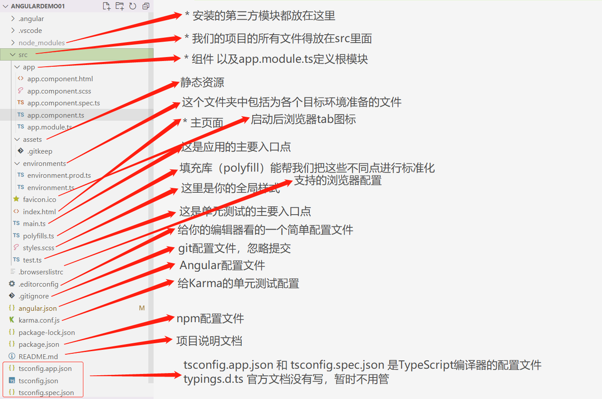

# Angular环境搭建与项目创建

1. 安装nodejs

   ```bash
   C:\Users\jalchu>node -v      # v14.18.0
   ```

2. npm可能安装失败，可以使用cnpm替代npm(该步骤可选)

   ```bash
   C:\Users\jalchu>npm install -g cnpm --registry=https://registry.npm.taobao.org
   C:\Users\jalchu>cnpm -v   # 6.14.15
   C:\Users\jalchu>npm -v  # cnpm@8.3.0
   ```

3. 使用npm/cnpm 命令安装angular/cli (只需要安装一次)

   以下两个选择一个即可，注意是全局安装angular脚手架

   ```bash
   C:\Users\jalchu>npm install -g @angular/cli      # 使用npm
   C:\Users\jalchu>cnpm install -g @angular/cli     # 使用cnpm
   ```

   ```bash
   # 安装过程开始会问你是否想分享匿名数据和Angular Team，可以选yes，也可以选no
   # 选yes的话后期可以通过 ng analytics disable --global 命令disable这个feature
   D:\angular> npm install -g @angular/cli
   ...
   Package                      Version
   ------------------------------------------------------
   @angular-devkit/architect    0.1401.2 (cli-only)
   @angular-devkit/core         14.1.2 (cli-only)
   @angular-devkit/schematics   14.1.2 (cli-only)
   @schematics/angular          14.1.2 (cli-only)
   ```

4. 创建项目

    ```bash
    # 进入D盘
    C:\Users\jalchu>d:

    # 进入我们预先建好的angular练习目录
    D:\>cd angular

    # 通过脚手架创建新项目
    # 下面命令默认会安装依赖包，如果想先不安装，可以执行“ng new 项目名 --skip-install”
    # Would you like to add Angular routing，先选no，不加路由
    # Which stylesheet format would you like to use，这里看你的需要
    # 打印Packages installed successfully说明包安装成功
    # 注意windows可能会有CRLF替换的警告，没关系，LF是unix换行符号，windows是回车+换行，所以是CR+LF=CRLF
    D:\angular>ng new angulardemo01

    # 进入项目目录
    D:\angular>cd angulardemo01

    # 安装依赖包
    D:\angular\angulardemo01>npm install      

    # 项目创建完毕后可以使用下面命令启动该项目
    # 问是否share数据，如果share后期可以使用ng analytics disable关掉
    # 开启成功打印“Compiled successfully.”, 浏览器可以访问http://localhost:4200/
    D:\angular\angulardemo01>ng serve --open
    ```

5. Angular开发工具：项目创建好以后，我们可以把项目导入到一个开发工具里，比如vscode。

# Angular目录结构分析、核心文件分析以及创建使用组件

1. 完整项目结构说明

   

2. 核心文件：app.module.ts文件说明

    ```ts app.module.ts文件说明
    // 这个文件是Angular根模块，告诉Angular如何组装应用

    // Angular核心模块
    import { NgModule } from '@angular/core';
    // BrowserModule，浏览器解析的模块
    import { BrowserModule } from '@angular/platform-browser';
    // 根组件
    import { AppComponent } from './app.component';

    // @NgModule装饰器，@NgModule接受一个元数据对象，告诉Angular如何编译和启动应用
    @NgModule({
      declarations: [    // 配置当前项目运行的组件
        AppComponent
      ],
      imports: [   // 配置当前模块运行依赖的其他模块
        BrowserModule
      ],
      providers: [],   // 配置项目所需要的服务
      bootstrap: [AppComponent]   // 指定应用的主视图（称为根组件）通过引导根AppModule来启动应用，这里一般写的是根组件
    })

    // 根模块不需要导出任何东西，因为其他组件不需要导入根模块
    export class AppModule { }
    ```

3. 核心文件：app.component.ts文件说明

    ```ts app.component.ts文件说明
    // 引入核心模块里面的Component
    import { Component } from '@angular/core';

    @Component({
      selector: 'app-root',    // 使用这个而组建的名称
      templateUrl: './app.component.html',  // html
      styleUrls: ['./app.component.scss']  // css
    })
    export class AppComponent {
      title = 'angulardemo01';   // 定义属性

      constructor(){
        // 构造函数
      }
    }
    ```

4. 创建一个组件

    ```bash
    D:\angular\angulardemo01>ng g component components/news
    CREATE src/app/components/news/news.component.html (19 bytes)
    CREATE src/app/components/news/news.component.spec.ts (585 bytes)
    CREATE src/app/components/news/news.component.ts (268 bytes)
    CREATE src/app/components/news/news.component.scss (0 bytes)
    UPDATE src/app/app.module.ts (985 bytes)

    D:\angular\angulardemo01>ng g component components/header
    D:\angular\angulardemo01>ng g component components/home
    ```

   尝试在app.component.html中引入这些组件即可

    ```
    <app-home></app-home>
    <app-header></app-header>
    <app-news></app-news>
    ```


