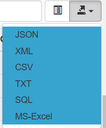

1. import cdn 

```html
    <link href="https://cdnjs.cloudflare.com/ajax/libs/bootstrap-table/1.13.5/bootstrap-table.css" rel="stylesheet">
    <script src="https://cdnjs.cloudflare.com/ajax/libs/bootstrap-table/1.13.5/bootstrap-table.js"></script>
    <script src="https://rawgit.com/hhurz/tableExport.jquery.plugin/master/tableExport.js"></script>
    <script src="https://rawgit.com/hhurz/tableExport.jquery.plugin/master/libs/FileSaver/FileSaver.min.js"></script>
    <script src="https://rawgit.com/hhurz/tableExport.jquery.plugin/master/libs/js-xlsx/xlsx.core.min.js"></script>
    <script src="https://rawgit.com/hhurz/tableExport.jquery.plugin/master/libs/jsPDF/jspdf.min.js"></script>
    <script src="https://rawgit.com/hhurz/tableExport.jquery.plugin/master/libs/es6-promise/es6-promise.auto.min.js"></script>
    <script src="https://rawgit.com/hhurz/tableExport.jquery.plugin/master/libs/html2canvas/html2canvas.min.js"></script>
    <script src="https://rawgit.com/hhurz/tableExport.jquery.plugin/master/libs/jsPDF-AutoTable/jspdf.plugin.autotable.js"></script>
    <script src="https://cdnjs.cloudflare.com/ajax/libs/bootstrap-table/1.13.5/extensions/export/bootstrap-table-export.js"></script>
```

2. show export

```javascript
$("#tableId").bootstrapTable({
    showExport: true
})
```

3. display



### 参考：

官网：https://bootstrap-table.com/docs/extensions/export/

Github：https://github.com/hhurz/tableExport.jquery.plugin

简书：https://www.jianshu.com/p/9cc6c903c4b6
