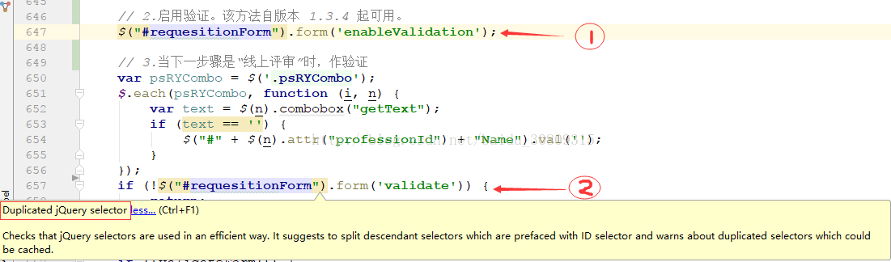

如果你在一个函数中重复写这个id的选择器，你就可能遇到这种警告，而这种警告通常实在Intellj系列的编辑器中显示，警告截图如下：

上面代码中两处使用了同一个id选择器，JQuery建议你使用一个变量去存储这个选择器，而不是每次用的时候便拿来调用一下，它不会帮你做缓存，而是重新去取。可以参考StackOverflow上的回答：

https://stackoverflow.com/questions/16863844/jquery-duplicate-selector-error

官方文档说明：http://learn.jquery.com/using-jquery-core/selecting-elements/#saving-selections

Saving Selections

jQuery doesn't cache elements for you. If you've made a selection that you might need to make again, you should save the selection in a variable rather than making the selection repeatedly.

1| var divs = $( "div" );

Once the selection is stored in a variable, you can call jQuery methods on the variable just like you would have called them on the original selection.

A selection only fetches the elements that are on the page at the time the selection is made. If elements are added to the page later, you'll have to repeat the selection or otherwise add them to the selection stored in the variable. Stored selections don't magically update when the DOM changes.
