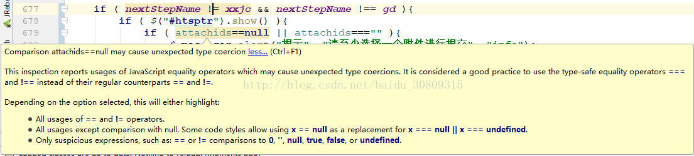
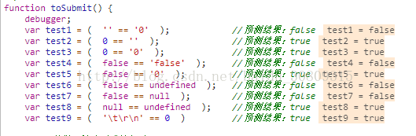

当我们在js中判等时，有两种方式，一种是全等（===），一种是相等（==），其中全等包含类型的判断，而相等会对类型做隐式转换，大家在idea中编辑js时可能会遇到如下警告（**注意其中全等并未报任何警告**）：



可以看到类型的转换是值得注意的，使用==判断时很容易引起类型上的歧义，有一种违和感，如下我们使用==做一下简单测试：

```javascript
function toSubmit() {
    debugger;
    var test1 = (  '' == '0'  );            //预测结果：false
    var test2 = (  0 == ''  );              //预测结果：true
    var test3 = (  0 == '0'  );             //预测结果：true
    var test4 = (  false == 'false'  );     //预测结果：false
    var test5 = (  false == '0'  );         //预测结果：true
    var test6 = (  false == undefined  );   //预测结果：false
    var test7 = (  false == null  );        //预测结果：false
    var test8 = (  null == undefined  );    //预测结果：true
    var test9 = (  '\t\r\n' == 0  )         //预测结果：true
}
```

下面我们调用这个函数从页面debug一下，看一下值：



在You Don't Know JS一书中，作者称之为含蓄的、隐式类型控制，并有如下写道：

But a controversial topic is what happens when you try to compare two values that are not already of the same type, which would require implicit coercion.

When comparing the string "99.99" to the number 99.99, most people would agree they are equivalent. But they're not exactly the same, are they? It's the same value in two different representations, two different types. You could say they're "loosely equal," couldn't you?

To help you out in these common situations, JavaScript will sometimes kick in and implicitly coerce values to the matching types.

So if you use the == loose equals operator to make the comparison "99.99" == 99.99, JavaScript will convert the left-hand side "99.99" to its number equivalent 99.99. The comparison then becomes 99.99 == 99.99, which is of course true.

While designed to help you, implicit coercion can create confusion if you haven't taken the time to learn the rules that govern its behavior. Most JS developers never have, so the common feeling is that implicit coercion is confusing and harms programs with unexpected bugs, and should thus be avoided. It's even sometimes called a flaw in the design of the language.

However, implicit coercion is a mechanism that can be learned, and moreover should be learned by anyone wishing to take JavaScript programming seriously. Not only is it not confusing once you learn the rules, it can actually make your programs better! The effort is well worth it.


因此，建议尽量不要使用相等运算符（loosely equal）

附录：

1.参考知乎回答：https://www.zhihu.com/question/31442029

2.github上you don‘t know js系列书籍：You Don't Know JS  

（具体章节是第一本书第二章节：https://github.com/getify/You-Dont-Know-JS/blob/master/up%20%26%20going/ch2.md）

举例如下：

```javascript
var a = "42";
var b = 42;
 
a == b;			// true
a === b;		// false
```
