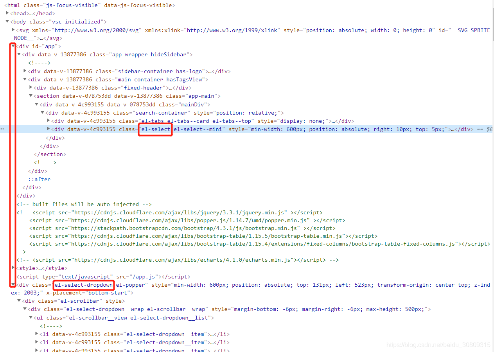

1.自动展开使用automaticDropdown属性控制（可以看源码里props下面有该属性，是一个布尔值）

```html
      <el-select ref="selectFeature"
                 v-model="feature"
                 id="selectFeatureBox"
                 clearable
                 @change = "changeFeature"
                 placeholder = "Please choose one new feature"
                 filterable
                 size='mini'
                 style="min-width: 600px;position: absolute;right:10px;top:5px;"
                 :automaticDropdown="autoDropdown">
        <el-option v-for="item in featureOptions" :key="item.value" :label="item.label" :value="{value:item.value, label:item.label, urls:item.urls}">
          <span style="float: left">{{ item.label }}</span>
          <span v-if="['Feature1', 'Feature2'].indexOf(item.value) > -1 || item.urls.length > 0"
                style="float: right; font-weight: 700;color: #12adec; font-size: 12px;">Flag & Label</span>
        </el-option>
      </el-select>
```

```javascript
this.autoDropdown = true
this.$refs.selectFeature.focus()
```

2.自动展开有个高度设置，在mount里指定

```javascript
    mounted() {
      this.$nextTick(() => {
        let selectDropDownNode = document.getElementsByClassName('el-select-dropdown__wrap')
        for (let i = 0; i < selectDropDownNode.length; i++) {
          selectDropDownNode[i].style.maxHeight = '500px'
        }
      })
    }
```

附：

针对高度设置，这里有两个尝试没有成功，记录一下

（1）尝试给el-select设置一个id，在js里通过对id选择器进行dom操作，尝试修改style，尝试多次没有生效，后来发现el-select展开后的弹出层div是和vue app是平级（兄弟级）的，没有父子关系，所以肯定是无效的



(2) 尝试操作css也没有生效

```css
<style lang="scss" scoped>
  .el-select-dropdown {
    max-height: 500px;
  }
  .el-select-dropdown__wrap {
    max-height: 500px;
  }
</style>
```
