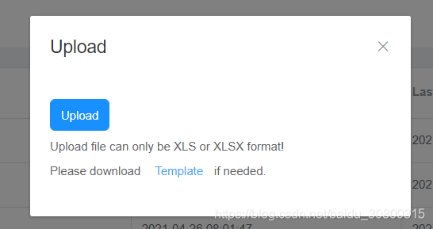

## 效果 



## 实现

```html
      <el-dialog title="Upload" :visible.sync="uploadVisible" width="25%">
        <el-upload action="/api/tools/disable_ec/file"
                   :on-preview="handleUploadPreview"
                   :before-upload="beforeUpload"
                   :limit="1"
                   :on-exceed="handleUploadExceed"
                   :file-list="fileList">
          <el-button size="small" type="primary">Upload</el-button>
          <div slot="tip" class="el-upload__tip">
            Upload file can only be XLS or XLSX format! <br>
            Please download
            <el-button type="text"
                       size="small"
                       style="outline: none"
                       @click="downloadUploadFileTemplate">
              <span>Template</span>
            </el-button>if needed.
          </div>
        </el-upload>
      </el-dialog>
```

```javascript
  export default {
    data() {
      return {
        uploadVisible: false,
        fileList: []
      }
    },
    methods: {
      handleUploadPreview(file) {
        console.log(file);
      },
      handleUploadExceed(files, fileList) {
        this.$message.warning('Currently limited to select 1 file');
      },
      beforeUpload(file) {
        let extension = file.name.substring(file.name.lastIndexOf('.')+1).toLowerCase()
        if(['xls', 'xlsx'].indexOf(extension) < 0) {
          this.$message.warning('Upload file can only be XLS or xlsx format!');
          return false;
        }
      },
      downloadUploadFileTemplate() {
        window.location.href = '/api/xxx/xxx/file'
        return false;
      }
    }
  }
```

```python
@app.route('/api/xxx/xxx/file', methods=['GET', 'POST'])
@login_required
def file_operation():
    if request.method == 'GET':
        logger.info('Download upload template... ...')
        data = [{'SiteName': 'site name',
                 'Action': 'del'}]
        df = pd.DataFrame(data)[['SiteName', 'Action']]
 
        # 1.Export excel format
        output = BytesIO()
        writer = pd.ExcelWriter(output)
        df.to_excel(writer, index=False, sheet_name='template')
        workbook = writer.book
        header_fmt = workbook.add_format({
            'font_size': 14,
            'bold': True,
            'fg_color': '#D7E4BC',
            'border': 1})
        sheet_table = writer.sheets['template']
        for col_num, value in enumerate(df.columns.values):
            sheet_table.write(0, col_num, value, header_fmt)
        sheet_table.set_column('A:B', 60)
        workbook.close()
        writer.close()
        output.seek(0)
        return send_file(output, attachment_filename="template.xlsx", as_attachment=True)
 
        # 2.Export CSV format
        # resp = make_response(df.to_csv(index=False))
        # resp.headers["Content-Disposition"] = "attachment; filename=template.csv"
        # resp.headers["Content-Type"] = "text/csv"
        # return resp
    if request.method == 'POST':
        file = request.files['file']
        df = pd.read_excel(file, engine='openpyxl')
        # Save the import file if needed
        # filename = secure_filename(file.filename)
        # file.save(os.path.join(r'C:\Users\jalchu\upload', filename))
        # do some other logic
```
