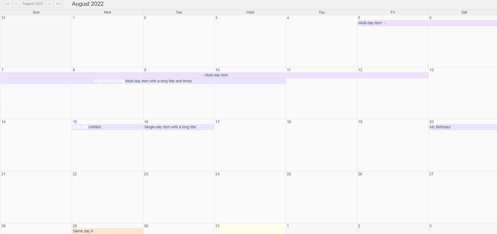

# 背景

:::info
Vue版本： 2.6.10
vue-element-admin版本：4.2.1
日历组件： vue-simple-calendar@5.0.1
日历组件Github地址： https://github.com/richardtallent/vue-simple-calendar
日历组件在线Demo地址： https://tallent.us/vue-simple-calendar/
需求： 用户希望通过右键calendar组件里某一天的某一项，弹出一个菜单，在菜单里面修改这一项
:::

# 效果



# 代码

下面代码直接引入到router里的index.js即可

```js
<template>
    <div class="calendarTest">
        <calendar-view
            :items="items"
            v-loading="loading"
            :show-date="showDate"
            :time-format-options="{ hour: 'numeric', minute: '2-digit' }"
            :enable-drag-drop="true"
            :disable-past="disablePast"
            :disable-future="disableFuture"
            :show-times="showTimes"
            :display-period-uom="displayPeriodUom"
            :display-period-count="displayPeriodCount"
            :starting-day-of-week="startingDayOfWeek"
            :enable-date-selection="true"
            :period-changed-callback="periodChanged"
            :selection-start="selectionStart"
            :selection-end="selectionEnd"
            @date-selection-start="setSelection"
            @date-selection="setSelection"
            @date-selection-finish="finishSelection"
            @drop-on-date="onDrop"
            @click-date="onClickDay"
            @click-item="onClickItem"
            style="font-size:11px;"
            @contextmenu.prevent.native="openMenu($event)"
            class="theme-default holiday-us-traditional holiday-us-official">
            <calendar-view-header
                slot="header"
                slot-scope="t"
                :header-props="t.headerProps"
                @input="setShowDate"/>
        </calendar-view>
        <ul v-show="visible" :style="{left:left+'px',top:top+'px'}" class="contextmenu">
            <li><strong>HTML 学习</strong></li>
            <li>HTML 元素</li>
            <li>HTML 属性</li>
            <li>HTML 标题</li>
            <li>HTML 段落</li>
            <li>HTML 图像</li>
            <li>HTML 表格</li>
            <li>HTML 列表</li>
            <li>HTML 布局</li>
            <li>表单</li>
            <li>
                <el-button
                    :loading="convertLoading"
                    :disabled="convertDisabled"
                    @click="changeSomething"
                    type="primary">
                    Test Button
                </el-button>
            </li>
        </ul>
    </div>
</template>

<script>
import { CalendarView, CalendarViewHeader } from "vue-simple-calendar"
import "vue-simple-calendar/static/css/default.css"
import "vue-simple-calendar/static/css/holidays-us.css"

export default {
    name: "CalendarTest",
    components: {
        CalendarView,
        CalendarViewHeader
    },
    data() {
        return {
            /* Show the current month, and give it some fake items to show */
            loading: false,
            showDate: this.thisMonth(1),
            message: "",
            startingDayOfWeek: 0,
            disablePast: false,
            disableFuture: false,
            displayPeriodUom: "month",
            displayPeriodCount: 1,
            displayWeekNumbers: false,
            showTimes: true,
            selectionStart: null,
            selectionEnd: null,
            newItemTitle: "",
            useDefaultTheme: true,
            useHolidayTheme: true,
            useTodayIcons: false,
            items: [
                {
                    id: "e0",
                    startDate: "2018-01-05",
                },
                {
                    id: "e1",
                    startDate: this.thisMonth(15, 18, 30),
                },
                {
                    id: "e2",
                    startDate: this.thisMonth(15),
                    title: "Single-day item with a long title",
                },
                {
                    id: "e3",
                    startDate: this.thisMonth(7, 9, 25),
                    endDate: this.thisMonth(10, 16, 30),
                    title: "Multi-day item with a long title and times",
                },
                {
                    id: "e4",
                    startDate: this.thisMonth(20),
                    title: "My Birthday!",
                    classes: "birthday",
                    url: "https://en.wikipedia.org/wiki/Birthday",
                },
                {
                    id: "e5",
                    startDate: this.thisMonth(5),
                    endDate: this.thisMonth(12),
                    title: "Multi-day item",
                    classes: "purple",
                },
                {
                    id: "foo",
                    startDate: this.thisMonth(29),
                    title: "Same day 1",
                },
                {
                    id: "e6",
                    startDate: this.thisMonth(29),
                    title: "Same day 2",
                    classes: "orange",
                },
                {
                    id: "e7",
                    startDate: this.thisMonth(29),
                    title: "Same day 3",
                },
                {
                    id: "e8",
                    startDate: this.thisMonth(29),
                    title: "Same day 4",
                    classes: "orange",
                },
                {
                    id: "e9",
                    startDate: this.thisMonth(29),
                    title: "Same day 5",
                },
                {
                    id: "e10",
                    startDate: this.thisMonth(29),
                    title: "Same day 6",
                    classes: "orange",
                },
                {
                    id: "e11",
                    startDate: this.thisMonth(29),
                    title: "Same day 7",
                },
            ],

            // 右键菜单属性
            visible: false,
            top: 0,
            left: 0,
            convertLoading: false,
            convertDisabled: false,
        }
    },
    computed: {

    },
    watch: {
        visible(value) {
            if (value) {
                document.body.addEventListener('click', this.closeMenu)
            } else {
                document.body.removeEventListener('click', this.closeMenu)
            }
        }
    },
    methods: {
        // 日历组件方法
        periodChanged() {
            // range, eventSource) {
            // Demo does nothing with this information, just including the method to demonstrate how
            // you can listen for changes to the displayed range and react to them (by loading items, etc.)
            //console.log(eventSource)
            //console.log(range)
        },
        thisMonth(d, h, m) {
            const t = new Date()
            return new Date(t.getFullYear(), t.getMonth(), d, h || 0, m || 0)
        },
        onClickDay(d) {
            this.selectionStart = null
            this.selectionEnd = null
            this.message = `You clicked: ${d.toLocaleDateString()}`
            this.$message.info(this.message)
        },
        onClickItem(e) {
            this.message = `You clicked: ${e.title}`
            this.$message.info(this.message)
        },
        setShowDate(d) {
            this.message = `Changing calendar view to ${d.toLocaleDateString()}`
            this.showDate = d
        },
        setSelection(dateRange) {
            this.selectionEnd = dateRange[1]
            this.selectionStart = dateRange[0]
        },
        finishSelection(dateRange) {
            this.setSelection(dateRange)
            this.message = `You selected: ${this.selectionStart.toLocaleDateString()} -${this.selectionEnd.toLocaleDateString()}`
            this.$message.info(this.message)
        },
        onDrop(item, date) {
            this.message = `You dropped ${item.id} on ${date.toLocaleDateString()}`
            this.$message.info(this.message)
            // Determine the delta between the old start date and the date chosen,
            // and apply that delta to both the start and end date to move the item.

            let startDate = item.startDate,
                endDate = item.endDate
            if(startDate === endDate){
                console.log('No changes')
                return
            }
            let formattedStart = startDate.getFullYear() + '-' +
                ((startDate.getMonth() + 1) >= 10 ? (startDate.getMonth() + 1) : '0' +
                    (startDate.getMonth() + 1)) + '-' + (startDate.getDate() >= 10 ?
                    startDate.getDate() : '0' + startDate.getDate())
            let formattedDropped = date.getFullYear() + '-' +
                ((date.getMonth() + 1) >= 10 ? (date.getMonth() + 1) : '0' +
                    (date.getMonth() + 1)) + '-' + (date.getDate() >= 10 ?
                    date.getDate() : '0' + date.getDate())

            let startHMSMicroSeconds = startDate.getTime() - new Date(formattedStart).getTime()
            let endHMSMicroSeconds = endDate.getTime() - new Date(formattedStart).getTime()

            let newStartDate = new Date(new Date(formattedDropped).getTime() + startHMSMicroSeconds)
            let newEndDate = new Date(new Date(formattedDropped).getTime() + endHMSMicroSeconds)

            item.originalItem.startDate = newStartDate
            item.originalItem.endDate = newEndDate
            item.originalItem.schstartdate = this.formatTimer(newStartDate)
            item.originalItem.schenddate = this.formatTimer(newEndDate)
        },
        formatTimer(date) {
            let y = date.getFullYear();
            let MM = date.getMonth() + 1;
            MM = MM < 10 ? "0" + MM : MM;
            let d = date.getDate();
            d = d < 10 ? "0" + d : d;
            let h = date.getHours();
            h = h < 10 ? "0" + h : h;
            let m = date.getMinutes();
            m = m < 10 ? "0" + m : m;
            let s = date.getSeconds();
            s = s < 10 ? "0" + s : s;
            return y + "-" + MM + "-" + d + " " + h + ":" + m + ":" + s;
        },

        // 右键菜单方法
        openMenu(e) {
            let eClassList = e.target.classList
            if (eClassList.contains('cv-item')){
                const menuMinWidth = 105
                const offsetLeft = this.$el.getBoundingClientRect().left // container margin left
                const offsetWidth = this.$el.offsetWidth // container width
                const maxLeft = offsetWidth - menuMinWidth // left boundary
                const left = e.clientX - offsetLeft + 15 // 15: margin right
                if (left > maxLeft) {
                    this.left = maxLeft
                } else {
                    this.left = left
                }
                this.top = e.pageY - 1  // 如果有进度条调整此处
                this.visible = true
            }
        },
        closeMenu() {
            this.visible = false
        },
        changeSomething(){
            this.$message.info('do something')
        }
    }
}
</script>

<style lang="scss">
.calendarTest {
    font-family: 'Avenir', Helvetica, Arial, sans-serif;
    color: #2c3e50;
    height: 100vh;
    width: 100%;
    margin-left: auto;
    margin-right: auto;

    .theme-default .cv-item .startTime, .theme-default .cv-item .endTime {
        font-weight: bold;
        color: #ffffff!important;
    }

    .contextmenu {
        margin: 0;
        background: #fff;
        z-index: 3000;
        position: absolute;
        list-style-type: none;
        padding: 5px 0;
        border-radius: 4px;
        font-size: 12px;
        font-weight: 400;
        color: #333;
        box-shadow: 2px 2px 3px 0 rgba(0, 0, 0, .3);
        li {
            margin: 0;
            padding: 7px 16px;
            cursor: pointer;
            &:hover {
                background: #eee;
            }
        }
    }
}
</style>
```

# 转载一个原生的js右键菜单

转自：https://github.com/sealday/notes/issues/8

```html
<!DOCTYPE html>
<html>
  <head>
    <meta charset="utf-8">
    <title>JS实现自定义右键菜单</title>
    <style>
        #container {
            text-align : center;
            width : 500px;
            height : 500px;
            border : 1px solid blue;
            margin :     0 auto;
        }
        .skin {
            width : 200px;
            border : 1px solid gray;
            padding : 2px;
           visibility : hidden;
            position : absolute;
        }
        div.menuitems {
            margin : 1px 0;
        }
        div.menuitems a {
            text-decoration : none;
        }
        div.menuitems p {
            margin: 0;
            padding: 4px;
        }
        div.menuitems:hover {
            background-color : #c0c0c0;
        }
    </style>
  </head>
  <body>
    <div id="menu" class="skin">
        <div class="menuitems">
            <a href="">这是右键菜单项</a>
        </div>
        <hr>
        <div class="menuitems">
            <a href="" >关于</a>
        </div>
    </div>
    <div id="container">      
        <p>右键此区域</p>
    </div>
    <script>
    (function() {
        "use strict";
        var container = document.getElementById('container');
        var menu = document.getElementById('menu');
        /*显示菜单*/
        function showMenu() {
            var evt = window.event || arguments[0];
            /*获取当前鼠标右键按下后的位置，据此定义菜单显示的位置*/
            var rightedge = container.clientWidth - evt.clientX;
            var bottomedge = container.clientHeight - evt.clientY;
            /*如果从鼠标位置到容器右边的空间小于菜单的宽度，就定位菜单的左坐标（Left）为当前鼠标位置向左一个菜单宽度*/
            if (rightedge < menu.offsetWidth)
                menu.style.left = container.scrollLeft + evt.clientX - menu.offsetWidth + "px";
            else
            /*否则，就定位菜单的左坐标为当前鼠标位置*/
                menu.style.left = container.scrollLeft + evt.clientX + "px";
            /*如果从鼠标位置到容器下边的空间小于菜单的高度，就定位菜单的上坐标（Top）为当前鼠标位置向上一个菜单高度*/
            if (bottomedge < menu.offsetHeight)
                menu.style.top = container.scrollTop + evt.clientY - menu.offsetHeight + "px";
            else
            /*否则，就定位菜单的上坐标为当前鼠标位置*/
                menu.style.top = container.scrollTop + evt.clientY + "px";
            /*设置菜单可见*/
            menu.style.visibility = "visible";
            menu.addEventListener("contextmenu", function(e) {
                e.stopPropagation();
                e.preventDefault();
            }, false);
        }
        /*隐藏菜单*/
        function hideMenu() {
            menu.style.visibility = 'hidden';
        }
        container.addEventListener("contextmenu", function(e) {
            e.stopPropagation();
            e.preventDefault();
            showMenu();
        }, false);
        document.addEventListener("click", hideMenu, false);
    })();

</script>
</body>
</html> 
```

