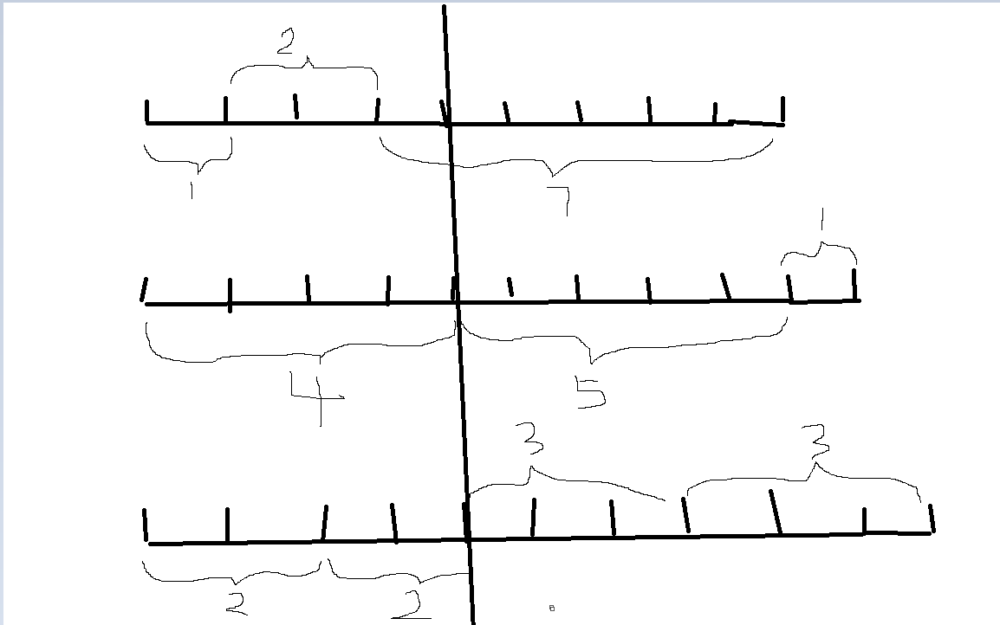

# 二维数组中的查找

> 题目描述: 有多根打乱的绳子，绳子长度为正整数，现将他们分组，每组有几根绳子，现将每组绳子横向拼接并排放置，问从中间切一刀，尽可能不切断单根绳子的最佳选择。参考下图，比如有3组绳子：[[1, 2, 7], [4, 5, 1], [2, 2, 3, 3]]，第一组和第二组都是3根，第三组是4根。



## 方法

```python
def cut_lines1(input_list):
    maintenance_list = []
    for ls in input_list:
        cut_list = []
        for i in range(len(ls)):
            if i != 0:
                cut_list.append(sum(ls[:i]))
                print(f"当前组切点：{cut_list}")
        maintenance_list.append(cut_list)
    print(f"所有组切点：{maintenance_list}")

    record_dict = {}
    for m_list in maintenance_list:
        for item in m_list:
            if item in record_dict:
                record_dict[item] = record_dict[item] + 1
            else:
                record_dict[item] = 1
    print(f"字典计数器：{record_dict}")

    max_num = max([v for k, v in record_dict.items()])
    max_key = [k for k, v in record_dict.items() if v == max_num]  # 出现次数最多的切点
    return max_key


def cut_lines2(input_list):
    maintenance_list = []
    for ls in input_list:
        cut_list = []
        for i in range(1, len(ls)):  # 优化
            cut_list.append(sum(ls[:i]))
        maintenance_list.append(cut_list)
    print(maintenance_list)

    record_dict = {}
    for m_list in maintenance_list:
        for item in m_list:
            record_dict[item] = record_dict.get(item, 0) + 1  # 优化
    print(record_dict)

    max_num = max([v for k, v in record_dict.items()])
    max_key = [k for k, v in record_dict.items() if v == max_num]
    return max_key


def cut_lines3(input_list):
    maintenance_list = []
    for ls in input_list:
        for i in range(1, len(ls)):
            maintenance_list.append(sum(ls[:i]))
    max_key = max(maintenance_list, key=maintenance_list.count)
    return max_key


if __name__ == '__main__':
    lines_list = [[1, 2, 7], [4, 5, 1], [2, 2, 3, 3]]
    cut_points1 = cut_lines1(lines_list)
    print(f"优化前：{cut_points1}")

    cut_points2 = cut_lines2(lines_list)
    print(f"优化1：{cut_points2}")

    cut_points3 = cut_lines3(lines_list)
    print(f"优化2：{cut_points3}")
```


