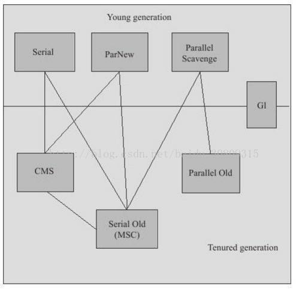

# GC需要完成的三件事情：
① 哪些内存需要回收？

② 什么时候回收？

③ 如何回收？


# GC Area
程序计数器、虚拟机栈、本地方法栈三个区域随线程而生，随线程而灭，所以这几个区域不需要过多考虑回收问题，因为线程结束时，内存自然就跟着回收了，而java堆和方法去不同；


# 为何GC
在堆里存放几乎java中所有对象实例，垃圾收集器对其回收前需要确定这些对象之中哪些还“存活”着；


# 引用计数算法-判断对象是否存活的算法
① 实现简单，判定效率也很高；

② 使用：微软COM技术、使用ActionScript3的FlasPlayer、Python语言和在游戏领域被广泛应用的Squirrel中都使用了引用计数算法进行内存管理；

③ java虚拟机并没有使用计数算法来管理内存（很难解决对象之间互相循环引用的问题）；

```java
package com.demo.test;
 
 
/**
 * 验证结果：虚拟机并没有因为这两个对象互相引用就不回收他们，侧面说明虚拟机并不是通过引用计数算法来判断对象是否存活的
 */
public class Test {
 
 
    public Object instance = null;
 
 
    private static final int _1MB = 1024*1024;
 
 
    //占点内存，以便能在GC日志中看清楚是否被回收过
    private byte[] bigSize = new byte[2*_1MB];
 
 
    public static void testGC(){
        Test objA = new Test();
        Test objB = new Test();
        objA.instance = objB;
        objB.instance = objA;
 
 
        objA = null;
        objB = null;
 
 
        System.gc();
    }

    public static void main(String[] args) {
        testGC();
    }
}
```

# 可达性分析算法-判断对象是否存活算法
① 当一个对象到GC Roots没有任何引用链相连，即从GC Roots到这个对象不可达时，证明此对象是不可用的，会被判定为可回收对象；


# 可作为GC Roots的对象包括下面几种
① 虚拟机栈（栈帧中的本地变量表）中引用的对象；

② 方法区中类静态属性引用的对象；

③ 方法区中常量引用的对象；

④ 本地方法栈中JNI（即一般说的Native方法）引用的对象；


# JDK1.2之后，java对引用的概念进行扩充
① 强引用：指程序代码中普遍存在的，类似Object obj = new Object()；这类引用，只要存在，GC永远不会回收；

② 软引用：描述一些还有用但不是必须的对象，在即将内存溢出时会将这些对象第二次回收，如第二次回收还没有足够内存，则抛内存溢出异常；JDK1.2后提供了SoftReference类；

③ 弱引用：描述非必需对象，强度比软引用弱些，被弱引用关联的对象只能生存到下一次垃圾回收发生之前，无论当前内存是否足够，都会回收掉；JDK1.2后提供了WeakReference类；

④ 虚引用：最弱，一个对象是否有虚引用完全不会对其生存时间构成影响，也无法通过虚引用来获取一个对象实例，其存在唯一目的就是能在这个对象被收集器回收时收到一个系统通知；JDK1.2后提供了PhantomReference类；

# 两次标记过程
① 第一次标记：即便对象与GC Roots不可达，但也不是“非死不可”，它将会被第一次标记并且进行一次筛选，筛选条件——此对象是否有必要执行finalize()方法；

② 没有必要执行finalize()方法情况：
- （1）对象没有覆盖finalize()方法；
- （2）finalize()方法已被虚拟机调用过；

③ 若有必要执行finalize()方法，这个对象会先进入F-Queue队列，并在稍后由虚拟机自动建立的、低优先级的Finalizer线程去执行它。

④ 执行过程：指虚拟机会触发这个方法，但并不承诺等待它运行结束，可能遇到执行缓慢或死循环，导致F-Queue中其他对象永久等待，甚至导致内存回收机制崩溃；

⑤ 第二次标记：GC将对F-Queue中的对象进行第二次小规模标记，如对象要在finalize()中拯救自己，需要‌重新与引用链上的任何一个对象建立关联，否则就真被回收了；

```java
package com.demo.test;
 
 
/**
 * 运行结果：
 * 任何一个对象的finalize方法只会被系统自动调用一次，如果对象面临下一次回收，它的finalize方法不会被再次执行
 * > finalize method executed!
 * > yes,i am still alive :)
 * > no,i am dead :(
 */
public class FinalizeEscapeGC {
 
 
    public static FinalizeEscapeGC SAVE_HOOK = null;
 
 
    public void isAlive(){
        System.out.println("yes,i am still alive :)");
    }
 
 
    @Override
    protected void finalize() throws Throwable{
        super.finalize();
        System.out.println("finalize method executed!");
        FinalizeEscapeGC.SAVE_HOOK = this;
    }
 
 
    public static void main(String[] args) throws Throwable {
        SAVE_HOOK = new FinalizeEscapeGC();
 
 
        //对象第一次成功姐就自己
        SAVE_HOOK = null;
        System.gc();
        //因为finalize方法优先级很低，所以暂停0.5秒以等待它
        Thread.sleep(500);
        if (SAVE_HOOK!=null){
            SAVE_HOOK.isAlive();
        }else {
            System.out.println("no,i am dead :(");
        }
 
 
 
 
        //下面这段代码与上面完全相同，但是这次自救却失败了
        SAVE_HOOK = null;
        System.gc();
        Thread.sleep(500);
        if (SAVE_HOOK!=null){
            SAVE_HOOK.isAlive();
        }else {
            System.out.println("no,i am dead :(");
        }
    }
}
```

# 不建议使用finalize()
作者不建议使用finalize()方法拯救对象，要避免使用它，它是一种为了使c/c++程序员更容易接受它所做的一个妥协，其运行代价高昂，不确定性大...，其所做的工作，我们使用try-finally或其他方式可以做的更好；


# 回收方法区
① 方法区->HotSpot虚拟机中的永久代；

② java虚拟机规范中说过可以不要求虚拟机在方法区实现垃圾回收，而且在方法区中进行垃圾回收“性价比”比较低；

③ 永久代垃圾回收分两部分：

- 废弃常量和无用的类：与java堆中对象的清理类似，可以清除常量池中的其他类（接口）、方法、字段等，但是判定一个“无用的类”相对比较苛刻，需要满足3个方面才会清理：

① 该类中所有的实例都已经被回收，也就是java堆中不存在该类的任何实例；

② 加载该类的ClassLoader已经被回收；

③ 该类对应的java.lang.Class对象没有在任何地方被引用，无法在任何地方通过反射访问该类的方法；

④ 在大量使用反射、动态代理、CGLIB等ByteCode框架、动态生成JSP以及OSGI这类频繁自定义ClassLoader的场景都需要虚拟机具备类卸载的功能，以保证永久代不会溢出；


# 垃圾收集算法

① 标记-清除算法
- （1）方法：首先标记所有需要回收的对象，标记完成后统一清除；
- （2）缺点：效率问题；空间问题（空间碎片）

② 复制算法
- （1）方法：内存划分2块（Eden空间和Survivor空间），每次只使用一块，当一块用完后，就将还存活着的对象复制到另一块，然后再把已使用过的内存空间一次清理掉。
- （2）代价：将内存缩小了
- （3）HotSpot：Eden空间：Survivor空间 = 8：1
- （4）Survivor空间不足时需要依赖其他内存（这里指老年代）进行分配担保（类似银行贷款担保）

③ 标记-整理算法：
- （1）特点：根据老年代特点而指定的一种算法，标记过程与“标记-清除”算法一样，但后续是让所有存活的对象都向一端移动，然后直接清理掉边界以外的内存；

④ 分代收集算法
- （1）当前商业虚拟机的垃圾收集都采用“分代收集”算法；
- （2）一般把java堆分为新生代和老年代；
- （3）新生代：每次垃圾回收都有大批对象死去，只有少量存活，可选用复制算法，只需要付出少量存货对象的复制成本就可以完成收集。
- （4）老年代：因老年代对象存活率高、没有额外空间对它进行分配担保，就必须使用“标记-清理”或者“标记-整理”算法来进行回收；


# HotSpot的算法实现
① 枚举根节点
- （1）特点：敏感、GC停顿、“一致性”,GC进行时必须停顿所有Java执行线程（Sun称为“Stop the world”），即枚举根节点总是要停顿的；
- （2）当前主流java虚拟机使用的都是准确式GC，HotSpot中是使用一组称为OopMap的数据结构来达到这个目的的（知道哪里存放着对象引用，快速且准确地完成GC Roots枚举）；

② 安全点：
- （1）在“特定的位置”记录OopMap信息，这里的位置就是安全点，即程序执行时并非在所有地方都停下来开始GC，只有到达安全点时才能暂停
- （2）安全点选定以程序“是否具有让程序长时间执行的特征”为标准，“长时间执行”最明显特征就是指令序列服用，如方法调用、循环跳转、一场跳转等（所以具有这些功能的指令才会产生Safepoint）
- （3）如何在GC发生时让所有线程（不包括JNI调用的线程）都跑到最近的安全点上再停顿下来：有两种方案，抢先式中断和主动式中断，前者少用，后者让各个线程轮询一个标志（若为真，则自己中断挂起，轮询标志的地点与安全点重合）；

③ 安全区域：
- （1）程序没有分配CPU时间，如线程处于sleep状态或block状态，此时线程无法相应jvm的中断请求，这种情况需要安全区域解决；
- （2）在安全区域中任意地方开始GC都是安全的；


# HotSpot垃圾收集器
（JDK1.7 Update14之后的，这个版本正式提供了商用的G1收集器，之前的G1仍处于实验状态）



（上面展示了7种作用于不同分代的垃圾收集器，两者之间连线的意思可以搭配使用，按其所属区域分为新生代收集器和老年代收集器）

① Serial收集器：“单线程”，JDK1.3开始，至今依然是虚拟机运行在Client模式下默认的新生代收集器，简单而高效，Client模式下很好的选择；

② ParNew收集器：Serial收集器多线程版本，其他与之类似，但它是许多运行在Server模式下的虚拟机中首选的新生代收集器，除了Serial外，只有他可以与CMS配合工作

③ Paraller Scavenge收集器：使用复制算法，并行的多线程收集器，目标是达到一个可控制的吞吐量（吞吐量=运行用户代码时间/（运行用户代码时间+垃圾回收时间））

④ Serial Old收集器：单线程，标记-整理算法，Client模式下虚拟机使用，若在Server模式下（在JDK1.5及之前与Parallel Scavenge搭配或作为CMS后备方案-在并发发生Concurrent Mode Failure时使用）

⑤ Paraller Old收集器：多线程，标记-整理算法，JDK1.6提供，吞吐量优先

⑥ CMS收集器：JDK1.5，强交互应用，划时代意义的收集器，以获取最短回收停顿时间为目标，适用于当前互联网或B/S系统服务端，标记-清除算法，运作过程（初始标记-并发标记-重新标记-并发清除），与用户线程并发执行，低停顿，缺点（对CPU资源敏感，无法处理浮动垃圾，标记-清除算法的空间碎片）

# G1收集器

① 面向服务端，目标-替换CMS

② 有点：并行/并发，分代收集，空间整合（标记-整理算法），可预测的停顿（几乎是实时-RTSJ的垃圾回收器特征）

③ 堆内存布局变化：堆分成多个大小相等独立区域Region，虽保留老年代和新生代概念，但他们不在是物理隔离的了，G1后台维护Region列表，择价值最大的Region回收

④ 使用Remember Set避免全堆扫描，每个Region有一个Remember Set，

⑤ 操作步骤：初始标记-并发标记-最终标记-筛选回收

⑥ 反应停顿时间测试和吞吐量测试是作者从网上搜集的一些数据，真实生产环境暂无


# 理解GC日志

① GC发生时间

② 停顿类型： GC，Full GC-stop-the-world

③ GC发生区域：ParNew等

④ GC前该内存区域已使用容量-GC后已使用容量

⑤ 该内存区域GC所占用的时间，秒


15.垃圾收集器参数总结参考

http://blog.csdn.net/huxian1234/article/details/17163023

