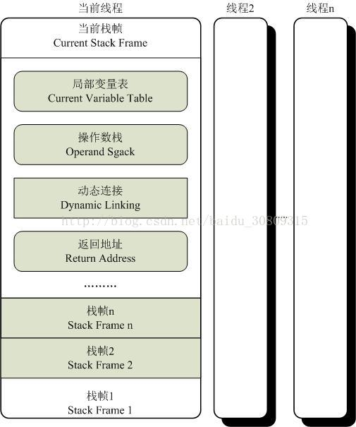

# 概述

> 执行引擎是jvm最核心的组成部分之一，“虚拟机”是一个相对于“物理机”的概念。这两种机器都有代码执行能力；

## 虚拟机和物理机区别

① 物理机执行引擎：建立在处理器、硬件、指令集和OS层面；

② 虚拟机执行引擎：自己去实现，可自行指定指令集与执行引擎的结构体系，并且能够执行那些不被硬件直接支持的指令集格式；

## 统一外观

① 在jvm规范中制定了虚拟机字节码执行引擎的概念模型，这个概念模型称为各种虚拟机执行引擎的统一外观；

② 不同虚拟机实现里，执行引擎在执行java代码时可能会有解释执行（通过解释器）和编译执行（通过即时编译器产生本地代码执行）两种选择，也可能两者兼备，甚至会包含几个不同级别的编译器执行引擎；

③ 外观上看，所有jvm的执行引擎都是一致的：输入的是字节码文件，处理过程是字节码解析的等效过程，输出的是执行结果

# 运行时栈帧结构

## 栈帧

① 定义： 栈帧是用于支持虚拟机进行方法调用和方法执行的数据结构，它是虚拟机运行时数据区中的虚拟机栈的栈元素；

② 作用：存储了方法的局部变量表、操作数栈、动态链接、方法返回地址和一些额外的附加信息；每个方法从调用到执行完成的过程，都对应着一个栈帧在虚拟机栈里面从入栈到出栈的过程；

③ 编译程序代码时，栈帧中需要多大的局部变量表，多深的操作数栈都已完全确定，并写入方法表的code属性之中，因此一个栈帧需要分配多少内存，不会受到程序运行期变量数据的影响，而仅仅取决于虚拟机的具体实现；

④ 当前栈帧：一个线程中的方法调用链可能会很长，很多方法都同时处于执行状态，对于执行引擎来说，在活动线程中，只有位于栈顶的栈帧才是有效的，称为当前栈帧，与这个栈帧相关联的方法称为当前方法；

⑤ 执行引擎运行的所有字节码指令都只针对当前栈帧进行操作；

⑥ 栈帧的概念结构图：

## 局部变量表

① 定义：局部变量表是一组变量值存储空间，用于存放方法参数和方法内部定义的局部变量；

② 最小单位：变量槽（Slot），一个Slot可以存放一个32bit以内的数据类型，64bit虚拟机需要使用对齐和补白的手段让其外观看起来与32bit虚拟机一致；

③ java中32bit以内的数据类型：boolean、byte、char、short、int、float、reference（对象实例的引用）、returnAddress（目前很少见，古老的java虚拟机曾经使用，现已由异常表代替）；

④ reference类型作用：一是从此引用直接或间接地查找到对象在java堆中的数据存放的起始地址索引；二是此引用中直接或间接地查找到对象所属数据类型在方法区中的存储的类型信息，否则无法实现java语言规范中定义的语法约束约束；

⑤ 对于64bit数据类型（long和double两种），虚拟机会以高位对齐方式分配2个连续的Slot空间，由于局部变量表建立在线程的堆栈上，是线程私有数据，无论两个连续的Slot是否为原子操作，都不会引起数据安全问题（long和double的非原子协定）；

⑥ 索引定位：虚拟机通过索引定位的方式使用局部变量表，索引值范围从0到最大的Slot数量，对于两个相邻的共同存放一个64bit数据的两个Slot，不允许采用任何方式单独访问其中的某一个；

⑦ 为节省栈帧空间，Slot可以重用（可参考书中示例）；

## 操作数栈
① 也称为操作栈，后入先出，同局部变量表：最大深度写入到Code属性的max_stacks数据项中，栈中元素可以是任意类型，含long和double，32bit栈容量为1，64则为2；

② 操作数栈中元素的数据类型必须与字节码指令的序列严格匹配；

③ 概念模型中两个栈帧完全相互独立，实际中会出现部分重叠公用；

④ java虚拟机的解释执行引擎称为“基于栈的执行引擎”，其中栈指的就是操作数栈；

## 动态连接
① 说明：每个栈帧都包含一个指向运行时常量池中该栈帧所属方法的引用，持有这个引用是为了支持方法调用过程中的动态连接。

② 静态解析：Class文件常量池中的符号引用一部分会在类加载阶段或第一次使用的时候就转化为直接引用，这个转化称为静态解析；

③ 动态连接：Class文件常量池中的符号引用另一部分将在运行期间转化为直接引用，这部分称为动态连接；

## 方法返回地址
① 正常完成出口：是否存在返回值传递给上层的方法调用者的退出方法；

② 异常完成出口：程序中断，遇到异常并且未能搜索到匹配的异常处理器；

## 附加信息
① 虚拟机规范允许具体的虚拟机实现增加一些规范 里没有描述的信息到栈帧之中；

② 实际开发中，一般会把动态连接、方法返回地址与其他附加信息全部归为一类，称为栈帧信息；
